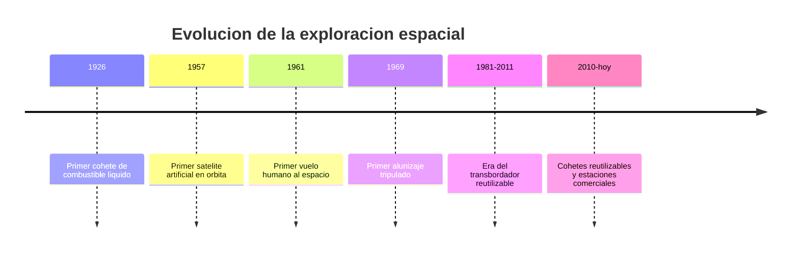

# 📜 Historia de la nave espacial

[🏠 Inicio](../../../README.md) · [🚀 Curso: Naves espaciales](../README.md) · 📜 Historia

## Origen

La nave espacial nace de la fisica del cohete: para salir de la atmosfera y
alcanzar la orbita hace falta expulsar masa a gran velocidad. En 1926 volo el
primer cohete de combustible liquido, y en pocas decadas la humanidad puso
satelites, personas y sondas mas alla de la atmosfera. Esta es historia de
**ciencia real**.

## Linea de tiempo

| Periodo | Hito | Importancia |
| --- | --- | --- |
| 1926 | Primer cohete de combustible liquido | Prueba del principio de propulsion cohete. |
| 1957 | Primer satelite artificial | Comienza la era espacial. |
| 1961 | Primer vuelo humano al espacio | El ser humano llega a la orbita. |
| 1969 | Primer alunizaje tripulado | Viaje humano a otro cuerpo celeste. |
| 1981-2011 | Transbordador reutilizable | Nave espacial parcialmente reutilizable. |
| 2010-presente | Cohetes reutilizables | Baja el costo de acceso al espacio. |

## Evolucion tecnologica

- **Propulsion**: de cohetes simples a motores reutilizables y de alta eficiencia.
- **Estructura**: materiales ligeros y escudos termicos para la reentrada.
- **Energia**: de baterias a paneles solares y sistemas nucleares en sondas.
- **Control**: de la guia analogica a computadores de vuelo autonomos.
- **Soporte vital**: sistemas que reciclan aire y agua en misiones largas.
- **Reutilizacion**: recuperar etapas para bajar el costo de cada lanzamiento.

## Tipos representativos

| Tipo | Uso tipico | Caracteristica destacada |
| --- | --- | --- |
| Cohete lanzador | Poner carga en orbita | Multiples etapas, gran empuje. |
| Capsula tripulada | Llevar personas | Escudo termico para la reentrada. |
| Satelite | Comunicacion y observacion | Permanece en orbita, sin tripulacion. |
| Sonda interplanetaria | Explorar otros mundos | Autonomia y comunicacion a gran distancia. |
| Estacion espacial | Habitat en orbita | Soporte vital de larga duracion. |

## Ciencia real frente a ficcion

- **Real hoy**: cohetes quimicos, orbitas, microgravedad, reentrada, estaciones.
- **En desarrollo**: propulsion electrica avanzada, misiones tripuladas lejanas.
- **Ficcion**: motores de "curvatura", gravedad artificial simple, viajes instantaneos.

Este curso usa la ficcion solo como escenario, siempre marcada como tal.

## Impacto social y economico

La actividad espacial dio satelites de comunicacion, navegacion (GPS),
observacion de la Tierra y prediccion del clima. Para paises como Chile, con
cielos ideales para la astronomia, el espacio es tambien ciencia, economia y
cooperacion internacional.

## Fuentes

- Registrar aqui las fuentes publicas consultadas.
- Enlazar cada fuente tambien en [`manuales/fuentes.md`](../../../manuales/fuentes.md).

---

[🎓 Portada del curso](../README.md) · [➡️ Siguiente: Caracteristicas](../operacion/caracteristicas-nave-espacial.md)
