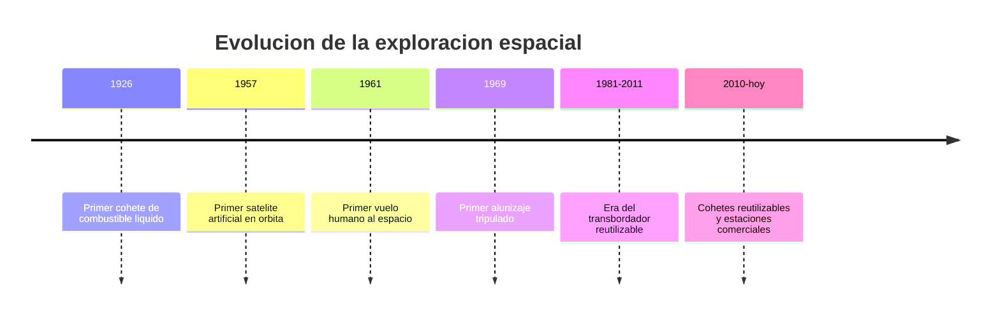

<!-- clase-meta
tipo_documento: clase
clase: 1
codigo: NAVESESPACIA-01
curso: naves-espaciales
titulo: "Historia de la nave espacial"
modalidad: "teórica dialogada"
duracion_minutos: 45
nivel: introductorio
prerrequisito: ninguno
competencia: "contexto_historico"
resultados_aprendizaje:
  - "Explicar origen, evolución tecnológica, variantes representativas e impacto con vocabulario propio de Naves espaciales."
  - "Aplicar esos conceptos a una decisión segura o a un escenario de simulación de Naves espaciales."
evidencia: "Línea de tiempo comentada con cuatro hitos o más."
criterio_aprobacion: "Los hitos están ordenados, son pertinentes y dos relaciones de causa y efecto quedan justificadas."
fuentes: manuales/fuentes.md
ultima_revision: 2026-09-10
-->

# 📜 Historia de la nave espacial

[🏠 Inicio](../../../README.md) · [🚀 Curso: Naves espaciales](../README.md) · 📜 Historia

```mermaid
timeline
    title Evolucion de la exploracion espacial
    1926 : Primer cohete de combustible liquido
    1957 : Primer satelite artificial en orbita
    1961 : Primer vuelo humano al espacio
    1969 : Primer alunizaje tripulado
    1981-2011 : Era del transbordador reutilizable
    2010-hoy : Cohetes reutilizables y estaciones comerciales
```

## Origen

La nave espacial nace de la física del cohete: para salir de la atmósfera y
alcanzar la órbita hace falta expulsar masa a gran velocidad. En 1926 volo el
primer cohete de combustible líquido, y en pocas decadas la humanidad puso
satélites, personas y sondas más allá de la atmósfera. Esta es historia de
**ciencia real**.

## Línea de tiempo

| Periodo | Hito | Importancia |
| --- | --- | --- |
| 1926 | Primer cohete de combustible líquido | Prueba del principio de propulsión cohete. |
| 1957 | Primer satélite artificial | Comienza la era espacial. |
| 1961 | Primer vuelo humano al espacio | El ser humano llega a la órbita. |
| 1969 | Primer alunizaje tripulado | Viaje humano a otro cuerpo celeste. |
| 1981-2011 | Transbordador reutilizable | Nave espacial parcialmente reutilizable. |
| 2010-presente | Cohetes reutilizables | Baja el costo de acceso al espacio. |

## Evolución tecnológica

- **Propulsión**: de cohetes simples a motores reutilizables y de alta eficiencia.
- **Estructura**: materiales ligeros y escudos térmicos para la reentrada.
- **Energía**: de baterías a paneles solares y sistemas nucleares en sondas.
- **Control**: de la guía analógica a computadores de vuelo autónomos.
- **Soporte vital**: sistemas que reciclan aire y agua en misiones largas.
- **Reutilización**: recuperar etapas para bajar el costo de cada lanzamiento.

## Tipos representativos

| Tipo | Uso típico | Característica destacada |
| --- | --- | --- |
| Cohete lanzador | Poner carga en órbita | Múltiples etapas, gran empuje. |
| Cápsula tripulada | Llevar personas | Escudo térmico para la reentrada. |
| Satélite | Comunicación y observación | Permanece en órbita, sin tripulación. |
| Sonda interplanetaria | Explorar otros mundos | Autonomía y comunicación a gran distancia. |
| Estación espacial | Habitat en órbita | Soporte vital de larga duración. |

## Ciencia real frente a ficción

- **Real hoy**: cohetes quimicos, órbitas, microgravedad, reentrada, estaciones.
- **En desarrollo**: propulsión eléctrica avanzada, misiones tripuladas lejanas.
- **Ficción**: motores de "curvatura", gravedad artificial simple, viajes instantáneos.

Este curso usa la ficción solo como escenario, siempre marcada como tal.

## Impacto social y económico

La actividad espacial dio satélites de comunicación, navegación (GPS),
observación de la Tierra y predicción del clima. Para países como Chile, con
cielos ideales para la astronomía, el espacio es también ciencia, economía y
cooperación internacional.

## 🧭 Guía de estudio aplicada

### Pregunta guía

¿Cómo ayuda **Origen, Línea de tiempo, Evolución tecnológica y Tipos representativos** a **explicar cómo la evolución hizo posibles alternativas como cápsula tripulada frente a sonda robótica**?

### Explicación razonada

La evolución de Naves espaciales se comprende mejor como una sucesión de respuestas a problemas, no como una lista de fechas. Los cambios en fuente de energía, propulsión, navegación y control y órbita o trayectoria alteraron qué podía hacer la máquina, quién podía usarla y qué riesgos debían controlarse. El contraste «cápsula tripulada frente a sonda robótica» permite observar qué decisiones de diseño permanecieron y cuáles cambiaron con la tecnología y el propósito.

Esta clase se conecta con el resto del curso mediante **pequeños cambios de velocidad producen cambios acumulativos de órbita y ventanas de encuentro**. El hilo de
seguridad consiste en reconocer a tiempo **colisión o imposibilidad de retirada por quemado mal orientado o tardío** y poder justificar la decisión
**verificar marco de referencia, ventana, delta-v y opción de aborto antes del encendido**; en clases posteriores cambiará el ángulo de análisis, no esa relación causal.
La lectura funcional común sigue **fuente de energía → propulsión → navegación y control → órbita o trayectoria**, de modo que cada concepto pueda
ubicarse dentro del funcionamiento completo y no quede como un dato aislado.

**Apoyo documental:** [Spaceships and Rockets](https://www.nasa.gov/humans-in-space/spaceships-and-rockets/) aporta naves, sistemas y misiones;
[Space Law Treaties and Principles](https://www.unoosa.org/oosa/SpaceLaw/treaties.html) se usa para derecho espacial internacional. Estas fuentes
se contrastan con el alcance de la clase y no sustituyen un manual de equipo concreto.

### Caso resuelto: de la observación a la decisión

1. **Situar:** ordena los hitos que explican cómo se llegó a **cápsula tripulada frente a sonda robótica** y describe la necesidad que impulsó cada cambio.
2. **Relacionar:** explica qué se modificó en **fuente de energía**, **propulsión**, **navegación y control** o **órbita o trayectoria**; una fecha sin mecanismo no basta.
3. **Interpretar:** vincula el cambio con una capacidad nueva y también con el riesgo **colisión o imposibilidad de retirada por quemado mal orientado o tardío**.
4. **Transferir:** usa la evolución para justificar por qué hoy conviene **verificar marco de referencia, ventana, delta-v y opción de aborto antes del encendido**.

### Comprueba tu comprensión

1. ¿Qué necesidad histórica impulsó un cambio en **fuente de energía** o **propulsión**?
2. ¿Qué hito modificó la relación entre capacidad y **colisión o imposibilidad de retirada por quemado mal orientado o tardío**?
3. ¿Por qué **cápsula tripulada frente a sonda robótica** no puede explicarse como una simple diferencia estética?

Orientación para revisar tus respuestas

- La primera respuesta debe relacionar el eslabón elegido con un efecto posterior, no solo nombrarlo.
- La segunda debe proponer una señal medible u observable y explicar qué tendencia sería preocupante.
- La tercera debe cambiar al menos una variable de capacidad, mando, entorno o margen de seguridad.

## 🎓 Cierre de clase

- **Actividad:** Construye una línea de tiempo de Naves espaciales y explica cómo dos cambios históricos transformaron su función o su puesto de mando.
- **Evidencia:** Línea de tiempo comentada con cuatro hitos o más.
- **Criterio de aprobación:** Los hitos están ordenados, son pertinentes y dos relaciones de causa y efecto quedan justificadas.
- **Transferencia:** explica qué cambiaría al pasar a otra variante de esta máquina.

### Fuentes de esta clase

- [NASA-SPACECRAFT](https://www.nasa.gov/humans-in-space/spaceships-and-rockets/): Spaceships and Rockets, NASA. Uso: naves, sistemas y misiones.
- [UNOOSA-TREATIES](https://www.unoosa.org/oosa/SpaceLaw/treaties.html): Space Law Treaties and Principles, UNOOSA. Uso: derecho espacial internacional.

> Las fuentes sostienen el marco conceptual y normativo; esta clase no reemplaza el manual
> del fabricante, la formación certificada ni la habilitación exigida para operar equipos reales.

---

[🎓 Portada del curso](../README.md) · [➡️ Siguiente: Características](../operacion/caracteristicas-nave-espacial.md)
