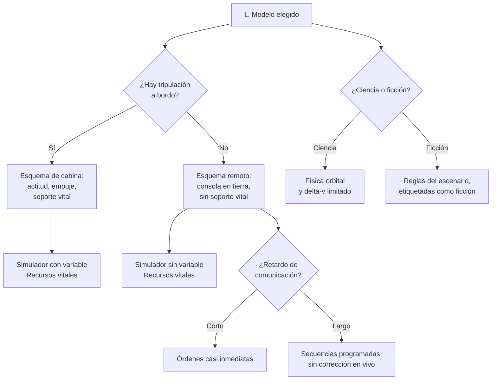

# 🧩 Modelos y variantes de la nave espacial

[🏠 Inicio](../../../README.md) · [🚀 Curso: Naves espaciales](../README.md) · 🧩 Modelos

El [Módulo 2](../operacion/caracteristicas-nave-espacial.md) ya dijo qué tipos de
nave espacial existen y para qué sirve cada uno. Este módulo responde a lo
siguiente: **no todas se manejan igual**, y esa diferencia no es de matiz. Cambia
qué mandos tiene la máquina y, por tanto, qué debe modelar el simulador.

> 🎯 **La idea que sostiene el módulo.** "Una nave espacial" no es una sola
> máquina desde el punto de vista del mando. Un satélite no tiene tripulación a
> bordo: no es que sus mandos sean más simples, es que **la cabina no existe** y
> el soporte vital tampoco. Un simulador que presente un solo puesto de pilotaje
> está representando una nave tripulada aunque diga representarlas todas.

---

## 🧭 Por qué el modelo decide el simulador

El [Módulo 5](../mandos/manual-mandos-nave-espacial.md) describe una cabina con
control de actitud, control de empuje, panel de soporte vital y una radio que
mantiene el contacto con control. El
[Módulo 9](../simulacion/diseno-simulador-nave-espacial.md) expone una variable
`Recursos vitales` que afecta a la tripulación. Ambos describen una nave
**tripulada y en órbita terrestre**.

En un satélite no hay nadie a bordo que accione esa consola: quien manda está en
tierra, y la variable `Recursos vitales` no tiene a quién afectar. En una sonda
interplanetaria el problema se agrava, porque la radio del Módulo 5 —la que
avisa de que hay retardo a gran distancia— deja de ser un mando de apoyo y pasa
a ser **el único mando**, con una demora que impide corregir en tiempo real. Si
el simulador se construye sobre el esquema tripulado y luego se le "añade" una
sonda, el resultado es una sonda pilotada al instante desde una cabina, que no
existe.

---

## 🗂️ Qué cambia en el manejo

| Modelo | Qué cambia en su operación |
| --- | --- |
| Cápsula tripulada | La referencia del curso: tripulación a bordo, misión corta, ciclo completo de lanzamiento, órbita y reentrada. |
| Cohete lanzador | Solo vive las fases de ascenso y separación de etapas: su masa cae por escalones y nunca llega a operar en órbita como nave. |
| Estación espacial | No maniobra para llegar: ya está. La operación es de larga duración y el soporte vital deja de ser un consumo para volverse un ciclo que hay que reciclar. |
| Satélite | Nadie a bordo. La operación se reduce a mantener la actitud, apuntar y administrar energía entre sol y sombra. |
| Sonda interplanetaria | El retardo de la comunicación obliga a operar por secuencias programadas: se ordena lo que se hará, no lo que se está haciendo. |
| Nave de ficción | Su operación la fija el escenario, no la física orbital, y por eso debe ir siempre etiquetada como ficción. |

---

## 🎛️ Qué cambia en el mando

| Modelo | Qué mando aparece o desaparece | Consecuencia |
| --- | --- | --- |
| Cápsula tripulada | Ninguno: el mapa de controles del Módulo 5 aplica tal cual. | Cambian los rangos y las fases, no los controles. |
| Cohete lanzador | **Desaparecen** el acoplamiento y la navegación orbital fina; el control de empuje y la separación de etapas concentran todo. | El puesto se reduce a guiar el ascenso; no hay maniobra que planificar. |
| Estación espacial | **Desaparece** el control de empuje como maniobra habitual. El soporte vital **asciende** de lectura a mando central. | Se opera un hábitat, no un vehículo: se gestiona, no se pilota. |
| Satélite | **Desaparecen** el soporte vital y todo el puesto de cabina. Las comunicaciones **se convierten** en el mando único, desde tierra. | Sin nadie a bordo no hay ergonomía de cabina que diseñar: hay una consola remota. |
| Sonda interplanetaria | **Desaparece** el mando en tiempo real. Las comunicaciones traen un retardo que **inserta** una planificación previa entre la orden y el efecto. | No se corrige lo que se ve: se ve lo que ya ocurrió. Es otro modo de control. |
| Nave de ficción | **Aparecen** los mandos que el escenario invente. | Deben quedar separados de los reales con etiquetas claras. |

---

## 🎮 Qué cambia en el simulador

Contrastado con las variables del
[Módulo 9](../simulacion/diseno-simulador-nave-espacial.md):

| Modelo | Variables que cambian | Esquema de control |
| --- | --- | --- |
| Cápsula tripulada | Ninguna: es el caso base. | El del Módulo 5. |
| Cohete lanzador | `Altitud orbital` y `Velocidad orbital` solo recorren el tramo de ascenso. `Propelente` se consume por etapas, no de forma continua. `Temperatura del escudo` no interviene. | El mismo, recortado: empuje y actitud, sin acoplamiento. |
| Estación espacial | `Delta-v disponible` pierde peso: casi no maniobra. `Recursos vitales` pasa de consumo a ciclo de reciclaje y se vuelve la variable dominante. | El mismo, con el soporte vital al centro. |
| Satélite | `Recursos vitales` **se elimina**: no hay tripulación. `Temperatura del escudo` **desaparece**: no reentra. `Actitud` y la energía disponible pasan a ser el juego entero. | Sin cabina: consola remota, sin entrada de soporte vital. |
| Sonda interplanetaria | `Recursos vitales` **se elimina**. `Delta-v disponible` se planifica con años de antelación y `Actitud` se ordena, no se corrige. **Aparece** el retardo de comunicación como variable propia. | Sin control en tiempo real: se envían secuencias y se espera. |
| Nave de ficción | `Modo ciencia/ficción` pasa a `ficción` y libera las reglas físicas del resto. | El que el escenario defina, siempre etiquetado. |

---

## 🗺️ Del modelo al esquema de control

---

## ⚠️ Qué modelos no comparten simulador

Tres familias no se resuelven con un ajuste de parámetros, porque su esquema de
control es otro:

- **El satélite** frente a la cápsula: no falta un mando, falta el puesto entero.
  Sin tripulación a bordo desaparecen el soporte vital y la ergonomía de cabina,
  y el control se muda a una consola remota. Es un modo de control distinto, no
  una dificultad distinta.
- **La sonda interplanetaria** frente a todo lo demás: el retardo rompe el lazo
  entre ver y corregir. El ciclo del Módulo 9 —leer la entrada del usuario y
  actualizar el estado— deja de cerrarse en el mismo instante, y eso no es un
  parámetro: es otra arquitectura.
- **La nave de ficción** frente a las reales: no comparte las reglas físicas, así
  que tampoco puede compartir el motor que las calcula sin marcar la frontera.

El cohete lanzador y la estación espacial sí caben en el mismo simulador que la
cápsula ajustando fases y rangos, tal como plantean los
[niveles de realismo](../../../docs/03-niveles-de-realismo.md): en el nivel 1 la
operación guiada los acerca, y las diferencias emergen a medida que el nivel
sube.

---

[⬅️ Anterior: Características](../operacion/caracteristicas-nave-espacial.md) · [➡️ Siguiente: Sistemas mecánicos](../operacion/sistemas-mecanicos-nave-espacial.md)
</content>
</invoke>
