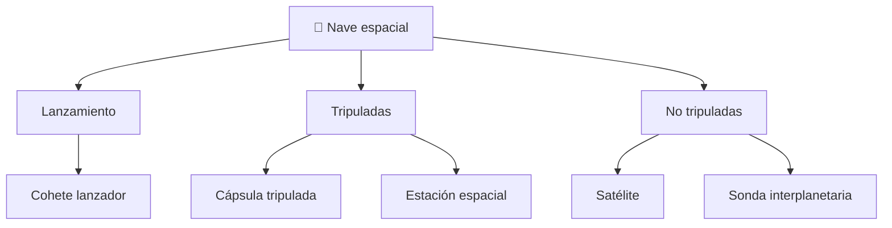

# 📋 Características funcionales de la nave espacial

[🏠 Inicio](../../../README.md) · [🚀 Curso: Naves espaciales](../README.md) · 📋 Características

Que es una nave espacial, que tipos existen y para que sirve cada uno. Este módulo
da el contexto antes de abrir los sistemas de la nave (Módulo 3), separando
siempre ciencia real de ficción.

---

## 🧭 Definición

Una nave espacial es un vehículo disenado para operar fuera de la atmósfera, donde
no hay aire que sustente ni frene. Se mueve por la física del cohete y de la
órbita: llega al espacio expulsando masa a gran velocidad y luego "cae" alrededor
de la Tierra en caída libre continua, lo que llamamos estar en órbita.

---

## 🧬 Características clave

| Característica | Descripción |
| --- | --- |
| Propulsión por reacción | Avanza expulsando masa, sin apoyarse en el aire. |
| Vuelo orbital | En órbita cae de forma continua alrededor de la Tierra. |
| Microgravedad | La tripulación y los objetos "flotan" en caída libre. |
| Vacío y temperatura extrema | Sin aire; frío a la sombra y calor al sol. |
| Autonomía de recursos | Lleva su aire, agua y energía; no los toma del entorno. |
| Presupuesto de delta-v | Cada maniobra gasta propelente limitado. |

---

## 🗂️ Tipos de nave espacial

| Tipo | Uso típico | Rasgo destacado |
| --- | --- | --- |
| Cohete lanzador | Poner carga en órbita | Múltiples etapas y gran empuje. |
| Cápsula tripulada | Llevar personas al espacio | Escudo térmico para reentrar. |
| Estación espacial | Habitat en órbita | Soporte vital de larga duración. |
| Satélite | Comunicación y observación | Sin tripulación, muy duradero. |
| Sonda interplanetaria | Explorar otros mundos | Autonomía y antenas de largo alcance. |
| Nave de ficción | Escenario narrativo | Solo simulación; marcada como ficción. |

---

## 🎯 Para qué se usa

- Comunicaciones, navegación (GPS) y observación de la Tierra.
- Investigación científica en microgravedad.
- Exploración de la Luna, planetas y cuerpos menores.
- Transporte de tripulación a estaciones en órbita.
- Educación y simulación de vuelo espacial.

---

[⬅️ Anterior: Historia](../historia/historia-nave-espacial.md) · [➡️ Siguiente: Sistemas mecánicos](sistemas-mecanicos-nave-espacial.md)
