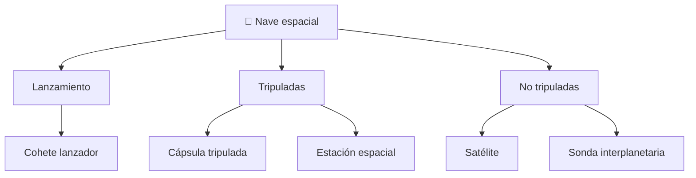

<!-- clase-meta
tipo_documento: clase
clase: 2
codigo: NAVESESPACIA-02
curso: naves-espaciales
titulo: "Características funcionales de la nave espacial"
modalidad: "teórica aplicada"
duracion_minutos: 45
nivel: introductorio
prerrequisito: NAVESESPACIA-01
competencia: "identificacion_funcional"
resultados_aprendizaje:
  - "Explicar definición, rasgos funcionales, tipos y usos con vocabulario propio de Naves espaciales."
  - "Aplicar esos conceptos a una decisión segura o a un escenario de simulación de Naves espaciales."
evidencia: "Matriz comparativa y decisión justificada."
criterio_aprobacion: "La elección considera función, límites, mando y efecto en la simulación; no se apoya solo en preferencias."
fuentes: manuales/fuentes.md
ultima_revision: 2026-09-10
-->

# 📋 Características funcionales de la nave espacial

[🏠 Inicio](../../../README.md) · [🚀 Curso: Naves espaciales](../README.md) · 📋 Características

Que es una nave espacial, que tipos existen y para que sirve cada uno. Esta clase
da el contexto antes de abrir los sistemas de la nave (Clase 4), separando
siempre ciencia real de ficción.

---

## 🧭 Definición

Una nave espacial es un vehículo disenado para operar fuera de la atmósfera, donde
no hay aire que sustente ni frene. Se mueve por la física del cohete y de la
órbita: llega al espacio expulsando masa a gran velocidad y luego "cae" alrededor
de la Tierra en caída libre continua, lo que llamamos estar en órbita.

---

## 🧬 Características clave

| Característica | Descripción |
| --- | --- |
| Propulsión por reacción | Avanza expulsando masa, sin apoyarse en el aire. |
| Vuelo orbital | En órbita cae de forma continua alrededor de la Tierra. |
| Microgravedad | La tripulación y los objetos "flotan" en caída libre. |
| Vacío y temperatura extrema | Sin aire; frío a la sombra y calor al sol. |
| Autonomía de recursos | Lleva su aire, agua y energía; no los toma del entorno. |
| Presupuesto de delta-v | Cada maniobra gasta propelente limitado. |

---

## 🗂️ Tipos de nave espacial

```mermaid
flowchart TD
    Nave[🚀 Nave espacial] --> Lanzamiento[Lanzamiento]
    Nave --> Tripuladas[Tripuladas]
    Nave --> NoTripuladas[No tripuladas]
    Lanzamiento --> Cohete[Cohete lanzador]
    Tripuladas --> Capsula[Cápsula tripulada]
    Tripuladas --> Estacion[Estación espacial]
    NoTripuladas --> Satelite[Satélite]
    NoTripuladas --> Sonda[Sonda interplanetaria]
```

| Tipo | Uso típico | Rasgo destacado |
| --- | --- | --- |
| Cohete lanzador | Poner carga en órbita | Múltiples etapas y gran empuje. |
| Cápsula tripulada | Llevar personas al espacio | Escudo térmico para reentrar. |
| Estación espacial | Habitat en órbita | Soporte vital de larga duración. |
| Satélite | Comunicación y observación | Sin tripulación, muy duradero. |
| Sonda interplanetaria | Explorar otros mundos | Autonomía y antenas de largo alcance. |
| Nave de ficción | Escenario narrativo | Solo simulación; marcada como ficción. |

---

## 🎯 Para qué se usa

- Comunicaciones, navegación (GPS) y observación de la Tierra.
- Investigación científica en microgravedad.
- Exploración de la Luna, planetas y cuerpos menores.
- Transporte de tripulación a estaciones en órbita.
- Educación y simulación de vuelo espacial.

## 🧭 Guía de estudio aplicada

### Pregunta guía

¿Cómo ayuda **Definición, Características clave, Tipos de nave espacial y Para qué se usa** a **elegir una configuración adecuada para maniobra de aproximación orbital con combustible de reserva limitado**?

### Explicación razonada

Una característica solo es útil cuando permite anticipar comportamiento. En Naves espaciales, la relación entre fuente de energía, propulsión, navegación y control y órbita o trayectoria determina capacidad, respuesta y límites. Por eso «cápsula tripulada frente a sonda robótica» no se compara por apariencia: se compara por misión, entorno, carga de trabajo y exposición al riesgo «colisión o imposibilidad de retirada por quemado mal orientado o tardío».

Esta clase se conecta con el resto del curso mediante **pequeños cambios de velocidad producen cambios acumulativos de órbita y ventanas de encuentro**. El hilo de
seguridad consiste en reconocer a tiempo **colisión o imposibilidad de retirada por quemado mal orientado o tardío** y poder justificar la decisión
**verificar marco de referencia, ventana, delta-v y opción de aborto antes del encendido**; en clases posteriores cambiará el ángulo de análisis, no esa relación causal.
La lectura funcional común sigue **fuente de energía → propulsión → navegación y control → órbita o trayectoria**, de modo que cada concepto pueda
ubicarse dentro del funcionamiento completo y no quede como un dato aislado.

**Apoyo documental:** [Spaceships and Rockets](https://www.nasa.gov/humans-in-space/spaceships-and-rockets/) aporta naves, sistemas y misiones;
[Space Law Treaties and Principles](https://www.unoosa.org/oosa/SpaceLaw/treaties.html) se usa para derecho espacial internacional. Estas fuentes
se contrastan con el alcance de la clase y no sustituyen un manual de equipo concreto.

### Caso resuelto: de la observación a la decisión

1. **Definir la necesidad:** convierte «maniobra de aproximación orbital con combustible de reserva limitado» en requisitos de capacidad, entorno y respuesta.
2. **Comparar:** contrasta **cápsula tripulada frente a sonda robótica** usando esos requisitos y la cadena **fuente de energía → propulsión → navegación y control → órbita o trayectoria**.
3. **Descartar:** elimina la alternativa que deja menos margen frente a **colisión o imposibilidad de retirada por quemado mal orientado o tardío**.
4. **Elegir:** declara la variante escogida, la evidencia usada y una limitación que todavía debe respetarse.

### Comprueba tu comprensión

1. ¿Qué característica de **órbita o trayectoria** condiciona primero el caso «maniobra de aproximación orbital con combustible de reserva limitado»?
2. ¿Qué requisito descartaría una de las alternativas **cápsula tripulada frente a sonda robótica**?
3. ¿Qué límite debe declararse junto con la variante elegida?

Orientación para revisar tus respuestas

- La primera respuesta debe relacionar el eslabón elegido con un efecto posterior, no solo nombrarlo.
- La segunda debe proponer una señal medible u observable y explicar qué tendencia sería preocupante.
- La tercera debe cambiar al menos una variable de capacidad, mando, entorno o margen de seguridad.

## 🎓 Cierre de clase

- **Actividad:** Compara variantes de Naves espaciales mediante los ejes «definición, rasgos funcionales, tipos y usos» y elige una para un caso de uso razonado.
- **Evidencia:** Matriz comparativa y decisión justificada.
- **Criterio de aprobación:** La elección considera función, límites, mando y efecto en la simulación; no se apoya solo en preferencias.
- **Transferencia:** explica qué cambiaría al pasar a otra variante de esta máquina.

### Fuentes de esta clase

- [NASA-SPACECRAFT](https://www.nasa.gov/humans-in-space/spaceships-and-rockets/): Spaceships and Rockets, NASA. Uso: naves, sistemas y misiones.
- [UNOOSA-TREATIES](https://www.unoosa.org/oosa/SpaceLaw/treaties.html): Space Law Treaties and Principles, UNOOSA. Uso: derecho espacial internacional.

> Las fuentes sostienen el marco conceptual y normativo; esta clase no reemplaza el manual
> del fabricante, la formación certificada ni la habilitación exigida para operar equipos reales.

---

[⬅️ Anterior: Historia](../historia/historia-nave-espacial.md) · [➡️ Siguiente: Modelos y variantes](../modelos/modelos-nave-espacial.md)
