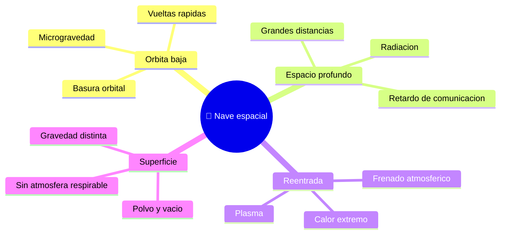

# 🌍 Entornos de trabajo de la nave espacial

[🏠 Inicio](../../../README.md) · [🚀 Curso: Naves espaciales](../README.md) · 🌍 Entornos

Donde opera una nave espacial y como cambian las condiciones segun el entorno.
Cada entorno implica riesgos y ajustes distintos, y en simulacion se traduce en
escenarios diferentes, siempre separando ciencia real de ficcion.

---

## 🗺️ Entornos principales

| Entorno | Caracteristicas | Riesgos tipicos | Ajuste de operacion |
| --- | --- | --- | --- |
| Orbita baja | Microgravedad, orbita rapida. | Basura orbital, radiacion parcial. | Control de actitud, gestion de recursos. |
| Espacio profundo | Grandes distancias, poca luz. | Retardo de comunicacion, radiacion. | Autonomia y planificacion de energia. |
| Reentrada | Calor y frenado por el aire. | Sobrecalentamiento, mala orientacion. | Escudo termico al frente, angulo correcto. |
| Superficie (Luna, Marte) | Gravedad menor, vacio o poca atmosfera. | Polvo, temperatura, sin aire. | Trajes, soporte vital, descenso controlado. |
| Escenario de ficcion | Reglas inventadas. | Confundir con la realidad. | Marcar siempre como ficcion. |

---

## 🌦️ Factores del entorno

- **Vacio**: sin aire no hay sustentacion ni conveccion; el calor se maneja distinto.
- **Temperatura**: mucho calor al Sol y mucho frio a la sombra.
- **Radiacion**: fuera de la atmosfera aumenta y afecta a personas y equipos.
- **Distancia**: cuanto mas lejos, mayor el retardo de las comunicaciones.

---

## 🎮 Traduccion a simulacion

Cada entorno es un escenario con su gravedad, su radiacion y su regimen de orbita
o reentrada. Ver como se modela en el
[Modulo 8: Diseno de simulacion](../simulacion/diseno-simulador-nave-espacial.md).

---

[⬅️ Anterior: Principios y operacion](principios-nave-espacial.md) · [➡️ Siguiente: Reglamentos](../reglamentos/reglamentos-nave-espacial.md)
