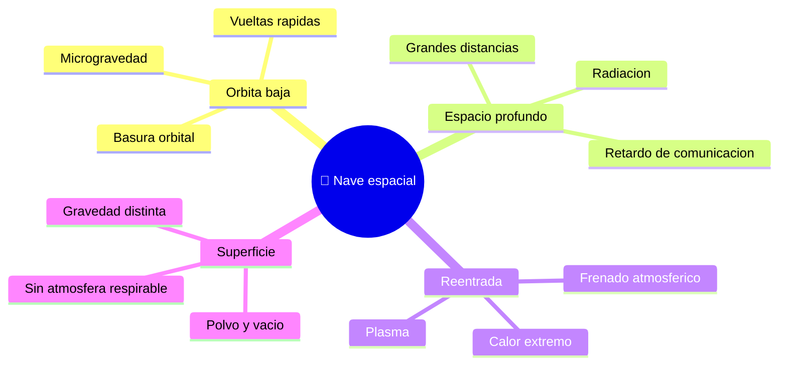

# 🌍 Entornos de trabajo de la nave espacial

[🏠 Inicio](../../../README.md) · [🚀 Curso: Naves espaciales](../README.md) · 🌍 Entornos

Dónde opera una nave espacial y cómo cambian las condiciones según el entorno.
Cada entorno implica riesgos y ajustes distintos, y en simulación se traduce en
escenarios diferentes, siempre separando ciencia real de ficción.

---

## 🗺️ Entornos principales

| Entorno | Características | Riesgos típicos | Ajuste de operación |
| --- | --- | --- | --- |
| Órbita baja | Microgravedad, órbita rápida. | Basura orbital, radiación parcial. | Control de actitud, gestión de recursos. |
| Espacio profundo | Grandes distancias, poca luz. | Retardo de comunicación, radiación. | Autonomía y planificación de energía. |
| Reentrada | Calor y frenado por el aire. | Sobrecalentamiento, mala orientación. | Escudo térmico al frente, ángulo correcto. |
| Superficie (Luna, Marte) | Gravedad menor, vacío o poca atmósfera. | Polvo, temperatura, sin aire. | Trajes, soporte vital, descenso controlado. |
| Escenario de ficción | Reglas inventadas. | Confundir con la realidad. | Marcar siempre como ficción. |

---

## 🌦️ Factores del entorno

- **Vacío**: sin aire no hay sustentación ni convección; el calor se maneja distinto.
- **Temperatura**: mucho calor al Sol y mucho frío a la sombra.
- **Radiación**: fuera de la atmósfera aumenta y afecta a personas y equipos.
- **Distancia**: cuanto más lejos, mayor el retardo de las comunicaciones.

---

## 🎮 Traducción a simulación

Cada entorno es un escenario con su gravedad, su radiación y su régimen de órbita
o reentrada. Ver cómo se modela en el
[Módulo 8: Diseño de simulación](../simulacion/diseno-simulador-nave-espacial.md).

---

[⬅️ Anterior: Principios y operación](principios-nave-espacial.md) · [➡️ Siguiente: Reglamentos](../reglamentos/reglamentos-nave-espacial.md)
