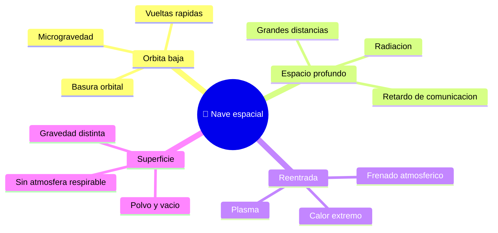

# 🌍 Entornos de trabajo de la nave espacial

[🏠 Inicio](../../../README.md) · [🚀 Curso: Naves espaciales](../README.md) · 🌍 Entornos

Dónde opera una nave espacial y cómo cambian las condiciones según el entorno.
Cada entorno implica riesgos y ajustes distintos, y en simulación se traduce en
escenarios diferentes, siempre separando ciencia real de ficción.

---

## 🗺️ Entornos principales

```mermaid
mindmap
  root((🚀 Nave espacial))
    Orbita baja
      Microgravedad
      Vueltas rapidas
      Basura orbital
    Espacio profundo
      Grandes distancias
      Retardo de comunicacion
      Radiacion
    Reentrada
      Calor extremo
      Frenado atmosferico
      Plasma
    Superficie
      Gravedad distinta
      Polvo y vacio
      Sin atmosfera respirable
```

| Entorno | Características | Riesgos típicos | Ajuste de operación |
| --- | --- | --- | --- |
| Órbita baja | Microgravedad, órbita rápida. | Basura orbital, radiación parcial. | Control de actitud, gestión de recursos. |
| Espacio profundo | Grandes distancias, poca luz. | Retardo de comunicación, radiación. | Autonomía y planificación de energía. |
| Reentrada | Calor y frenado por el aire. | Sobrecalentamiento, mala orientación. | Escudo térmico al frente, ángulo correcto. |
| Superficie (Luna, Marte) | Gravedad menor, vacío o poca atmósfera. | Polvo, temperatura, sin aire. | Trajes, soporte vital, descenso controlado. |
| Escenario de ficción | Reglas inventadas. | Confundir con la realidad. | Marcar siempre como ficción. |

---

## 🌦️ Factores del entorno

- **Vacío**: sin aire no hay sustentación ni convección; el calor se maneja distinto.
- **Temperatura**: mucho calor al Sol y mucho frío a la sombra.
- **Radiación**: fuera de la atmósfera aumenta y afecta a personas y equipos.
- **Distancia**: cuanto más lejos, mayor el retardo de las comunicaciones.

---

## 🎮 Traducción a simulación

Cada entorno es un escenario con su gravedad, su radiación y su régimen de órbita
o reentrada. Ver cómo se modela en el
[Módulo 9: Diseño de simulación](../simulacion/diseno-simulador-nave-espacial.md).

## 🎓 Cierre de clase

- **Actividad:** Contrasta tres entornos de Naves espaciales a partir de entornos, factores ambientales, riesgos y respuesta de simulación y determina cómo cambian variables, percepción, riesgos y respuesta.
- **Evidencia:** Matriz entorno–cambio–riesgo–respuesta.
- **Criterio de aprobación:** Cada respuesta se adapta al entorno y distingue riesgos que no son intercambiables entre escenarios.
- **Transferencia:** explica qué cambiaría al pasar a otra variante de esta máquina.

### Fuentes de esta clase

- [NASA-SPACECRAFT](https://www.nasa.gov/humans-in-space/spaceships-and-rockets/): Spaceships and Rockets, NASA. Uso: naves, sistemas y misiones.
- [UNOOSA-TREATIES](https://www.unoosa.org/oosa/SpaceLaw/treaties.html): Space Law Treaties and Principles, UNOOSA. Uso: derecho espacial internacional.

> Las fuentes sostienen el marco conceptual y normativo; esta clase no reemplaza el manual
> del fabricante, la formación certificada ni la habilitación exigida para operar equipos reales.

---

[⬅️ Anterior: Principios y operación](principios-nave-espacial.md) · [➡️ Siguiente: Reglamentos](../reglamentos/reglamentos-nave-espacial.md)
