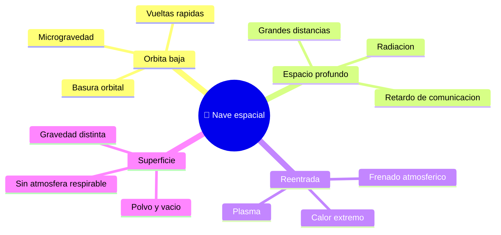

<!-- clase-meta
tipo_documento: clase
clase: 7
codigo: NAVESESPACIA-07
curso: naves-espaciales
titulo: "Entornos de trabajo de la nave espacial"
modalidad: "análisis de escenarios"
duracion_minutos: 60
nivel: introductorio
prerrequisito: NAVESESPACIA-06
competencia: "adaptacion_al_entorno"
resultados_aprendizaje:
  - "Explicar entornos, factores ambientales, riesgos y respuesta de simulación con vocabulario propio de Naves espaciales."
  - "Aplicar esos conceptos a una decisión segura o a un escenario de simulación de Naves espaciales."
evidencia: "Matriz entorno–cambio–riesgo–respuesta."
criterio_aprobacion: "Cada respuesta se adapta al entorno y distingue riesgos que no son intercambiables entre escenarios."
fuentes: manuales/fuentes.md
ultima_revision: 2026-09-10
-->

# 🌍 Entornos de trabajo de la nave espacial

[🏠 Inicio](../../../README.md) · [🚀 Curso: Naves espaciales](../README.md) · 🌍 Entornos

Dónde opera una nave espacial y cómo cambian las condiciones según el entorno.
Cada entorno implica riesgos y ajustes distintos, y en simulación se traduce en
escenarios diferentes, siempre separando ciencia real de ficción.

---

## 🗺️ Entornos principales

```mermaid
mindmap
  root((🚀 Nave espacial))
    Orbita baja
      Microgravedad
      Vueltas rapidas
      Basura orbital
    Espacio profundo
      Grandes distancias
      Retardo de comunicacion
      Radiacion
    Reentrada
      Calor extremo
      Frenado atmosferico
      Plasma
    Superficie
      Gravedad distinta
      Polvo y vacio
      Sin atmosfera respirable
```

| Entorno | Características | Riesgos típicos | Ajuste de operación |
| --- | --- | --- | --- |
| Órbita baja | Microgravedad, órbita rápida. | Basura orbital, radiación parcial. | Control de actitud, gestión de recursos. |
| Espacio profundo | Grandes distancias, poca luz. | Retardo de comunicación, radiación. | Autonomía y planificación de energía. |
| Reentrada | Calor y frenado por el aire. | Sobrecalentamiento, mala orientación. | Escudo térmico al frente, ángulo correcto. |
| Superficie (Luna, Marte) | Gravedad menor, vacío o poca atmósfera. | Polvo, temperatura, sin aire. | Trajes, soporte vital, descenso controlado. |
| Escenario de ficción | Reglas inventadas. | Confundir con la realidad. | Marcar siempre como ficción. |

---

## 🌦️ Factores del entorno

- **Vacío**: sin aire no hay sustentación ni convección; el calor se maneja distinto.
- **Temperatura**: mucho calor al Sol y mucho frío a la sombra.
- **Radiación**: fuera de la atmósfera aumenta y afecta a personas y equipos.
- **Distancia**: cuanto más lejos, mayor el retardo de las comunicaciones.

---

## 🎮 Traducción a simulación

Cada entorno es un escenario con su gravedad, su radiación y su régimen de órbita
o reentrada. Ver cómo se modela en el
[Clase 9: Diseño de simulación](../simulacion/diseno-simulador-nave-espacial.md).

## 🧭 Guía de estudio aplicada

### Pregunta guía

¿Cómo ayuda **Entornos principales, Factores del entorno, Traducción a simulación y Guía de estudio aplicada** a **adaptar maniobra de aproximación orbital con combustible de reserva limitado a tres condiciones ambientales distintas**?

### Explicación razonada

El entorno no es decoración: modifica las fuerzas, la percepción y el tiempo disponible. En el caso «maniobra de aproximación orbital con combustible de reserva limitado», cambia el comportamiento de órbita o trayectoria y aumenta la probabilidad de colisión o imposibilidad de retirada por quemado mal orientado o tardío. La respuesta correcta empieza por reconocer qué variable cambió y después adaptar límites, ruta o misión.

Esta clase se conecta con el resto del curso mediante **pequeños cambios de velocidad producen cambios acumulativos de órbita y ventanas de encuentro**. El hilo de
seguridad consiste en reconocer a tiempo **colisión o imposibilidad de retirada por quemado mal orientado o tardío** y poder justificar la decisión
**verificar marco de referencia, ventana, delta-v y opción de aborto antes del encendido**; en clases posteriores cambiará el ángulo de análisis, no esa relación causal.
La lectura funcional común sigue **fuente de energía → propulsión → navegación y control → órbita o trayectoria**, de modo que cada concepto pueda
ubicarse dentro del funcionamiento completo y no quede como un dato aislado.

**Apoyo documental:** [Spaceships and Rockets](https://www.nasa.gov/humans-in-space/spaceships-and-rockets/) aporta naves, sistemas y misiones;
[Space Law Treaties and Principles](https://www.unoosa.org/oosa/SpaceLaw/treaties.html) se usa para derecho espacial internacional. Estas fuentes
se contrastan con el alcance de la clase y no sustituyen un manual de equipo concreto.

### Caso resuelto: de la observación a la decisión

1. **Escenario base:** conserva la misión «maniobra de aproximación orbital con combustible de reserva limitado» para poder comparar.
2. **Cambiar una condición:** modifica sucesivamente superficie o medio, visibilidad y perturbación externa.
3. **Recalcular margen:** explica cómo cada cambio afecta **órbita o trayectoria** y acerca o aleja **colisión o imposibilidad de retirada por quemado mal orientado o tardío**.
4. **Adaptar:** cambia límite, ruta, configuración o incluso cancela; no mantengas la misma respuesta por hábito.

### Comprueba tu comprensión

1. ¿Cómo cambiaría **órbita o trayectoria** si empeora la perturbación externa?
2. ¿Qué condición ambiental acerca más el escenario a **colisión o imposibilidad de retirada por quemado mal orientado o tardío**?
3. ¿Cuándo adaptarías la maniobra y cuándo la cancelarías?

Orientación para revisar tus respuestas

- La primera respuesta debe relacionar el eslabón elegido con un efecto posterior, no solo nombrarlo.
- La segunda debe proponer una señal medible u observable y explicar qué tendencia sería preocupante.
- La tercera debe cambiar al menos una variable de capacidad, mando, entorno o margen de seguridad.

## 🎓 Cierre de clase

- **Actividad:** Contrasta tres entornos de Naves espaciales a partir de entornos, factores ambientales, riesgos y respuesta de simulación y determina cómo cambian variables, percepción, riesgos y respuesta.
- **Evidencia:** Matriz entorno–cambio–riesgo–respuesta.
- **Criterio de aprobación:** Cada respuesta se adapta al entorno y distingue riesgos que no son intercambiables entre escenarios.
- **Transferencia:** explica qué cambiaría al pasar a otra variante de esta máquina.

### Fuentes de esta clase

- [NASA-SPACECRAFT](https://www.nasa.gov/humans-in-space/spaceships-and-rockets/): Spaceships and Rockets, NASA. Uso: naves, sistemas y misiones.
- [UNOOSA-TREATIES](https://www.unoosa.org/oosa/SpaceLaw/treaties.html): Space Law Treaties and Principles, UNOOSA. Uso: derecho espacial internacional.

> Las fuentes sostienen el marco conceptual y normativo; esta clase no reemplaza el manual
> del fabricante, la formación certificada ni la habilitación exigida para operar equipos reales.

---

[⬅️ Anterior: Principios y operación](principios-nave-espacial.md) · [➡️ Siguiente: Reglamentos](../reglamentos/reglamentos-nave-espacial.md)
