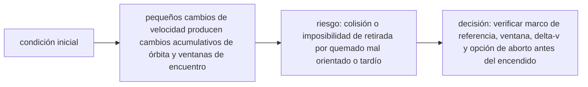

<!-- clase-meta
tipo_documento: clase
clase: 6
codigo: NAVESESPACIA-06
curso: naves-espaciales
titulo: "Principios y operación de la nave espacial"
modalidad: "resolución de problemas"
duracion_minutos: 90
nivel: introductorio
prerrequisito: NAVESESPACIA-05
competencia: "razonamiento_operacional"
resultados_aprendizaje:
  - "Explicar principios físicos, fases de operación, decisiones y errores frecuentes con vocabulario propio de Naves espaciales."
  - "Aplicar esos conceptos a una decisión segura o a un escenario de simulación de Naves espaciales."
evidencia: "Resolución argumentada de un escenario operacional."
criterio_aprobacion: "Aplica los principios correctos, anticipa consecuencias y respeta los límites del curso."
fuentes: manuales/fuentes.md
ultima_revision: 2026-09-10
-->

# 🧪 Principios y operación de la nave espacial

[🏠 Inicio](../../../README.md) · [🚀 Curso: Naves espaciales](../README.md) · 🧪 Principios

Documento general y educativo. Describe cómo se opera una nave espacial en
simulación y que principios físicos conviene representar, distinguiendo siempre la
ciencia real de la ficción.

## Principios de funcionamiento

- **Propulsión por reacción**: la nave avanza expulsando masa; vale la tercera ley
  de Newton y **no** necesita aire.
- **Órbita**: estar en órbita es caer de forma continua alrededor de la Tierra sin
  chocar, porque se avanza lo bastante rápido de lado.
- **Microgravedad**: en caída libre todo "flota"; no es ausencia de gravedad.
- **Delta-v**: cada maniobra gasta un presupuesto limitado de cambio de velocidad.
- **Reentrada**: al volver, la fricción con el aire genera calor; el escudo protege.

## La órbita en una idea

Si se lanza un objeto lo bastante rápido en horizontal, cae hacia la Tierra pero
la superficie se curva a la misma tasa: nunca llega al suelo. Eso es una órbita.

## Fases de operación

| Fase | Que ocurre | Puntos clave |
| --- | --- | --- |
| Prelanzamiento | Revisión y cuenta atrás | Checklist, propelente, sistemas vitales. |
| Lanzamiento | Despegue con gran empuje | Vencer gravedad y atmósfera densa. |
| Ascenso y etapas | Ganar velocidad orbital | Separar etapas al agotarse. |
| Inserción orbital | Alcanzar órbita estable | Velocidad de lado suficiente. |
| Operación en órbita | Cumplir la misión | Maniobras, acoplamiento, ciencia. |
| Desorbitación | Salir de la órbita | Frenar con el motor en el momento justo. |
| Reentrada | Volver a la atmósfera | Orientar el escudo, soportar el calor. |
| Aterrizaje / amerizaje | Tocar tierra o mar | Paracaídas o descenso propulsado. |

## Maniobra orbital: idea general

1. Toda maniobra cambia la órbita gastando **delta-v**.
2. Encender el motor a favor del movimiento sube la órbita opuesta.
3. Encenderlo en contra la baja; así se frena para reentrar.
4. El momento (donde en la órbita) importa tanto como la cantidad.
5. Sin propelente no hay maniobra: se planifica el presupuesto.

## Errores comunes que la simulación puede enseñar a evitar

- Pensar que en órbita "no hay gravedad" en vez de caída libre.
- Gastar todo el delta-v sin reserva para volver.
- Reentrar con mala orientación del escudo térmico.
- Ignorar el consumo de aire, agua y energía en misiones largas.
- Confundir capacidades reales con recursos de ficción.

## Relación con los niveles de realismo

- **Nivel 1 (educativo)**: lanzar, llegar a órbita y reentrar de forma guiada.
- **Nivel 2 (simplificado)**: agregar delta-v, órbitas y microgravedad.
- **Nivel 3 (técnico)**: sumar planificación de maniobras, acoplamiento y recursos.

Ver [`docs/03-niveles-de-realismo.md`](../../../docs/03-niveles-de-realismo.md) para el detalle de cada nivel.

## 🧭 Guía de estudio aplicada

### Pregunta guía

¿Cómo ayuda **Principios de funcionamiento, La órbita en una idea, Fases de operación y Maniobra orbital: idea general** a **resolver maniobra de aproximación orbital con combustible de reserva limitado sin agotar el margen operacional**?

### Explicación razonada

El principio rector puede resumirse así: pequeños cambios de velocidad producen cambios acumulativos de órbita y ventanas de encuentro. Esto explica por qué una misma orden produce resultados distintos cuando cambian velocidad, carga, configuración o entorno. Operar bien consiste en leer la tendencia antes de agotar el margen y tomar esta decisión: verificar marco de referencia, ventana, delta-v y opción de aborto antes del encendido.

Esta clase se conecta con el resto del curso mediante **pequeños cambios de velocidad producen cambios acumulativos de órbita y ventanas de encuentro**. El hilo de
seguridad consiste en reconocer a tiempo **colisión o imposibilidad de retirada por quemado mal orientado o tardío** y poder justificar la decisión
**verificar marco de referencia, ventana, delta-v y opción de aborto antes del encendido**; en clases posteriores cambiará el ángulo de análisis, no esa relación causal.
La lectura funcional común sigue **fuente de energía → propulsión → navegación y control → órbita o trayectoria**, de modo que cada concepto pueda
ubicarse dentro del funcionamiento completo y no quede como un dato aislado.

**Apoyo documental:** [Spaceships and Rockets](https://www.nasa.gov/humans-in-space/spaceships-and-rockets/) aporta naves, sistemas y misiones;
[Space Law Treaties and Principles](https://www.unoosa.org/oosa/SpaceLaw/treaties.html) se usa para derecho espacial internacional. Estas fuentes
se contrastan con el alcance de la clase y no sustituyen un manual de equipo concreto.

### Caso resuelto: de la observación a la decisión

1. **Datos:** reconoce condiciones, configuración y margen disponibles en **maniobra de aproximación orbital con combustible de reserva limitado**.
2. **Modelo:** aplica **pequeños cambios de velocidad producen cambios acumulativos de órbita y ventanas de encuentro** para predecir una tendencia antes de actuar.
3. **Riesgo:** explica mediante qué cadena de causas podría ocurrir **colisión o imposibilidad de retirada por quemado mal orientado o tardío**.
4. **Decisión:** ejecuta mentalmente **verificar marco de referencia, ventana, delta-v y opción de aborto antes del encendido** y define qué observación confirmaría que funcionó.

### Comprueba tu comprensión

1. ¿Qué variable del principio «pequeños cambios de velocidad producen cambios acumulativos de órbita y ventanas de encuentro» cambia primero en el caso?
2. ¿Cómo se propaga ese cambio hasta **órbita o trayectoria**?
3. ¿Qué evidencia confirmaría que **verificar marco de referencia, ventana, delta-v y opción de aborto antes del encendido** conservó margen operacional?

Orientación para revisar tus respuestas

- La primera respuesta debe relacionar el eslabón elegido con un efecto posterior, no solo nombrarlo.
- La segunda debe proponer una señal medible u observable y explicar qué tendencia sería preocupante.
- La tercera debe cambiar al menos una variable de capacidad, mando, entorno o margen de seguridad.

## 🎓 Cierre de clase

- **Actividad:** Resuelve un escenario de Naves espaciales explicando, paso a paso, cómo intervienen principios físicos, fases de operación, decisiones y errores frecuentes.
- **Evidencia:** Resolución argumentada de un escenario operacional.
- **Criterio de aprobación:** Aplica los principios correctos, anticipa consecuencias y respeta los límites del curso.
- **Transferencia:** explica qué cambiaría al pasar a otra variante de esta máquina.

### Fuentes de esta clase

- [NASA-SPACECRAFT](https://www.nasa.gov/humans-in-space/spaceships-and-rockets/): Spaceships and Rockets, NASA. Uso: naves, sistemas y misiones.
- [UNOOSA-TREATIES](https://www.unoosa.org/oosa/SpaceLaw/treaties.html): Space Law Treaties and Principles, UNOOSA. Uso: derecho espacial internacional.

> Las fuentes sostienen el marco conceptual y normativo; esta clase no reemplaza el manual
> del fabricante, la formación certificada ni la habilitación exigida para operar equipos reales.

---

[⬅️ Anterior: Mandos](../mandos/manual-mandos-nave-espacial.md) · [➡️ Siguiente: Entornos de trabajo](entornos-nave-espacial.md)
