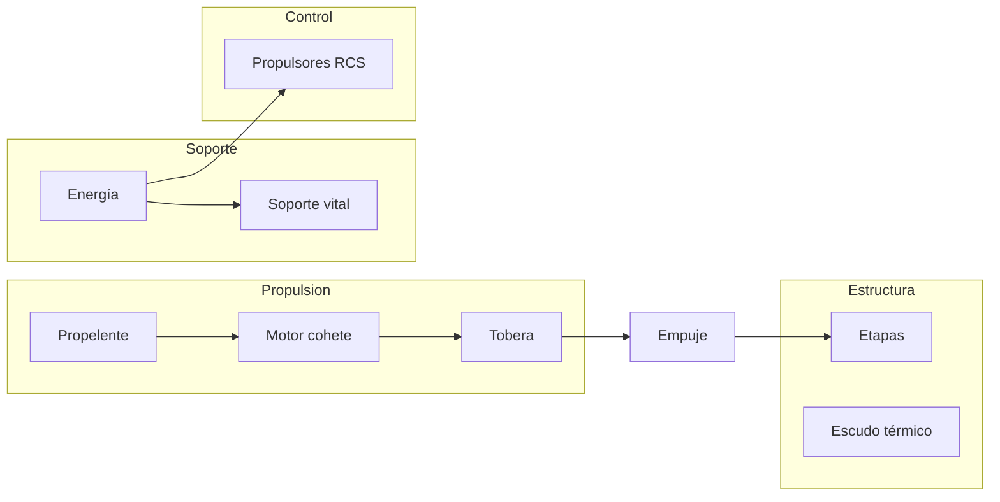
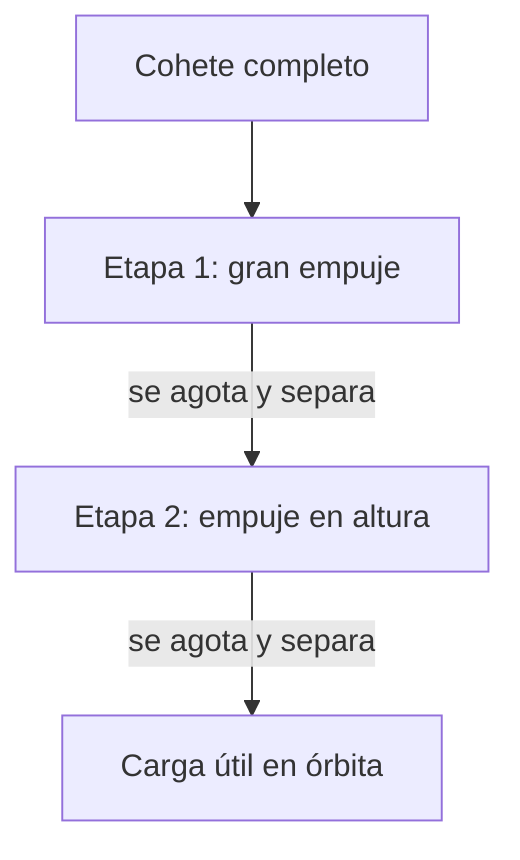
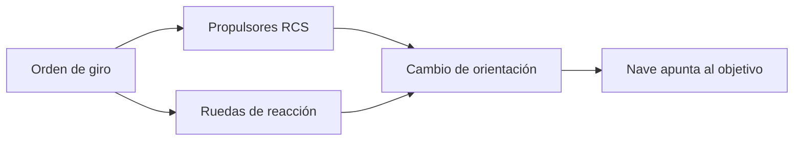

# 🔧 Sistemas mecánicos de la nave espacial

[🏠 Inicio](../../../README.md) · [🚀 Curso: Naves espaciales](../README.md) · 🔧 Sistemas mecánicos

Este módulo abre la nave por dentro. Explica cada sistema, como funciona y cómo se
conecta con los demás, distinguiendo ciencia real de ficción. Es la base técnica
para entender los mandos (Módulo 4) y la física orbital (Módulo 5).

---

## 1. 🔥 Propulsión cohete

El motor cohete impulsa la nave expulsando gases a gran velocidad. A diferencia de
un avión, **no** necesita aire: lleva su propio oxidante.

| Componente | Función |
| --- | --- |
| Combustible | Materia que se quema o expulsa. |
| Oxidante | Aporta el oxígeno para quemar sin aire externo. |
| Cámara de combustión | Dónde se quema la mezcla y sube la presión. |
| Tobera | Acelera los gases y convierte presión en empuje. |
| Presupuesto de delta-v | Cambio total de velocidad que la nave puede lograr. |

- **Propulsión química** (real): gran empuje, ideal para despegar.
- **Propulsión eléctrica / ionica** (real): poco empuje, muy eficiente, para el espacio.
- **Propulsión de ficción**: motores de "curvatura" y similares, solo como escenario.

---

## 2. 🪜 Etapas y separación

Un cohete se divide en etapas para no cargar peso muerto. Cada etapa se separa al
agotarse.

| Elemento | Función |
| --- | --- |
| Etapa inferior | Vence la gravedad y el aire densos del despegue. |
| Etapa superior | Da la velocidad final para la órbita. |
| Separación | Suelta la masa vacía para ganar eficiencia. |
| Carga útil | Lo que se pone en órbita (satélite, cápsula). |

---

## 3. 🧑‍🚀 Soporte vital

Mantiene a la tripulación viva donde no hay aire ni presión.

| Subsistema | Función |
| --- | --- |
| Aire y presión | Provee oxígeno y mantiene la cabina presurizada. |
| Control de CO2 | Retira el dioxido de carbono que exhala la tripulación. |
| Agua | Almacena y a veces recicla el agua. |
| Control térmico | Regula la temperatura interior. |
| Residuos | Gestiona los desechos en microgravedad. |

En misiones largas, reciclar aire y agua es clave: no hay como reabastecerse.

---

## 4. 🔋 Energía

Alimenta todos los sistemas de a bordo.

- **Paneles solares** (real): convierten la luz del Sol en electricidad.
- **Baterías**: almacenan energía para la fase de sombra.
- **Pilas de combustible**: generan electricidad y agua como subproducto.
- **Generadores nucleares** (real, en sondas lejanas): energía donde el Sol es débil.

---

## 5. 🎯 Control de actitud

Orienta la nave en el espacio, donde no hay aire para usar timones.

| Sistema | Función |
| --- | --- |
| Propulsores RCS | Pequeños chorros que giran o trasladan la nave. |
| Ruedas de reacción | Giran masas internas para orientar sin gastar propelente. |
| Sensores de actitud | Estrellas, Sol y giróscopos indican la orientación. |
| Escudo térmico | Protege en la reentrada, no es control pero es estructura clave. |

---

## 🔁 Cómo se conecta todo

1. La **propulsión** da el empuje para despegar y maniobrar.
2. Las **etapas** sueltan peso muerto para llegar a la **órbita**.
3. El **soporte vital** mantiene viva a la tripulación.
4. La **energía** alimenta todos los sistemas.
5. El **control de actitud** orienta la nave sin aire.
6. El **escudo térmico** protege en la **reentrada**.

Con esto entendido, el [Módulo 4: Mandos](../mandos/manual-mandos-nave-espacial.md)
muestra cómo la tripulación opera estos sistemas.

---

[⬅️ Anterior: Características](caracteristicas-nave-espacial.md) · [➡️ Siguiente: Mandos e instrumentos](../mandos/manual-mandos-nave-espacial.md)
