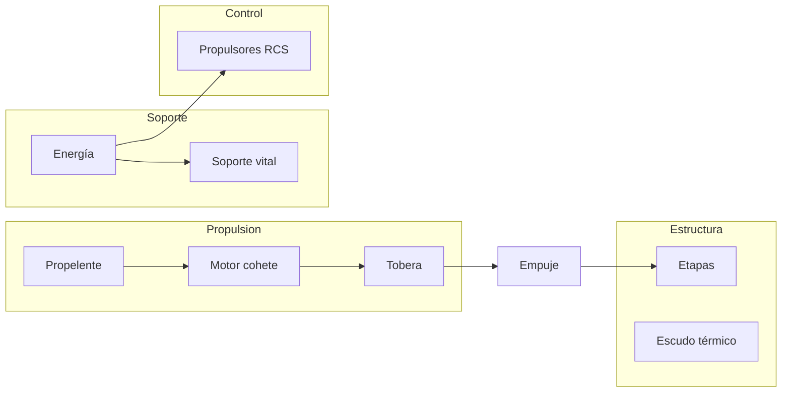
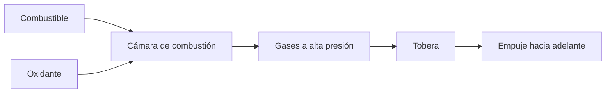
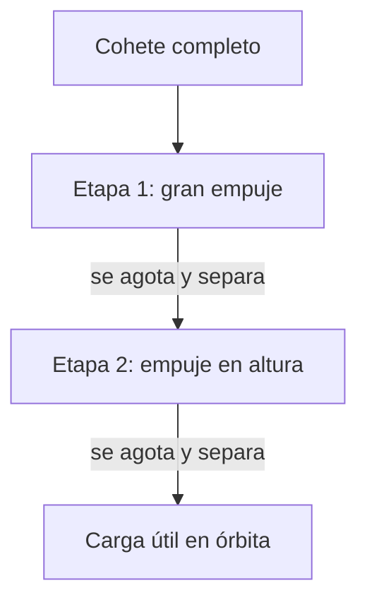
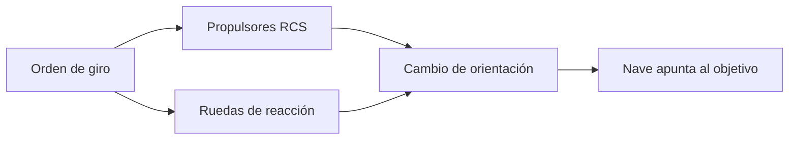
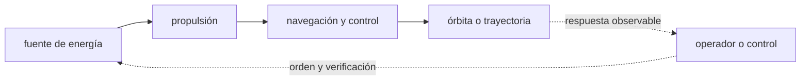

<!-- clase-meta
tipo_documento: clase
clase: 4
codigo: NAVESESPACIA-04
curso: naves-espaciales
titulo: "Sistemas mecánicos de la nave espacial"
modalidad: "teórica aplicada"
duracion_minutos: 90
nivel: introductorio
prerrequisito: NAVESESPACIA-03
competencia: "comprension_de_sistemas"
resultados_aprendizaje:
  - "Explicar Propulsión cohete, Etapas y separación, Soporte vital y Energía con vocabulario propio de Naves espaciales."
  - "Aplicar esos conceptos a una decisión segura o a un escenario de simulación de Naves espaciales."
evidencia: "Esquema con flujos de energía, materia o información anotados."
criterio_aprobacion: "Las conexiones esenciales son correctas y la consecuencia de la falla se propaga de manera coherente."
fuentes: manuales/fuentes.md
ultima_revision: 2026-09-10
-->

# 🔧 Sistemas mecánicos de la nave espacial

[🏠 Inicio](../../../README.md) · [🚀 Curso: Naves espaciales](../README.md) · 🔧 Sistemas mecánicos

Esta clase abre la nave por dentro. Explica cada sistema, como funciona y cómo se
conecta con los demás, distinguiendo ciencia real de ficción. Es la base técnica
para entender los mandos (Clase 5) y la física orbital (Clase 6).

```mermaid
flowchart LR
    subgraph Propulsion
        Prop[Propelente] --> Motor[Motor cohete]
        Motor --> Tobera[Tobera]
    end
    subgraph Estructura
        Etapas[Etapas]
        Escudo[Escudo térmico]
    end
    subgraph Soporte
        Vital[Soporte vital]
        Energia[Energía]
    end
    subgraph Control
        RCS[Propulsores RCS]
    end
    Tobera --> Empuje[Empuje]
    Empuje --> Etapas
    Energia --> Vital
    Energia --> RCS
```

---

## 1. 🔥 Propulsión cohete

El motor cohete impulsa la nave expulsando gases a gran velocidad. A diferencia de
un avión, **no** necesita aire: lleva su propio oxidante.

```mermaid
flowchart LR
    Comb[Combustible] --> Camara[Cámara de combustión]
    Oxid[Oxidante] --> Camara
    Camara --> Gases[Gases a alta presión]
    Gases --> Tobera[Tobera]
    Tobera --> Empuje[Empuje hacia adelante]
```

| Componente | Función |
| --- | --- |
| Combustible | Materia que se quema o expulsa. |
| Oxidante | Aporta el oxígeno para quemar sin aire externo. |
| Cámara de combustión | Dónde se quema la mezcla y sube la presión. |
| Tobera | Acelera los gases y convierte presión en empuje. |
| Presupuesto de delta-v | Cambio total de velocidad que la nave puede lograr. |

- **Propulsión química** (real): gran empuje, ideal para despegar.
- **Propulsión eléctrica / ionica** (real): poco empuje, muy eficiente, para el espacio.
- **Propulsión de ficción**: motores de "curvatura" y similares, solo como escenario.

---

## 2. 🪜 Etapas y separación

Un cohete se divide en etapas para no cargar peso muerto. Cada etapa se separa al
agotarse.

```mermaid
flowchart TD
    Total[Cohete completo] --> E1[Etapa 1: gran empuje]
    E1 -->|se agota y separa| E2[Etapa 2: empuje en altura]
    E2 -->|se agota y separa| Carga[Carga útil en órbita]
```

| Elemento | Función |
| --- | --- |
| Etapa inferior | Vence la gravedad y el aire densos del despegue. |
| Etapa superior | Da la velocidad final para la órbita. |
| Separación | Suelta la masa vacía para ganar eficiencia. |
| Carga útil | Lo que se pone en órbita (satélite, cápsula). |

---

## 3. 🧑‍🚀 Soporte vital

Mantiene a la tripulación viva donde no hay aire ni presión.

| Subsistema | Función |
| --- | --- |
| Aire y presión | Provee oxígeno y mantiene la cabina presurizada. |
| Control de CO2 | Retira el dioxido de carbono que exhala la tripulación. |
| Agua | Almacena y a veces recicla el agua. |
| Control térmico | Regula la temperatura interior. |
| Residuos | Gestiona los desechos en microgravedad. |

En misiones largas, reciclar aire y agua es clave: no hay como reabastecerse.

---

## 4. 🔋 Energía

Alimenta todos los sistemas de a bordo.

- **Paneles solares** (real): convierten la luz del Sol en electricidad.
- **Baterías**: almacenan energía para la fase de sombra.
- **Pilas de combustible**: generan electricidad y agua como subproducto.
- **Generadores nucleares** (real, en sondas lejanas): energía donde el Sol es débil.

---

## 5. 🎯 Control de actitud

Orienta la nave en el espacio, donde no hay aire para usar timones.

```mermaid
flowchart LR
    Orden[Orden de giro] --> RCS[Propulsores RCS]
    Orden --> Ruedas[Ruedas de reacción]
    RCS --> Giro[Cambio de orientación]
    Ruedas --> Giro
    Giro --> Apunta[Nave apunta al objetivo]
```

| Sistema | Función |
| --- | --- |
| Propulsores RCS | Pequeños chorros que giran o trasladan la nave. |
| Ruedas de reacción | Giran masas internas para orientar sin gastar propelente. |
| Sensores de actitud | Estrellas, Sol y giróscopos indican la orientación. |
| Escudo térmico | Protege en la reentrada, no es control pero es estructura clave. |

---

## 🔁 Cómo se conecta todo

1. La **propulsión** da el empuje para despegar y maniobrar.
2. Las **etapas** sueltan peso muerto para llegar a la **órbita**.
3. El **soporte vital** mantiene viva a la tripulación.
4. La **energía** alimenta todos los sistemas.
5. El **control de actitud** orienta la nave sin aire.
6. El **escudo térmico** protege en la **reentrada**.

Con esto entendido, el [Clase 5: Mandos](../mandos/manual-mandos-nave-espacial.md)
muestra cómo la tripulación opera estos sistemas.

## 🧭 Guía de estudio aplicada

### Pregunta guía

¿Cómo ayuda **Propulsión cohete, Etapas y separación, Soporte vital y Energía** a **seguir una alteración desde fuente de energía hasta órbita o trayectoria durante maniobra de aproximación orbital con combustible de reserva limitado**?

### Explicación razonada

El funcionamiento puede leerse como una cadena causal: fuente de energía entrega o transforma energía; propulsión la adapta; navegación y control la transmite o gobierna; y órbita o trayectoria produce el efecto observable. La cadena no es lineal en sentido estricto: sensores, estructura y operador cierran el lazo. Si un eslabón se degrada, la señal importante es cómo cambia el estado de órbita o trayectoria y qué margen queda.

```mermaid
flowchart LR
    A["fuente de energía"] --> B["propulsión"] --> C["navegación y control"] --> D["órbita o trayectoria"]
    D -. respuesta observable .-> O["operador o control"]
    O -. orden y verificación .-> A
```

Esta clase se conecta con el resto del curso mediante **pequeños cambios de velocidad producen cambios acumulativos de órbita y ventanas de encuentro**. El hilo de
seguridad consiste en reconocer a tiempo **colisión o imposibilidad de retirada por quemado mal orientado o tardío** y poder justificar la decisión
**verificar marco de referencia, ventana, delta-v y opción de aborto antes del encendido**; en clases posteriores cambiará el ángulo de análisis, no esa relación causal.
La lectura funcional común sigue **fuente de energía → propulsión → navegación y control → órbita o trayectoria**, de modo que cada concepto pueda
ubicarse dentro del funcionamiento completo y no quede como un dato aislado.

**Apoyo documental:** [Spaceships and Rockets](https://www.nasa.gov/humans-in-space/spaceships-and-rockets/) aporta naves, sistemas y misiones;
[Space Law Treaties and Principles](https://www.unoosa.org/oosa/SpaceLaw/treaties.html) se usa para derecho espacial internacional. Estas fuentes
se contrastan con el alcance de la clase y no sustituyen un manual de equipo concreto.

### Caso resuelto: de la observación a la decisión

1. **Entrada:** identifica el estado inicial de **fuente de energía** durante **maniobra de aproximación orbital con combustible de reserva limitado**.
2. **Transformación:** explica qué hacen **propulsión** y **navegación y control**, y qué magnitud cambia en cada paso.
3. **Salida:** comprueba el efecto esperado en **órbita o trayectoria** y busca una desviación temprana.
4. **Falla razonada:** si aparece **colisión o imposibilidad de retirada por quemado mal orientado o tardío**, retrocede por la cadena antes de ordenar otra acción.

### Comprueba tu comprensión

1. Si se degrada **propulsión**, ¿qué efecto esperarías primero en **navegación y control** y después en **órbita o trayectoria**?
2. ¿Qué observación ayudaría a diferenciar una falla de **fuente de energía** de una falla de **navegación y control**?
3. ¿Por qué una segunda orden podría agravar **colisión o imposibilidad de retirada por quemado mal orientado o tardío**?

Orientación para revisar tus respuestas

- La primera respuesta debe relacionar el eslabón elegido con un efecto posterior, no solo nombrarlo.
- La segunda debe proponer una señal medible u observable y explicar qué tendencia sería preocupante.
- La tercera debe cambiar al menos una variable de capacidad, mando, entorno o margen de seguridad.

## 🎓 Cierre de clase

- **Actividad:** Dibuja un esquema funcional de Naves espaciales que conecte Propulsión cohete, Etapas y separación, Soporte vital y Energía; después predice el efecto de una falla simulada.
- **Evidencia:** Esquema con flujos de energía, materia o información anotados.
- **Criterio de aprobación:** Las conexiones esenciales son correctas y la consecuencia de la falla se propaga de manera coherente.
- **Transferencia:** explica qué cambiaría al pasar a otra variante de esta máquina.

### Fuentes de esta clase

- [NASA-SPACECRAFT](https://www.nasa.gov/humans-in-space/spaceships-and-rockets/): Spaceships and Rockets, NASA. Uso: naves, sistemas y misiones.
- [UNOOSA-TREATIES](https://www.unoosa.org/oosa/SpaceLaw/treaties.html): Space Law Treaties and Principles, UNOOSA. Uso: derecho espacial internacional.

> Las fuentes sostienen el marco conceptual y normativo; esta clase no reemplaza el manual
> del fabricante, la formación certificada ni la habilitación exigida para operar equipos reales.

---

[⬅️ Anterior: Modelos y variantes](../modelos/modelos-nave-espacial.md) · [➡️ Siguiente: Mandos e instrumentos](../mandos/manual-mandos-nave-espacial.md)
