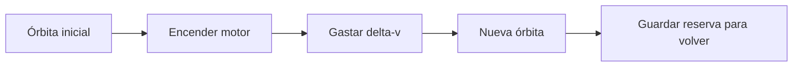

# 🧰 Recursos de la nave espacial

[🏠 Inicio](../../../README.md) · [🚀 Curso: Naves espaciales](../README.md) · 🧰 Recursos

Glosario específico, enlaces y diagramas de apoyo del curso de naves espaciales.
Amplia el [glosario general](../../../docs/05-glosario-general.md).

---

## 📖 Glosario específico

| Término | Definición |
| --- | --- |
| Órbita | Trayectoria de caída libre continua alrededor de un cuerpo. |
| Delta-v | Cambio total de velocidad que una nave puede lograr; mide su capacidad de maniobra. |
| Microgravedad | Estado de caída libre en que los objetos parecen flotar. |
| Propelente | Masa que la nave expulsa para propulsarse. |
| Oxidante | Sustancia que aporta oxígeno para quemar sin aire externo. |
| RCS | Sistema de propulsores pequeños para orientar y trasladar la nave. |
| Reentrada | Regreso a la atmósfera, con calor por fricción. |
| Escudo térmico | Protección que soporta el calor de la reentrada. |
| Apogeo y perigeo | Puntos más alto y más bajo de una órbita. |

---

## 🗺️ Diagrama de una maniobra orbital

---

## 🔗 Enlaces y fuentes

- Marco legal: [⚖️ docs/07-marco-legal-chile.md](../../../docs/07-marco-legal-chile.md)
- Seguridad y límites: [🦺 docs/04-seguridad-y-limites.md](../../../docs/04-seguridad-y-limites.md)
- Registro de fuentes: [📚 manuales/fuentes.md](../../../manuales/fuentes.md)

Registrar cada recurso nuevo con su origen y licencia, siguiendo
[`recursos/README.md`](../../../recursos/README.md). Distinguir siempre fuentes de
ciencia real de material de ficción.

---

[🎓 Portada del curso](../README.md) · [⬅️ Anterior: Diseño de simulación](../simulacion/diseno-simulador-nave-espacial.md) · [➡️ Siguiente: Ejercicios](../ejercicios/ejercicios-nave-espacial.md)
