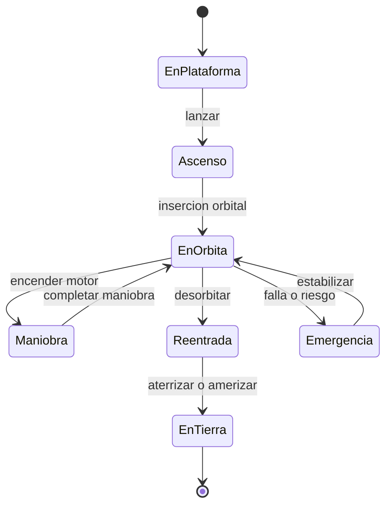

# 🎮 Diseño de simulación de la nave espacial

[🏠 Inicio](../../../README.md) · [🚀 Curso: Naves espaciales](../README.md) · 🎮 Simulación

Simulación educativa del vuelo espacial. Separa siempre la ciencia real de la
ficción: la física orbital se modela con rigor y los elementos inventados se
marcan como escenario.

## Objetivo de la simulación

Que el usuario aprenda a lanzar, alcanzar una órbita estable, planificar maniobras
con delta-v, gestionar energía y soporte vital, y reentrar con seguridad,
entendiendo la física orbital real.

## Nivel de realismo

- Nivel elegido: se ofrece del 1 al 3 (ver `docs/03-niveles-de-realismo.md`).
- Justificación: la mecánica orbital es el tema más abstracto del repositorio, por
  lo que se recomienda como vehículo avanzado.

## Variables principales

| Variable | Tipo | Rango | Afecta a | Comentarios |
| --- | --- | --- | --- | --- |
| Altitud orbital | numérica | 0-2000 km | Forma de la órbita | Apogeo y perigeo. |
| Velocidad orbital | numérica | 0-11 km/s | Estabilidad de la órbita | Alta cerca de la Tierra. |
| Delta-v disponible | numérica | 0-9000 m/s | Capacidad de maniobra | Depende del propelente. |
| Actitud | vectorial | 3 ejes | Orientación | Controlada por RCS y ruedas. |
| Propelente | numérica | 0-100% | Delta-v y empuje | Limitado, se planifica. |
| Recursos vitales | numérica | 0-100% | Tripulación | Aire, agua, CO2, energía. |
| Temperatura del escudo | numérica | 0-2000 grados | Reentrada | Crítica al reingresar. |
| Modo ciencia/ficción | discreta | real / ficción | Reglas físicas | Etiqueta el escenario. |

## Ciclo básico

1. Leer entrada del usuario (actitud, traslación, empuje, maniobras).
2. Actualizar propelente, energía y recursos vitales.
3. Calcular la física orbital (gravedad, velocidad, órbita).
4. Aplicar el entorno (atmósfera en reentrada, radiación, distancia).
5. Actualizar órbita, actitud y estado de la nave.
6. Refrescar instrumentos y alarmas (delta-v, recursos, temperatura).

## Modos de juego futuros

- Tutorial de lanzamiento y órbita básica.
- Práctica de maniobras orbitales con delta-v.
- Misiones de acoplamiento con una estación.
- Desafíos de reentrada y aterrizaje.
- Escenarios de ficción claramente marcados, sin mezclar con la ciencia real.

## Elementos fuera de alcance

- Presentar ficción como si fuera ciencia comprobada.
- Datos técnicos sensibles de sistemas de lanzamiento reales.
- Detalles de uso militar del espacio.
- Reproducción de operaciones peligrosas como si fueran seguras.

## Pendientes

- [ ] Definir valores por defecto de órbita y delta-v por tipo de nave.
- [ ] Prototipar el modelo de mecánica orbital simplificada.
- [ ] Ajustar el modelo de reentrada y calor del escudo.
- [ ] Agregar fuentes técnicas públicas a [`manuales/fuentes.md`](../../../manuales/fuentes.md).

---

[⬅️ Anterior: Reglamentos](../reglamentos/reglamentos-nave-espacial.md) · [➡️ Siguiente: Recursos](../recursos/recursos-nave-espacial.md)
