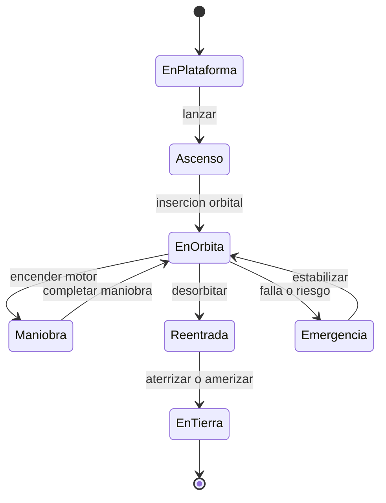
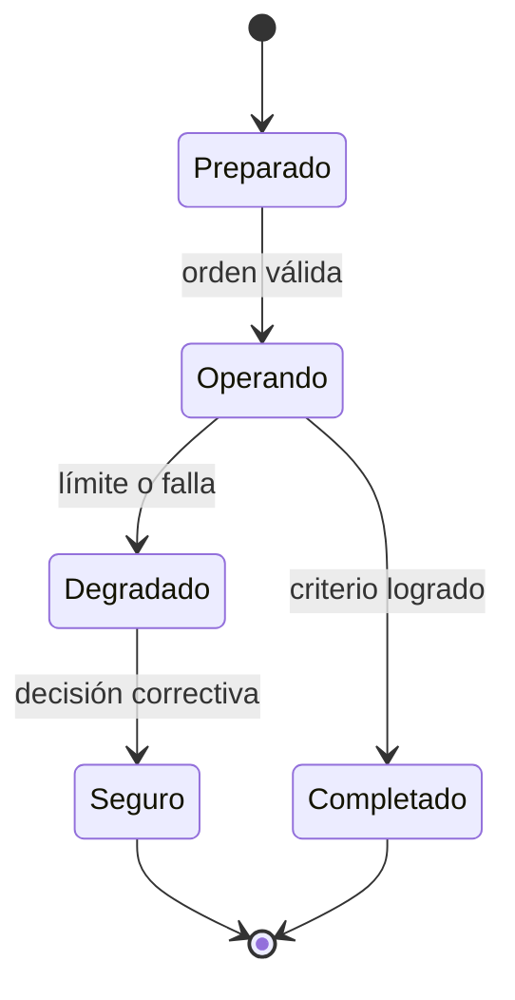

<!-- clase-meta
tipo_documento: clase
clase: 9
codigo: NAVESESPACIA-09
curso: naves-espaciales
titulo: "Diseño de simulación de la nave espacial"
modalidad: "laboratorio de diseño"
duracion_minutos: 90
nivel: introductorio
prerrequisito: NAVESESPACIA-08
competencia: "modelado_de_simulacion"
resultados_aprendizaje:
  - "Explicar objetivo, variables, estados, ciclo y escenarios de simulación con vocabulario propio de Naves espaciales."
  - "Aplicar esos conceptos a una decisión segura o a un escenario de simulación de Naves espaciales."
evidencia: "Ficha de escenario y diagrama de estados."
criterio_aprobacion: "El modelo es específico de la máquina, medible, seguro y trazable a clases anteriores."
fuentes: manuales/fuentes.md
ultima_revision: 2026-09-10
-->

# 🎮 Diseño de simulación de la nave espacial

[🏠 Inicio](../../../README.md) · [🚀 Curso: Naves espaciales](../README.md) · 🎮 Simulación

Simulación educativa del vuelo espacial. Separa siempre la ciencia real de la
ficción: la física orbital se modela con rigor y los elementos inventados se
marcan como escenario.

```mermaid
stateDiagram-v2
    [*] --> EnPlataforma
    EnPlataforma --> Ascenso: lanzar
    Ascenso --> EnOrbita: insercion orbital
    EnOrbita --> Maniobra: encender motor
    Maniobra --> EnOrbita: completar maniobra
    EnOrbita --> Reentrada: desorbitar
    Reentrada --> EnTierra: aterrizar o amerizar
    EnOrbita --> Emergencia: falla o riesgo
    Emergencia --> EnOrbita: estabilizar
    EnTierra --> [*]
```

## Objetivo de la simulación

Que el usuario aprenda a lanzar, alcanzar una órbita estable, planificar maniobras
con delta-v, gestionar energía y soporte vital, y reentrar con seguridad,
entendiendo la física orbital real.

## Nivel de realismo

- Nivel elegido: se ofrece del 1 al 3 (ver `docs/03-niveles-de-realismo.md`).
- Justificación: la mecánica orbital es el tema más abstracto del repositorio, por
  lo que se recomienda como vehículo avanzado.

## Variables principales

| Variable | Tipo | Rango | Afecta a | Comentarios |
| --- | --- | --- | --- | --- |
| Altitud orbital | numérica | 0-2000 km | Forma de la órbita | Apogeo y perigeo. |
| Velocidad orbital | numérica | 0-11 km/s | Estabilidad de la órbita | Alta cerca de la Tierra. |
| Delta-v disponible | numérica | 0-9000 m/s | Capacidad de maniobra | Depende del propelente. |
| Actitud | vectorial | 3 ejes | Orientación | Controlada por RCS y ruedas. |
| Propelente | numérica | 0-100% | Delta-v y empuje | Limitado, se planifica. |
| Recursos vitales | numérica | 0-100% | Tripulación | Aire, agua, CO2, energía. |
| Temperatura del escudo | numérica | 0-2000 grados | Reentrada | Crítica al reingresar. |
| Modo ciencia/ficción | discreta | real / ficción | Reglas físicas | Etiqueta el escenario. |

## Ciclo básico

1. Leer entrada del usuario (actitud, traslación, empuje, maniobras).
2. Actualizar propelente, energía y recursos vitales.
3. Calcular la física orbital (gravedad, velocidad, órbita).
4. Aplicar el entorno (atmósfera en reentrada, radiación, distancia).
5. Actualizar órbita, actitud y estado de la nave.
6. Refrescar instrumentos y alarmas (delta-v, recursos, temperatura).

## Modos de juego futuros

- Tutorial de lanzamiento y órbita básica.
- Práctica de maniobras orbitales con delta-v.
- Misiones de acoplamiento con una estación.
- Desafíos de reentrada y aterrizaje.
- Escenarios de ficción claramente marcados, sin mezclar con la ciencia real.

## Elementos fuera de alcance

- Presentar ficción como si fuera ciencia comprobada.
- Datos técnicos sensibles de sistemas de lanzamiento reales.
- Detalles de uso militar del espacio.
- Reproducción de operaciones peligrosas como si fueran seguras.

## Pendientes

- [ ] Definir valores por defecto de órbita y delta-v por tipo de nave.
- [ ] Prototipar el modelo de mecánica orbital simplificada.
- [ ] Ajustar el modelo de reentrada y calor del escudo.
- [ ] Agregar fuentes técnicas públicas a [`manuales/fuentes.md`](../../../manuales/fuentes.md).

## 🧭 Guía de estudio aplicada

### Pregunta guía

¿Cómo ayuda **Objetivo de la simulación, Nivel de realismo, Variables principales y Ciclo básico** a **modelar maniobra de aproximación orbital con combustible de reserva limitado como estados, variables y decisiones observables**?

### Explicación razonada

Una simulación de Naves espaciales es educativa si representa decisiones y consecuencias. Como mínimo debe modelar el estado de fuente de energía, la respuesta de propulsión, la transición en navegación y control y el resultado en órbita o trayectoria. El escenario «maniobra de aproximación orbital con combustible de reserva limitado» es valioso porque obliga a observar, formular una hipótesis, actuar y comprobar.

```mermaid
stateDiagram-v2
    [*] --> Preparado
    Preparado --> Operando: orden válida
    Operando --> Degradado: límite o falla
    Degradado --> Seguro: decisión correctiva
    Operando --> Completado: criterio logrado
    Seguro --> [*]
    Completado --> [*]
```

Esta clase se conecta con el resto del curso mediante **pequeños cambios de velocidad producen cambios acumulativos de órbita y ventanas de encuentro**. El hilo de
seguridad consiste en reconocer a tiempo **colisión o imposibilidad de retirada por quemado mal orientado o tardío** y poder justificar la decisión
**verificar marco de referencia, ventana, delta-v y opción de aborto antes del encendido**; en clases posteriores cambiará el ángulo de análisis, no esa relación causal.
La lectura funcional común sigue **fuente de energía → propulsión → navegación y control → órbita o trayectoria**, de modo que cada concepto pueda
ubicarse dentro del funcionamiento completo y no quede como un dato aislado.

**Apoyo documental:** [Spaceships and Rockets](https://www.nasa.gov/humans-in-space/spaceships-and-rockets/) aporta naves, sistemas y misiones;
[Space Law Treaties and Principles](https://www.unoosa.org/oosa/SpaceLaw/treaties.html) se usa para derecho espacial internacional. Estas fuentes
se contrastan con el alcance de la clase y no sustituyen un manual de equipo concreto.

### Caso resuelto: de la observación a la decisión

1. **Estado inicial:** representa maniobra de aproximación orbital con combustible de reserva limitado con valores observables para **fuente de energía**, **propulsión**, **navegación y control** y **órbita o trayectoria**.
2. **Decisión del estudiante:** ofrece una elección que cambie el estado, no una animación automática.
3. **Consecuencia:** modela la tendencia hacia **colisión o imposibilidad de retirada por quemado mal orientado o tardío** y una señal previa que permita corregir.
4. **Cierre:** evalúa la explicación de la decisión, además de si el estudiante “ganó” el escenario.

### Comprueba tu comprensión

1. ¿Qué cuatro estados mínimos necesita el escenario «maniobra de aproximación orbital con combustible de reserva limitado»?
2. ¿Qué variable anticipa **colisión o imposibilidad de retirada por quemado mal orientado o tardío** antes de llegar al estado de falla?
3. ¿Cómo evaluarías la explicación del estudiante y no solo el resultado final?

Orientación para revisar tus respuestas

- La primera respuesta debe relacionar el eslabón elegido con un efecto posterior, no solo nombrarlo.
- La segunda debe proponer una señal medible u observable y explicar qué tendencia sería preocupante.
- La tercera debe cambiar al menos una variable de capacidad, mando, entorno o margen de seguridad.

## 🎓 Cierre de clase

- **Actividad:** Diseña un escenario educativo de Naves espaciales basado en objetivo, variables, estados, ciclo y escenarios de simulación, con entradas, estados, variables y criterio de cierre.
- **Evidencia:** Ficha de escenario y diagrama de estados.
- **Criterio de aprobación:** El modelo es específico de la máquina, medible, seguro y trazable a clases anteriores.
- **Transferencia:** explica qué cambiaría al pasar a otra variante de esta máquina.

### Fuentes de esta clase

- [NASA-SPACECRAFT](https://www.nasa.gov/humans-in-space/spaceships-and-rockets/): Spaceships and Rockets, NASA. Uso: naves, sistemas y misiones.
- [UNOOSA-TREATIES](https://www.unoosa.org/oosa/SpaceLaw/treaties.html): Space Law Treaties and Principles, UNOOSA. Uso: derecho espacial internacional.

> Las fuentes sostienen el marco conceptual y normativo; esta clase no reemplaza el manual
> del fabricante, la formación certificada ni la habilitación exigida para operar equipos reales.

---

[⬅️ Anterior: Reglamentos](../reglamentos/reglamentos-nave-espacial.md) · [➡️ Siguiente: Recursos](../recursos/recursos-nave-espacial.md)
