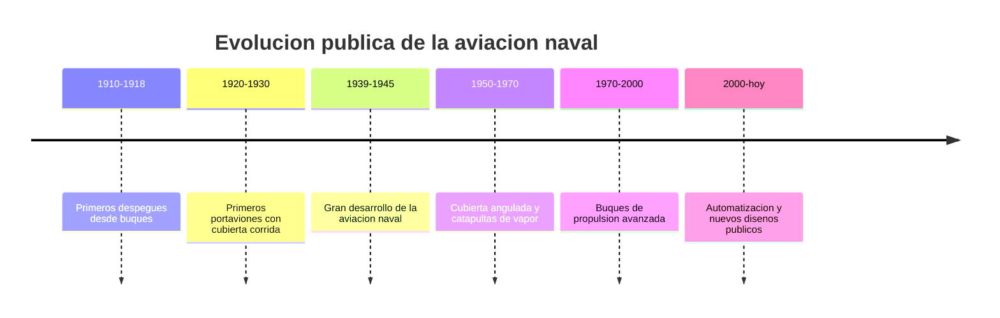

# 📜 Historia del portaviones

[🏠 Inicio](../../../README.md) · [🛳️ Curso: Portaviones](../README.md) · 📜 Historia

## Origen

El portaviones nace cuando se logra operar aeronaves desde un buque. Los primeros
despegues y aterrizajes sobre cubiertas dieron paso a buques con cubierta corrida
disenados para ese fin. Este módulo trata solo la evolución **histórica y
pública** del tipo de buque.

## Línea de tiempo

| Periodo | Hito | Importancia |
| --- | --- | --- |
| 1910-1918 | Primeros despegues desde buques | Prueba del concepto. |
| 1920-1930 | Cubierta corrida | Nace el portaviones moderno. |
| 1939-1945 | Gran desarrollo | La aviación naval gana protagonismo. |
| 1950-1970 | Cubierta angulada, catapultas | Operación más segura y eficiente. |
| 1970-2000 | Propulsión avanzada | Mayor autonomía y tamaño. |
| 2000-presente | Automatización | Nuevos diseños de dominio público. |

## Evolución tecnológica

- **Cubierta**: de la cubierta recta a la angulada, más segura para operar.
- **Lanzamiento**: aparición de catapultas y rampas de despegue.
- **Recuperación**: sistemas de frenado para el aterrizaje a bordo.
- **Propulsión**: de las calderas a plantas de mayor autonomía.
- **Isla**: superestructura lateral que integra puente y control.
- **Escala**: aumento del desplazamiento y de la tripulación.

## Tipos representativos

| Tipo | Rasgo | Característica destacada |
| --- | --- | --- |
| Portaviones de escolta | Histórico, menor tamaño | Cubierta corta. |
| Portaviones de flota | Gran tamaño | Cubierta y hangar amplios. |
| Cubierta angulada | Diseño moderno | Operación más segura. |
| Buque museo | Actualidad | Uso patrimonial y educativo. |

## Impacto histórico y patrimonial

El portaviones impulso enormes avances en aviación, ingeniería naval y logística.
Hoy varios se conservan como buques museo, con gran valor educativo sobre la
historia de la aviación naval.

## Fuentes

- Registrar aquí las fuentes públicas consultadas.
- Enlazar cada fuente también en [`manuales/fuentes.md`](../../../manuales/fuentes.md).

---

[🎓 Portada del curso](../README.md) · [➡️ Siguiente: Características](../operacion/caracteristicas-portaviones.md)
