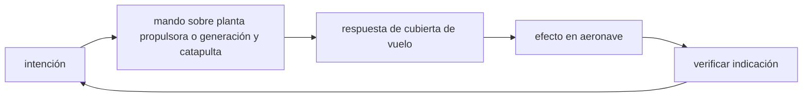

<!-- clase-meta
tipo_documento: clase
clase: 5
codigo: PORTAVIONES-05
curso: portaviones
titulo: "Mandos e instrumentos del portaviones"
modalidad: "taller de simulación"
duracion_minutos: 60
nivel: introductorio
prerrequisito: PORTAVIONES-04
competencia: "lectura_y_mando"
resultados_aprendizaje:
  - "Explicar controles, instrumentos, entradas y estados del sistema con vocabulario propio de Portaviones."
  - "Aplicar esos conceptos a una decisión segura o a un escenario de simulación de Portaviones."
evidencia: "Mapa de mandos y resolución de dos estados del tablero."
criterio_aprobacion: "Reconoce los controles críticos y responde a los estados sin introducir acciones inseguras."
fuentes: manuales/fuentes.md
ultima_revision: 2026-09-10
-->

# 🎛️ Mandos e instrumentos del portaviones

[🏠 Inicio](../../../README.md) · [🛳️ Curso: Portaviones](../README.md) · 🎛️ Mandos

## Vista general

Esta clase describe, **a nivel educativo y solo para simulación**, el puente de
navegación de un portaviones (ubicado en la isla lateral). No representa
operación militar real ni sistemas de armas: se limita al gobierno, la
propulsión, la navegación y la coordinación general de cubierta a nivel
divulgativo.

## Mapa de controles

| Zona | Control | Tipo | Función | Prioridad | Comentarios |
| --- | --- | --- | --- | --- | --- |
| Puente (isla) | Timón / rueda de gobierno | Rueda o palanca | Cambiar el rumbo | Alta | Actua sobre la pala del timón. |
| Puente | Telégrafo de máquina | Palanca de rango | Ordenar potencia y sentido | Alta | Avante, atrás, parado. |
| Puente | Piloto de rumbo | Selector | Mantener rumbo fijo | Media | Para travesía sostenida. |
| Puente | Comunicaciones internas | Panel | Coordinar la tripulación | Media | Ordenes de navegación. |
| Control de cubierta | Estado de cubierta | Panel simulado | Coordinar movimientos | Media | Solo logística general. |
| Puente | Señales acústicas | Botón | Señalizar maniobras | Alta | Según reglas de navegación. |
| Puente | Luces de navegación | Interruptores | Ser visto de noche | Alta | Configuración COLREG. |

## Instrumentos principales

| Instrumento | Mide o muestra | Unidad | Importancia | Notas |
| --- | --- | --- | --- | --- |
| Compás / giroscópica | Rumbo | grados | Alta | Referencia de dirección. |
| Corredera | Velocidad respecto al agua | nudos | Alta | Central para navegar. |
| Anemómetro | Viento sobre cubierta | nudos | Alta | Relevante en operaciones de vuelo. |
| Indicador de timón | Ángulo de la pala | grados | Media | Confirma la orden. |
| Inclinómetro | Escora | grados | Alta | Estabilidad y seguridad en cubierta. |
| Sonda | Profundidad bajo la quilla | metros | Alta | Evita varar. |

## Entradas de simulación

| Acción | Teclado | Controlador | Pantalla táctil | Comentarios |
| --- | --- | --- | --- | --- |
| Cambiar rumbo | Flechas izq/der | Stick izquierdo | Rueda táctil | Respuesta lenta por inercia. |
| Ordenar avante | Flecha arriba | Gatillo derecho | Palanca telégrafo | Escalonado por regímenes. |
| Ordenar atrás | Flecha abajo | Gatillo izquierdo | Palanca telégrafo | Detención muy progresiva. |
| Parar máquina | Tecla P | Botón central | Botón parado | Ordena régimen cero. |
| Mantener rumbo | Tecla H | Botón dedicado | Interruptor | Piloto de rumbo. |
| Rumbo al viento | Tecla W | Botón dedicado | Botón viento | Alinear con el viento relativo. |
| Señal acústica | Barra espaciadora | Botón R1 | Botón bocina | Según maniobra. |

## Estados del sistema

| Estado | Descripción | Indicadores | Acciones disponibles |
| --- | --- | --- | --- |
| Atracado | En muelle, amarrado | Máquina parada | Preparar zarpe, revisar sistemas. |
| Maniobra | Entrando o saliendo de puerto | Baja velocidad | Gobierno fino, señales. |
| Navegación | En travesía | Piloto de rumbo | Rumbo, vigilancia, guardias. |
| Cubierta activa | Coordinación de cubierta | Estado de cubierta | Rumbo al viento, logística general. |
| Emergencia | Riesgo o vía de agua | Alarmas activas | Achique, contrainundación, auxilio. |

## Observaciones ergonomicas

- La isla debe ofrecer visión de la cubierta y del entorno.
- El rumbo, la velocidad, el viento y la escora deben verse en todo momento.
- La simulación debe reflejar el gran retardo entre orden y respuesta.
- Toda la interfaz debe dejar claro que es una **simulación educativa**, no
  operación real ni entrenamiento militar.

## 🧭 Guía de estudio aplicada

### Pregunta guía

¿Cómo ayuda **Vista general, Mapa de controles, Instrumentos principales y Entradas de simulación** a **interpretar mandos e indicaciones durante recuperación simulada de aeronaves con cubierta ocupada parcialmente**?

### Explicación razonada

Un mando no se aprende memorizando su nombre, sino recorriendo el ciclo intención → acción → indicación → verificación. En Portaviones, el operador actúa sobre planta propulsora o generación y catapulta, observa la respuesta en cubierta de vuelo y confirma el efecto en aeronave. Una indicación inesperada exige detener la secuencia mental, identificar el modo activo y evitar una segunda orden que agrave el estado.

Esta clase se conecta con el resto del curso mediante **integración de viento relativo, movimiento del buque y secuencia segura de cubierta**. El hilo de
seguridad consiste en reconocer a tiempo **conflicto de trayectorias, objetos extraños o envolvente de viento inadecuada** y poder justificar la decisión
**ordenar cubierta, rumbo y velocidad antes de iniciar la recuperación**; en clases posteriores cambiará el ángulo de análisis, no esa relación causal.
La lectura funcional común sigue **planta propulsora → generación y catapulta → cubierta de vuelo → aeronave**, de modo que cada concepto pueda
ubicarse dentro del funcionamiento completo y no quede como un dato aislado.

**Apoyo documental:** [Ships](https://www.history.navy.mil/browse-by-topic/ships.html) aporta historia pública de buques militares;
[Safety of Navigation](https://www.imo.org/en/ourwork/safety/pages/navigationdefault.aspx) se usa para navegación, SOLAS, COLREG y STCW. Estas fuentes
se contrastan con el alcance de la clase y no sustituyen un manual de equipo concreto.

### Caso resuelto: de la observación a la decisión

1. **Intención:** formula qué cambio se necesita durante **recuperación simulada de aeronaves con cubierta ocupada parcialmente**.
2. **Mando:** identifica el control que actúa sobre **planta propulsora** o **generación y catapulta** y el modo que debe estar activo.
3. **Lectura:** localiza la indicación que confirma la respuesta de **cubierta de vuelo** y el efecto en **aeronave**.
4. **Verificación:** si la lectura no coincide, no acumules órdenes; estabiliza e investiga el estado.

### Comprueba tu comprensión

1. ¿Qué mando inicia la respuesta y qué instrumento confirma que el modo correcto está activo?
2. ¿Qué indicación temprana advertiría **conflicto de trayectorias, objetos extraños o envolvente de viento inadecuada**?
3. ¿Qué secuencia usarías si la respuesta de **aeronave** no coincide con la orden?

Orientación para revisar tus respuestas

- La primera respuesta debe relacionar el eslabón elegido con un efecto posterior, no solo nombrarlo.
- La segunda debe proponer una señal medible u observable y explicar qué tendencia sería preocupante.
- La tercera debe cambiar al menos una variable de capacidad, mando, entorno o margen de seguridad.

## 🎓 Cierre de clase

- **Actividad:** Recorre el puesto de mando simulado de Portaviones: localiza los controles de controles, instrumentos, entradas y estados del sistema y asocia cada indicación con una decisión.
- **Evidencia:** Mapa de mandos y resolución de dos estados del tablero.
- **Criterio de aprobación:** Reconoce los controles críticos y responde a los estados sin introducir acciones inseguras.
- **Transferencia:** explica qué cambiaría al pasar a otra variante de esta máquina.

### Fuentes de esta clase

- [US-NHHC-SHIPS](https://www.history.navy.mil/browse-by-topic/ships.html): Ships, Naval History and Heritage Command. Uso: historia pública de buques militares.
- [IMO-NAV](https://www.imo.org/en/ourwork/safety/pages/navigationdefault.aspx): Safety of Navigation, International Maritime Organization. Uso: navegación, SOLAS, COLREG y STCW.
- [US-FAA-HANDBOOKS](https://www.faa.gov/regulations_policies/handbooks_manuals): Aviation Handbooks and Manuals, FAA. Uso: aerodinámica, sistemas y operación.

> Las fuentes sostienen el marco conceptual y normativo; esta clase no reemplaza el manual
> del fabricante, la formación certificada ni la habilitación exigida para operar equipos reales.

---

[⬅️ Anterior: Sistemas mecánicos](../operacion/sistemas-mecanicos-portaviones.md) · [➡️ Siguiente: Principios y operación](../operacion/principios-portaviones.md)
