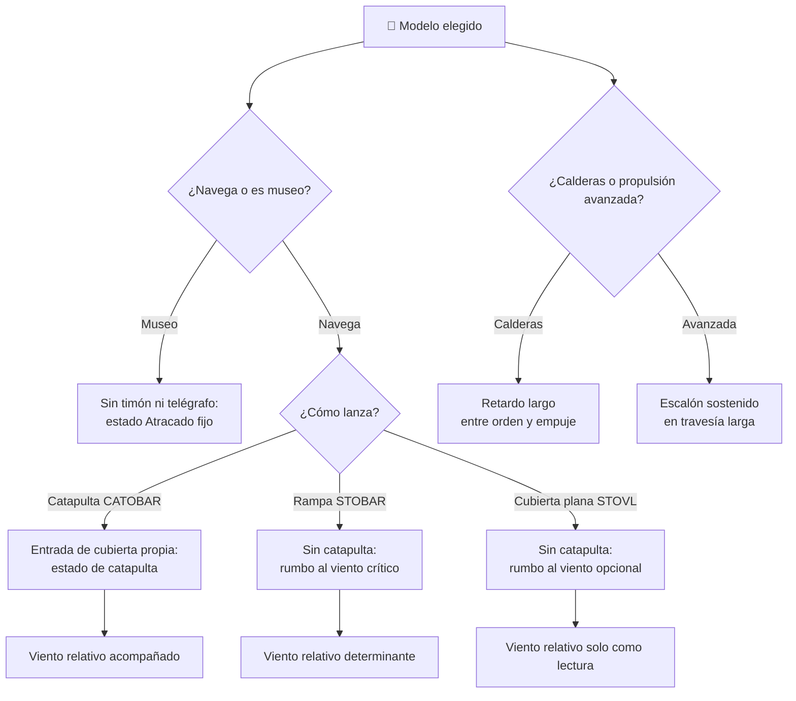

# 🧩 Modelos y variantes del portaviones

[🏠 Inicio](../../../README.md) · [🛳️ Curso: Portaviones](../README.md) · 🧩 Modelos

El [Módulo 2](../operacion/caracteristicas-portaviones.md) ya dijo qué tipos de
portaviones existieron y cuál fue el papel general de cada uno. Este módulo
responde a lo siguiente: **no todos se manejan igual**, y esa diferencia no es de
matiz. Cambia qué mandos tiene la máquina y, por tanto, qué debe modelar el
simulador.

> 🎯 **La idea que sostiene el módulo.** "Un portaviones" no es una sola máquina
> desde el punto de vista del mando. Lo que separa a un modelo de otro, en este
> curso, es su sistema de lanzamiento y recuperación y su propulsión: sin
> catapulta, el mando de catapulta **no existe**, y no es que sea más fácil de
> usar. Todo lo que sigue es **histórico y de dominio público**, a nivel
> divulgativo: aquí no hay táctica, doctrina ni sistemas de armas, conforme a
> [`docs/04-seguridad-y-limites.md`](../../../docs/04-seguridad-y-limites.md).

---

## 🧭 Por qué el modelo decide el simulador

El [Módulo 5](../mandos/manual-mandos-portaviones.md) describe un puente con
timón, telégrafo de máquina, piloto de rumbo, panel de estado de cubierta y una
entrada dedicada de **rumbo al viento** (tecla W). El
[Módulo 9](../simulacion/diseno-simulador-portaviones.md) expone las variables
`Velocidad`, `Rumbo`, `Régimen de máquina`, `Ángulo de timón`, `Viento
relativo`, `Escora`, `Estabilidad (GM)` y `Lastre`. Ambos describen un buque
**que navega y que depende de su propia velocidad para generar viento sobre la
cubierta**.

Ese supuesto no vale para todos los modelos. En un buque con catapulta, la
cubierta gana un mando propio que el Módulo 5 ni siquiera nombra. En una cubierta
plana de despegue corto y aterrizaje vertical (STOVL), ese mando no existe y
además el rumbo al viento deja de ser la condición que manda sobre la maniobra.
Y en un buque museo, el telégrafo no ordena nada. Si el simulador se construye
sobre un único esquema y luego se le "añaden" los demás, el resultado es una
rampa con catapulta, que no existe.

---

## 🗂️ Qué cambia en el manejo

| Modelo | Qué cambia en su operación |
| --- | --- |
| De flota, cubierta recta (histórico) | La referencia del curso: cubierta corrida, hangar amplio y gran desplazamiento. Toda la operación se ordena en el eje de la cubierta. |
| De escolta (histórico) | Cubierta corta y menor tamaño: menos inercia y giro más corto que un buque de flota, pero mucho menos margen de cubierta. |
| Cubierta angulada con catapulta (CATOBAR) | La cubierta separa lanzamiento y recuperación, y la catapulta aporta la aceleración que antes salía solo de la carrera y del viento. |
| Cubierta angulada con rampa (STOBAR) | Sin catapulta: la carrera y el viento relativo vuelven a ser la única fuente de velocidad de lanzamiento. La proa al viento pasa a mandar. |
| Cubierta plana STOVL | El despegue corto y el aterrizaje vertical liberan al buque de la exigencia de viento relativo alto; la maniobra deja de girar en torno a la proa al viento. |
| Propulsión de calderas (histórico) | El escalón del telégrafo tarda más en convertirse en empuje: hay que anticipar todavía más. |
| Propulsión avanzada | Mayor autonomía y respuesta más sostenida en travesía larga; la inercia del casco no cambia. |
| Buque museo | No navega. La operación es patrimonial y educativa: recorrido, no maniobra. |

---

## 🎛️ Qué cambia en el mando

| Modelo | Qué mando aparece o desaparece | Consecuencia |
| --- | --- | --- |
| De flota, cubierta recta | Ninguno: el mapa de controles del Módulo 5 aplica tal cual. | Cambian los rangos, no los controles. |
| De escolta | Ninguno. | El mismo puente en una escala menor. |
| Cubierta angulada con catapulta (CATOBAR) | **Aparece** el mando de catapulta en el control de cubierta, con su propio estado de listo. **Aparece** la separación de zonas en el panel de estado de cubierta. | El puente deja de ser el único origen de la orden: cubierta pasa a tener una entrada propia que el Módulo 5 no contempla. |
| Cubierta angulada con rampa (STOBAR) | **No existe** el mando de catapulta. `Rumbo al viento` (tecla W) queda como la entrada crítica de cubierta. | El buque sustituye con velocidad y rumbo lo que otro modelo resuelve con un mando. |
| Cubierta plana STOVL | **No existe** el mando de catapulta. `Rumbo al viento` **se degrada** de entrada crítica a entrada opcional. | El puente recupera libertad de rumbo con cubierta activa: la tecla W deja de encadenar la maniobra. |
| Propulsión de calderas | Ninguno: el telégrafo sigue siendo el mismo mando. | Cambia el retardo entre orden y respuesta, no el control. |
| Propulsión avanzada | Ninguno. | Igual mando, escalones sostenidos más tiempo. |
| Buque museo | **Desaparecen** el telégrafo, el timón y el piloto de rumbo como mandos activos. | No hay gobierno: quedan los paneles como objeto de lectura, no de mando. |

---

## 🎮 Qué cambia en el simulador

Contrastado con las variables del
[Módulo 9](../simulacion/diseno-simulador-portaviones.md):

| Modelo | Variables que cambian | Esquema de control |
| --- | --- | --- |
| De flota, cubierta recta | Ninguna: es el caso base. | El del Módulo 5. |
| De escolta | `Velocidad` y `Ángulo de timón` conservan rango, pero la inercia asociada baja: el mismo timón da un giro más corto. | El mismo. |
| Cubierta angulada con catapulta (CATOBAR) | `Viento relativo` **deja de ser el único requisito** de cubierta y se acompaña de un estado de catapulta. `Rumbo` gana margen con cubierta activa. | El del Módulo 5 **más** una entrada de cubierta. |
| Cubierta angulada con rampa (STOBAR) | `Viento relativo` **sube a variable determinante**: acopla `Velocidad` y `Rumbo` a la ventana de cubierta. | El mismo, con la tecla W encadenada. |
| Cubierta plana STOVL | `Viento relativo` **se desacopla** de la condición de cubierta y pasa a ser solo una lectura de seguridad. `Escora` gana peso: el aterrizaje vertical se juega en la plataforma, no en la carrera. | Sin entrada de catapulta; rumbo libre. |
| Propulsión de calderas | `Régimen de máquina` conserva sus escalones, pero el retardo hasta `Velocidad` **se alarga**. | El mismo. |
| Propulsión avanzada | `Régimen de máquina` sostiene escalón sin degradarse en travesía larga. | El mismo. |
| Buque museo | `Velocidad` y `Régimen de máquina` quedan fijos en cero. `Escora`, `Estabilidad (GM)` y `Lastre` pasan a ser estado fijo, no resultado de la maniobra. | Sin gobierno ni telégrafo: solo el estado `Atracado`. |

---

## 🗺️ Del modelo al esquema de control

---

## ⚠️ Qué modelos no comparten simulador

Tres familias no se resuelven con un ajuste de parámetros, porque su esquema de
control es otro:

- **El buque con catapulta (CATOBAR)** frente a la rampa y la cubierta plana:
  suma una entrada de cubierta que el resto no tiene. Es un mando más, no un
  parámetro más.
- **La cubierta plana STOVL** frente al resto de buques que navegan: el `Viento
  relativo` deja de encadenar `Velocidad` y `Rumbo`. La tecla W sigue en el
  teclado, pero ya no manda. Es un modo de control distinto, no una dificultad
  distinta.
- **El buque museo** frente a todos: no tiene gobierno. Un simulador que lo
  represente como "un portaviones muy lento" está representando otra cosa.

El resto de variantes sí caben en un mismo simulador ajustando rangos y retardos,
tal como plantean los
[niveles de realismo](../../../docs/03-niveles-de-realismo.md): en el nivel 1
casi todos se comportan igual, y las diferencias emergen a medida que el nivel
sube y entran la inercia, el viento relativo y la estabilidad.

> ⚖️ **El principio detrás de todo esto.** Cuánto pesa la carga y dónde va no cambia
> solo los números: cambia qué puede hacer el operador. La física común a todas las
> máquinas del catálogo —sostener, girar, equilibrar y la masa que cambia en
> marcha— está en [⚖️ carga y manejo](../../../docs/09-carga-y-manejo.md).

---

[⬅️ Anterior: Características](../operacion/caracteristicas-portaviones.md) · [➡️ Siguiente: Sistemas mecánicos](../operacion/sistemas-mecanicos-portaviones.md)
