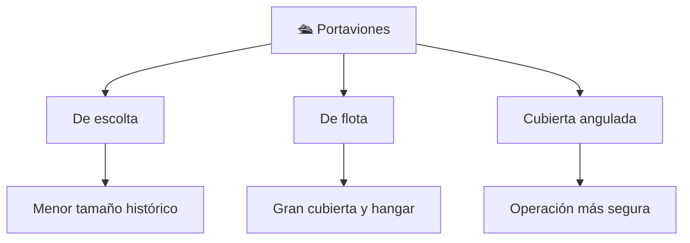

# 📋 Características funcionales del portaviones

[🏠 Inicio](../../../README.md) · [🛳️ Curso: Portaviones](../README.md) · 📋 Características

Que es un portaviones, que tipos históricos existieron y cual fue su papel
general. Contexto público antes de abrir la física naval (Módulo 4). No se
documentan táctica ni sistemas de armas.

---

## 🧭 Definición

Un portaviones es un buque de guerra cuya función es operar aeronaves desde una
cubierta de vuelo. Como todo buque, flota por el principio de Arquímedes, avanza
por el empuje de sus hélices y gobierna con el timón. Su rasgo distintivo es la
gran cubierta plana y el hangar, descritos aquí solo a nivel divulgativo.

---

## 🧬 Características clave

| Característica | Descripción |
| --- | --- |
| Cubierta de vuelo | Superficie plana para operar aeronaves. |
| Hangar | Espacio interior para guardar y mantener aeronaves. |
| Gran desplazamiento | Uno de los buques más grandes; enorme inercia. |
| Isla | Superestructura lateral con el puente. |
| Estabilidad | Cuidada por el peso alto de la cubierta y la isla. |
| Autonomía | Disenado para largas travesías oceánicas. |

---

## 🗂️ Tipos históricos

| Tipo | Época | Rasgo destacado |
| --- | --- | --- |
| De escolta | Histórico | Cubierta corta, menor tamaño. |
| De flota | Histórico y moderno | Cubierta y hangar amplios. |
| Cubierta angulada | Moderno | Operación más segura. |
| Buque museo | Actualidad | Uso patrimonial y educativo. |

---

## 🎯 Para qué se usó

- Operar aeronaves desde el mar (contexto histórico general).
- Impulsar avances en aviación, ingeniería naval y logística.
- Hoy, valor patrimonial como buques museo.
- En este repositorio: base para simulación educativa de navegación y cubierta.

---

[⬅️ Anterior: Historia](../historia/historia-portaviones.md) · [➡️ Siguiente: Modelos y variantes](../modelos/modelos-portaviones.md)
