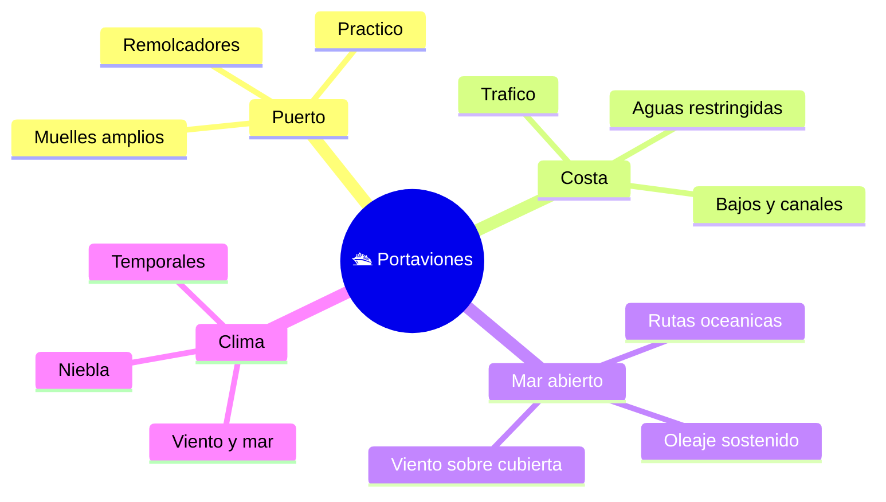

# 🌍 Entornos de trabajo del portaviones

[🏠 Inicio](../../../README.md) · [🛳️ Curso: Portaviones](../README.md) · 🌍 Entornos

Donde navega un portaviones y como cambia la navegacion segun el entorno. Enfoque
general y educativo; cada entorno se traduce en un escenario de simulacion
distinto.

---

## 🗺️ Entornos principales

| Entorno | Caracteristicas | Riesgos tipicos | Ajuste de navegacion |
| --- | --- | --- | --- |
| Puerto | Espacio estrecho para su tamano. | Colision, mala maniobra. | Baja velocidad, remolcadores. |
| Costa | Aguas restringidas, bajos. | Varada por gran calado. | Vigilancia, sonda, margen amplio. |
| Mar abierto | Rutas largas, oleaje. | Temporales, fatiga. | Rumbo, guardias, meteorologia. |
| Viento en cubierta | Operaciones de cubierta. | Escora, movimiento en cubierta. | Rumbo al viento, cuidar estabilidad. |
| Niebla / noche | Baja visibilidad. | No ser visto, abordaje. | Luces, senales, vigilancia. |

---

## 🌦️ Factores del entorno

- **Viento y mar**: el oleaje afecta rumbo, escora y la cubierta.
- **Viento relativo**: clave en las operaciones aereas de cubierta.
- **Corrientes y mareas**: modifican la trayectoria y el calado disponible.
- **Profundidad**: el gran calado limita puertos y rutas.
- **Visibilidad**: niebla y noche exigen luces y vigilancia.

---

## 🎮 Traduccion a simulacion

Cada entorno es un escenario con su profundidad, clima, viento y trafico. Ver
como se modela en el
[Modulo 8: Diseno de simulacion](../simulacion/diseno-simulador-portaviones.md).

---

[⬅️ Anterior: Principios y operacion](principios-portaviones.md) · [➡️ Siguiente: Reglamentos](../reglamentos/reglamentos-portaviones.md)
