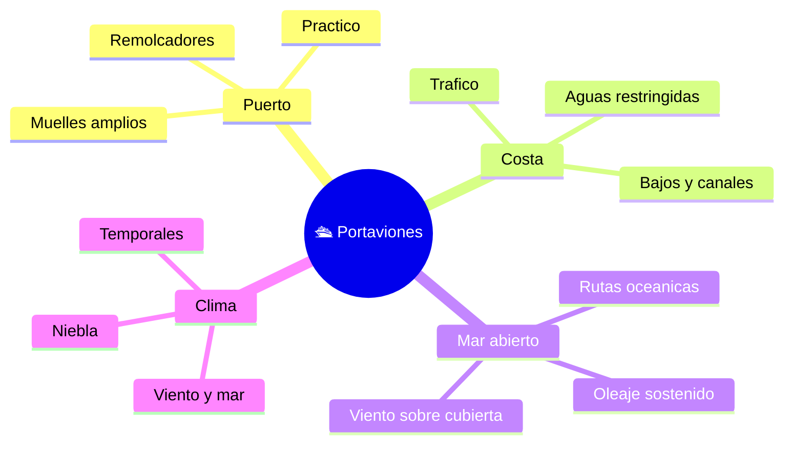

<!-- clase-meta
tipo_documento: clase
clase: 7
codigo: PORTAVIONES-07
curso: portaviones
titulo: "Entornos de trabajo del portaviones"
modalidad: "análisis de escenarios"
duracion_minutos: 60
nivel: introductorio
prerrequisito: PORTAVIONES-06
competencia: "adaptacion_al_entorno"
resultados_aprendizaje:
  - "Explicar entornos, factores ambientales, riesgos y respuesta de simulación con vocabulario propio de Portaviones."
  - "Aplicar esos conceptos a una decisión segura o a un escenario de simulación de Portaviones."
evidencia: "Matriz entorno–cambio–riesgo–respuesta."
criterio_aprobacion: "Cada respuesta se adapta al entorno y distingue riesgos que no son intercambiables entre escenarios."
fuentes: manuales/fuentes.md
ultima_revision: 2026-09-10
-->

# 🌍 Entornos de trabajo del portaviones

[🏠 Inicio](../../../README.md) · [🛳️ Curso: Portaviones](../README.md) · 🌍 Entornos

Donde navega un portaviones y cómo cambia la navegación según el entorno. Enfoque
general y educativo; cada entorno se traduce en un escenario de simulación
distinto.

---

## 🗺️ Entornos principales

```mermaid
mindmap
  root((🛳️ Portaviones))
    Puerto
      Muelles amplios
      Remolcadores
      Practico
    Costa
      Aguas restringidas
      Bajos y canales
      Trafico
    Mar abierto
      Rutas oceanicas
      Oleaje sostenido
      Viento sobre cubierta
    Clima
      Viento y mar
      Niebla
      Temporales
```

| Entorno | Características | Riesgos típicos | Ajuste de navegación |
| --- | --- | --- | --- |
| Puerto | Espacio estrecho para su tamaño. | Colisión, mala maniobra. | Baja velocidad, remolcadores. |
| Costa | Aguas restringidas, bajos. | Varada por gran calado. | Vigilancia, sonda, margen amplio. |
| Mar abierto | Rutas largas, oleaje. | Temporales, fatiga. | Rumbo, guardias, meteorología. |
| Viento en cubierta | Operaciones de cubierta. | Escora, movimiento en cubierta. | Rumbo al viento, cuidar estabilidad. |
| Niebla / noche | Baja visibilidad. | No ser visto, abordaje. | Luces, señales, vigilancia. |

---

## 🌦️ Factores del entorno

- **Viento y mar**: el oleaje afecta rumbo, escora y la cubierta.
- **Viento relativo**: clave en las operaciones aéreas de cubierta.
- **Corrientes y mareas**: modifican la trayectoria y el calado disponible.
- **Profundidad**: el gran calado limita puertos y rutas.
- **Visibilidad**: niebla y noche exigen luces y vigilancia.

---

## 🎮 Traducción a simulación

Cada entorno es un escenario con su profundidad, clima, viento y tráfico. Ver
como se modela en el
[Clase 9: Diseño de simulación](../simulacion/diseno-simulador-portaviones.md).

## 🧭 Guía de estudio aplicada

### Pregunta guía

¿Cómo ayuda **Entornos principales, Factores del entorno, Traducción a simulación y Guía de estudio aplicada** a **adaptar recuperación simulada de aeronaves con cubierta ocupada parcialmente a tres condiciones ambientales distintas**?

### Explicación razonada

El entorno no es decoración: modifica las fuerzas, la percepción y el tiempo disponible. En el caso «recuperación simulada de aeronaves con cubierta ocupada parcialmente», cambia el comportamiento de aeronave y aumenta la probabilidad de conflicto de trayectorias, objetos extraños o envolvente de viento inadecuada. La respuesta correcta empieza por reconocer qué variable cambió y después adaptar límites, ruta o misión.

Esta clase se conecta con el resto del curso mediante **integración de viento relativo, movimiento del buque y secuencia segura de cubierta**. El hilo de
seguridad consiste en reconocer a tiempo **conflicto de trayectorias, objetos extraños o envolvente de viento inadecuada** y poder justificar la decisión
**ordenar cubierta, rumbo y velocidad antes de iniciar la recuperación**; en clases posteriores cambiará el ángulo de análisis, no esa relación causal.
La lectura funcional común sigue **planta propulsora → generación y catapulta → cubierta de vuelo → aeronave**, de modo que cada concepto pueda
ubicarse dentro del funcionamiento completo y no quede como un dato aislado.

**Apoyo documental:** [Ships](https://www.history.navy.mil/browse-by-topic/ships.html) aporta historia pública de buques militares;
[Safety of Navigation](https://www.imo.org/en/ourwork/safety/pages/navigationdefault.aspx) se usa para navegación, SOLAS, COLREG y STCW. Estas fuentes
se contrastan con el alcance de la clase y no sustituyen un manual de equipo concreto.

### Caso resuelto: de la observación a la decisión

1. **Escenario base:** conserva la misión «recuperación simulada de aeronaves con cubierta ocupada parcialmente» para poder comparar.
2. **Cambiar una condición:** modifica sucesivamente superficie o medio, visibilidad y perturbación externa.
3. **Recalcular margen:** explica cómo cada cambio afecta **aeronave** y acerca o aleja **conflicto de trayectorias, objetos extraños o envolvente de viento inadecuada**.
4. **Adaptar:** cambia límite, ruta, configuración o incluso cancela; no mantengas la misma respuesta por hábito.

### Comprueba tu comprensión

1. ¿Cómo cambiaría **aeronave** si empeora la perturbación externa?
2. ¿Qué condición ambiental acerca más el escenario a **conflicto de trayectorias, objetos extraños o envolvente de viento inadecuada**?
3. ¿Cuándo adaptarías la maniobra y cuándo la cancelarías?

Orientación para revisar tus respuestas

- La primera respuesta debe relacionar el eslabón elegido con un efecto posterior, no solo nombrarlo.
- La segunda debe proponer una señal medible u observable y explicar qué tendencia sería preocupante.
- La tercera debe cambiar al menos una variable de capacidad, mando, entorno o margen de seguridad.

## 🎓 Cierre de clase

- **Actividad:** Contrasta tres entornos de Portaviones a partir de entornos, factores ambientales, riesgos y respuesta de simulación y determina cómo cambian variables, percepción, riesgos y respuesta.
- **Evidencia:** Matriz entorno–cambio–riesgo–respuesta.
- **Criterio de aprobación:** Cada respuesta se adapta al entorno y distingue riesgos que no son intercambiables entre escenarios.
- **Transferencia:** explica qué cambiaría al pasar a otra variante de esta máquina.

### Fuentes de esta clase

- [US-NHHC-SHIPS](https://www.history.navy.mil/browse-by-topic/ships.html): Ships, Naval History and Heritage Command. Uso: historia pública de buques militares.
- [IMO-NAV](https://www.imo.org/en/ourwork/safety/pages/navigationdefault.aspx): Safety of Navigation, International Maritime Organization. Uso: navegación, SOLAS, COLREG y STCW.
- [US-FAA-HANDBOOKS](https://www.faa.gov/regulations_policies/handbooks_manuals): Aviation Handbooks and Manuals, FAA. Uso: aerodinámica, sistemas y operación.

> Las fuentes sostienen el marco conceptual y normativo; esta clase no reemplaza el manual
> del fabricante, la formación certificada ni la habilitación exigida para operar equipos reales.

---

[⬅️ Anterior: Principios y operación](principios-portaviones.md) · [➡️ Siguiente: Reglamentos](../reglamentos/reglamentos-portaviones.md)
