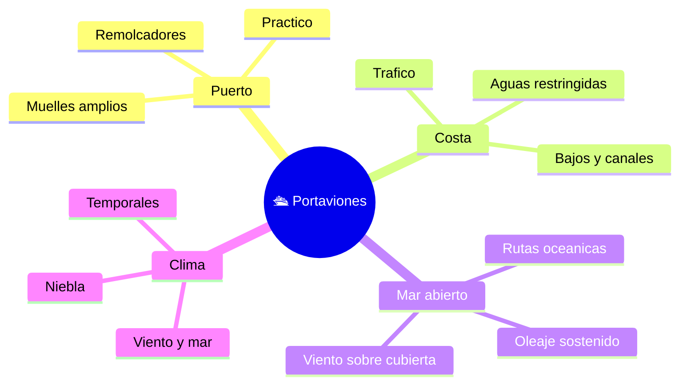

# 🌍 Entornos de trabajo del portaviones

[🏠 Inicio](../../../README.md) · [🛳️ Curso: Portaviones](../README.md) · 🌍 Entornos

Donde navega un portaviones y cómo cambia la navegación según el entorno. Enfoque
general y educativo; cada entorno se traduce en un escenario de simulación
distinto.

---

## 🗺️ Entornos principales

```mermaid
mindmap
  root((🛳️ Portaviones))
    Puerto
      Muelles amplios
      Remolcadores
      Practico
    Costa
      Aguas restringidas
      Bajos y canales
      Trafico
    Mar abierto
      Rutas oceanicas
      Oleaje sostenido
      Viento sobre cubierta
    Clima
      Viento y mar
      Niebla
      Temporales
```

| Entorno | Características | Riesgos típicos | Ajuste de navegación |
| --- | --- | --- | --- |
| Puerto | Espacio estrecho para su tamaño. | Colisión, mala maniobra. | Baja velocidad, remolcadores. |
| Costa | Aguas restringidas, bajos. | Varada por gran calado. | Vigilancia, sonda, margen amplio. |
| Mar abierto | Rutas largas, oleaje. | Temporales, fatiga. | Rumbo, guardias, meteorología. |
| Viento en cubierta | Operaciones de cubierta. | Escora, movimiento en cubierta. | Rumbo al viento, cuidar estabilidad. |
| Niebla / noche | Baja visibilidad. | No ser visto, abordaje. | Luces, señales, vigilancia. |

---

## 🌦️ Factores del entorno

- **Viento y mar**: el oleaje afecta rumbo, escora y la cubierta.
- **Viento relativo**: clave en las operaciones aéreas de cubierta.
- **Corrientes y mareas**: modifican la trayectoria y el calado disponible.
- **Profundidad**: el gran calado limita puertos y rutas.
- **Visibilidad**: niebla y noche exigen luces y vigilancia.

---

## 🎮 Traducción a simulación

Cada entorno es un escenario con su profundidad, clima, viento y tráfico. Ver
como se modela en el
[Módulo 9: Diseño de simulación](../simulacion/diseno-simulador-portaviones.md).

## 🎓 Cierre de clase

- **Actividad:** Contrasta tres entornos de Portaviones a partir de entornos, factores ambientales, riesgos y respuesta de simulación y determina cómo cambian variables, percepción, riesgos y respuesta.
- **Evidencia:** Matriz entorno–cambio–riesgo–respuesta.
- **Criterio de aprobación:** Cada respuesta se adapta al entorno y distingue riesgos que no son intercambiables entre escenarios.
- **Transferencia:** explica qué cambiaría al pasar a otra variante de esta máquina.

### Fuentes de esta clase

- [US-NHHC-SHIPS](https://www.history.navy.mil/browse-by-topic/ships.html): Ships, Naval History and Heritage Command. Uso: historia pública de buques militares.
- [IMO-NAV](https://www.imo.org/en/ourwork/safety/pages/navigationdefault.aspx): Safety of Navigation, International Maritime Organization. Uso: navegación, SOLAS, COLREG y STCW.
- [US-FAA-HANDBOOKS](https://www.faa.gov/regulations_policies/handbooks_manuals): Aviation Handbooks and Manuals, FAA. Uso: aerodinámica, sistemas y operación.

> Las fuentes sostienen el marco conceptual y normativo; esta clase no reemplaza el manual
> del fabricante, la formación certificada ni la habilitación exigida para operar equipos reales.

---

[⬅️ Anterior: Principios y operación](principios-portaviones.md) · [➡️ Siguiente: Reglamentos](../reglamentos/reglamentos-portaviones.md)
