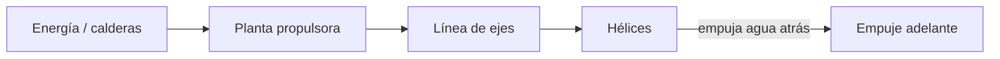

# 🔧 Sistemas mecánicos del portaviones

[🏠 Inicio](../../../README.md) · [🛳️ Curso: Portaviones](../README.md) · 🔧 Sistemas mecánicos

Este módulo describe, **solo con física pública y a nivel divulgativo**, como
flota, avanza, gobierna y opera su cubierta un portaviones. No incluye sistemas
de armas, táctica ni datos sensibles. Es la base para entender los mandos
(Módulo 4) y la física de la navegación (Módulo 5).

---

## 1. 🚢 Casco y flotación

El casco estanco sostiene un buque enorme por flotación, con la cubierta como
techo estructural.

- **Reserva de flotabilidad**: gran volumen estanco por encima de la flotación.
- **Compartimentación**: mamparos que dividen el casco para limitar inundaciones.
- **Estabilidad**: el peso alto de la cubierta y la isla se compensa con lastre.

| Parte | Función | Efecto en el buque |
| --- | --- | --- |
| Quilla | Eje estructural inferior | Rigidez y estabilidad. |
| Mamparos | Dividen el casco | Contienen inundaciones. |
| Cubierta de vuelo | Techo y zona de trabajo | Peso alto que afecta estabilidad. |
| Isla | Superestructura lateral | Aloja el puente. |

---

## 2. 🔧 Propulsión

Convierte energía en empuje para mover una masa enorme.

- **Planta propulsora**: genera la potencia; varios ejes y hélices.
- **Línea de ejes**: transmite el giro a las hélices.
- **Hélices**: empujan agua hacia atrás y, por reacción, mueven el buque.
- **Viento sobre cubierta**: navegar contra el viento aumenta el viento relativo
  sobre la cubierta, concepto útil para las operaciones de vuelo.

---

## 3. ⚙️ Gobierno y timón

- **Pala del timón**: al girar desvia el agua y hace rotar el buque.
- **Servomotor**: mueve la pala con la fuerza necesaria para la gran masa.
- **Inercia**: por su tamaño, el giro es muy amplio y lento.

---

## 4. 🛫 Cubierta de vuelo y hangar (nivel divulgativo)

La cubierta de vuelo y el hangar son el rasgo distintivo. Se describen solo como
logística y seguridad general, sin detalle operativo sensible.

- **Cubierta de vuelo**: superficie plana donde se estacionan y mueven aeronaves.
- **Cubierta angulada**: separa las zonas de despegue y aterrizaje para más
  seguridad.
- **Hangar**: espacio interior bajo cubierta para guardar y mantener aeronaves.
- **Ascensores**: plataformas que suben y bajan aeronaves entre hangar y cubierta.

| Elemento | Función | Nota divulgativa |
| --- | --- | --- |
| Cubierta de vuelo | Operar aeronaves | Zona de trabajo abierta. |
| Cubierta angulada | Separar operaciones | Mejora la seguridad. |
| Hangar | Guardar aeronaves | Bajo la cubierta. |
| Ascensores | Mover aeronaves | Conectan hangar y cubierta. |
| Isla | Control y observación | Visión de la cubierta. |

---

## 5. ⚖️ Estabilidad y flotabilidad

| Concepto | Definición | Riesgo si falla |
| --- | --- | --- |
| Centro de gravedad (G) | Punto donde actua el peso total. | Muy alto: inestable. |
| Metacentro (M) | Referencia de estabilidad al escorar. | G sobre M: riesgo de vuelco. |
| Escora | Inclinación transversal. | Excesiva: peligrosa en cubierta. |
| Lastre | Agua de ajuste de peso. | Mal manejo: inestabilidad. |
| Compartimentación | Zonas estancas. | Limita inundaciones. |

---

## 🔁 Cómo se conecta todo

1. El **casco** aporta flotación y sostiene la **cubierta**.
2. La **planta propulsora** mueve las **hélices** para avanzar.
3. El **timón** desvia el agua para cambiar el rumbo.
4. La **cubierta y el hangar** organizan la logística a nivel general.
5. El **lastre** y la **compartimentación** cuidan la estabilidad.

Con esto entendido, el
[Módulo 4: Mandos](../mandos/manual-mandos-portaviones.md) describe, a nivel
educativo, como se navega el buque desde el puente.

---

[⬅️ Anterior: Características](caracteristicas-portaviones.md) · [➡️ Siguiente: Mandos e instrumentos](../mandos/manual-mandos-portaviones.md)
