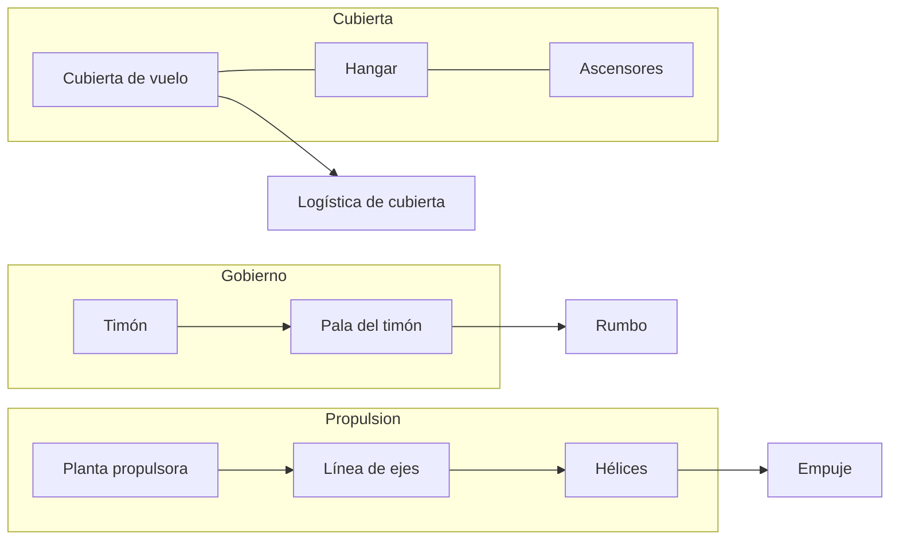
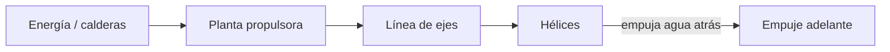
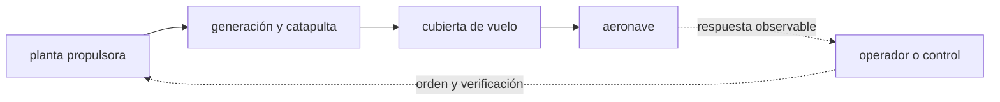

<!-- clase-meta
tipo_documento: clase
clase: 4
codigo: PORTAVIONES-04
curso: portaviones
titulo: "Sistemas mecánicos del portaviones"
modalidad: "teórica aplicada"
duracion_minutos: 90
nivel: introductorio
prerrequisito: PORTAVIONES-03
competencia: "comprension_de_sistemas"
resultados_aprendizaje:
  - "Explicar Casco y flotación, Propulsión, Gobierno y timón y Cubierta de vuelo y hangar (nivel divulgativo) con vocabulario propio de Portaviones."
  - "Aplicar esos conceptos a una decisión segura o a un escenario de simulación de Portaviones."
evidencia: "Esquema con flujos de energía, materia o información anotados."
criterio_aprobacion: "Las conexiones esenciales son correctas y la consecuencia de la falla se propaga de manera coherente."
fuentes: manuales/fuentes.md
ultima_revision: 2026-09-10
-->

# 🔧 Sistemas mecánicos del portaviones

[🏠 Inicio](../../../README.md) · [🛳️ Curso: Portaviones](../README.md) · 🔧 Sistemas mecánicos

Esta clase describe, **solo con física pública y a nivel divulgativo**, como
flota, avanza, gobierna y opera su cubierta un portaviones. No incluye sistemas
de armas, táctica ni datos sensibles. Es la base para entender los mandos
(Clase 5) y la física de la navegación (Clase 6).

```mermaid
flowchart LR
    subgraph Propulsion
        M[Planta propulsora] --> Ej[Línea de ejes] --> H[Hélices]
    end
    subgraph Gobierno
        Ti[Timón] --> Pa[Pala del timón]
    end
    subgraph Cubierta
        Cv[Cubierta de vuelo] --- Ha[Hangar]
        Ha --- As[Ascensores]
    end
    H --> Empuje[Empuje]
    Pa --> Rumbo[Rumbo]
    Cv --> Logistica[Logística de cubierta]
```

---

## 1. 🚢 Casco y flotación

El casco estanco sostiene un buque enorme por flotación, con la cubierta como
techo estructural.

- **Reserva de flotabilidad**: gran volumen estanco por encima de la flotación.
- **Compartimentación**: mamparos que dividen el casco para limitar inundaciones.
- **Estabilidad**: el peso alto de la cubierta y la isla se compensa con lastre.

| Parte | Función | Efecto en el buque |
| --- | --- | --- |
| Quilla | Eje estructural inferior | Rigidez y estabilidad. |
| Mamparos | Dividen el casco | Contienen inundaciones. |
| Cubierta de vuelo | Techo y zona de trabajo | Peso alto que afecta estabilidad. |
| Isla | Superestructura lateral | Aloja el puente. |

---

## 2. 🔧 Propulsión

Convierte energía en empuje para mover una masa enorme.

```mermaid
flowchart LR
    Energia[Energía / calderas] --> Planta[Planta propulsora]
    Planta --> Eje[Línea de ejes]
    Eje --> Helice[Hélices]
    Helice -->|empuja agua atrás| Empuje[Empuje adelante]
```

- **Planta propulsora**: genera la potencia; varios ejes y hélices.
- **Línea de ejes**: transmite el giro a las hélices.
- **Hélices**: empujan agua hacia atrás y, por reacción, mueven el buque.
- **Viento sobre cubierta**: navegar contra el viento aumenta el viento relativo
  sobre la cubierta, concepto útil para las operaciones de vuelo.

---

## 3. ⚙️ Gobierno y timón

- **Pala del timón**: al girar desvia el agua y hace rotar el buque.
- **Servomotor**: mueve la pala con la fuerza necesaria para la gran masa.
- **Inercia**: por su tamaño, el giro es muy amplio y lento.

---

## 4. 🛫 Cubierta de vuelo y hangar (nivel divulgativo)

La cubierta de vuelo y el hangar son el rasgo distintivo. Se describen solo como
logística y seguridad general, sin detalle operativo sensible.

- **Cubierta de vuelo**: superficie plana donde se estacionan y mueven aeronaves.
- **Cubierta angulada**: separa las zonas de despegue y aterrizaje para más
  seguridad.
- **Hangar**: espacio interior bajo cubierta para guardar y mantener aeronaves.
- **Ascensores**: plataformas que suben y bajan aeronaves entre hangar y cubierta.

| Elemento | Función | Nota divulgativa |
| --- | --- | --- |
| Cubierta de vuelo | Operar aeronaves | Zona de trabajo abierta. |
| Cubierta angulada | Separar operaciones | Mejora la seguridad. |
| Hangar | Guardar aeronaves | Bajo la cubierta. |
| Ascensores | Mover aeronaves | Conectan hangar y cubierta. |
| Isla | Control y observación | Visión de la cubierta. |

---

## 5. ⚖️ Estabilidad y flotabilidad

| Concepto | Definición | Riesgo si falla |
| --- | --- | --- |
| Centro de gravedad (G) | Punto donde actua el peso total. | Muy alto: inestable. |
| Metacentro (M) | Referencia de estabilidad al escorar. | G sobre M: riesgo de vuelco. |
| Escora | Inclinación transversal. | Excesiva: peligrosa en cubierta. |
| Lastre | Agua de ajuste de peso. | Mal manejo: inestabilidad. |
| Compartimentación | Zonas estancas. | Limita inundaciones. |

---

## 🔁 Cómo se conecta todo

1. El **casco** aporta flotación y sostiene la **cubierta**.
2. La **planta propulsora** mueve las **hélices** para avanzar.
3. El **timón** desvia el agua para cambiar el rumbo.
4. La **cubierta y el hangar** organizan la logística a nivel general.
5. El **lastre** y la **compartimentación** cuidan la estabilidad.

Con esto entendido, el
[Clase 5: Mandos](../mandos/manual-mandos-portaviones.md) describe, a nivel
educativo, como se navega el buque desde el puente.

## 🧭 Guía de estudio aplicada

### Pregunta guía

¿Cómo ayuda **Casco y flotación, Propulsión, Gobierno y timón y Cubierta de vuelo y hangar (nivel divulgativo)** a **seguir una alteración desde planta propulsora hasta aeronave durante recuperación simulada de aeronaves con cubierta ocupada parcialmente**?

### Explicación razonada

El funcionamiento puede leerse como una cadena causal: planta propulsora entrega o transforma energía; generación y catapulta la adapta; cubierta de vuelo la transmite o gobierna; y aeronave produce el efecto observable. La cadena no es lineal en sentido estricto: sensores, estructura y operador cierran el lazo. Si un eslabón se degrada, la señal importante es cómo cambia el estado de aeronave y qué margen queda.

```mermaid
flowchart LR
    A["planta propulsora"] --> B["generación y catapulta"] --> C["cubierta de vuelo"] --> D["aeronave"]
    D -. respuesta observable .-> O["operador o control"]
    O -. orden y verificación .-> A
```

Esta clase se conecta con el resto del curso mediante **integración de viento relativo, movimiento del buque y secuencia segura de cubierta**. El hilo de
seguridad consiste en reconocer a tiempo **conflicto de trayectorias, objetos extraños o envolvente de viento inadecuada** y poder justificar la decisión
**ordenar cubierta, rumbo y velocidad antes de iniciar la recuperación**; en clases posteriores cambiará el ángulo de análisis, no esa relación causal.
La lectura funcional común sigue **planta propulsora → generación y catapulta → cubierta de vuelo → aeronave**, de modo que cada concepto pueda
ubicarse dentro del funcionamiento completo y no quede como un dato aislado.

**Apoyo documental:** [Ships](https://www.history.navy.mil/browse-by-topic/ships.html) aporta historia pública de buques militares;
[Safety of Navigation](https://www.imo.org/en/ourwork/safety/pages/navigationdefault.aspx) se usa para navegación, SOLAS, COLREG y STCW. Estas fuentes
se contrastan con el alcance de la clase y no sustituyen un manual de equipo concreto.

### Caso resuelto: de la observación a la decisión

1. **Entrada:** identifica el estado inicial de **planta propulsora** durante **recuperación simulada de aeronaves con cubierta ocupada parcialmente**.
2. **Transformación:** explica qué hacen **generación y catapulta** y **cubierta de vuelo**, y qué magnitud cambia en cada paso.
3. **Salida:** comprueba el efecto esperado en **aeronave** y busca una desviación temprana.
4. **Falla razonada:** si aparece **conflicto de trayectorias, objetos extraños o envolvente de viento inadecuada**, retrocede por la cadena antes de ordenar otra acción.

### Comprueba tu comprensión

1. Si se degrada **generación y catapulta**, ¿qué efecto esperarías primero en **cubierta de vuelo** y después en **aeronave**?
2. ¿Qué observación ayudaría a diferenciar una falla de **planta propulsora** de una falla de **cubierta de vuelo**?
3. ¿Por qué una segunda orden podría agravar **conflicto de trayectorias, objetos extraños o envolvente de viento inadecuada**?

Orientación para revisar tus respuestas

- La primera respuesta debe relacionar el eslabón elegido con un efecto posterior, no solo nombrarlo.
- La segunda debe proponer una señal medible u observable y explicar qué tendencia sería preocupante.
- La tercera debe cambiar al menos una variable de capacidad, mando, entorno o margen de seguridad.

## 🎓 Cierre de clase

- **Actividad:** Dibuja un esquema funcional de Portaviones que conecte Casco y flotación, Propulsión, Gobierno y timón y Cubierta de vuelo y hangar (nivel divulgativo); después predice el efecto de una falla simulada.
- **Evidencia:** Esquema con flujos de energía, materia o información anotados.
- **Criterio de aprobación:** Las conexiones esenciales son correctas y la consecuencia de la falla se propaga de manera coherente.
- **Transferencia:** explica qué cambiaría al pasar a otra variante de esta máquina.

### Fuentes de esta clase

- [US-NHHC-SHIPS](https://www.history.navy.mil/browse-by-topic/ships.html): Ships, Naval History and Heritage Command. Uso: historia pública de buques militares.
- [IMO-NAV](https://www.imo.org/en/ourwork/safety/pages/navigationdefault.aspx): Safety of Navigation, International Maritime Organization. Uso: navegación, SOLAS, COLREG y STCW.
- [US-FAA-HANDBOOKS](https://www.faa.gov/regulations_policies/handbooks_manuals): Aviation Handbooks and Manuals, FAA. Uso: aerodinámica, sistemas y operación.

> Las fuentes sostienen el marco conceptual y normativo; esta clase no reemplaza el manual
> del fabricante, la formación certificada ni la habilitación exigida para operar equipos reales.

---

[⬅️ Anterior: Modelos y variantes](../modelos/modelos-portaviones.md) · [➡️ Siguiente: Mandos e instrumentos](../mandos/manual-mandos-portaviones.md)
