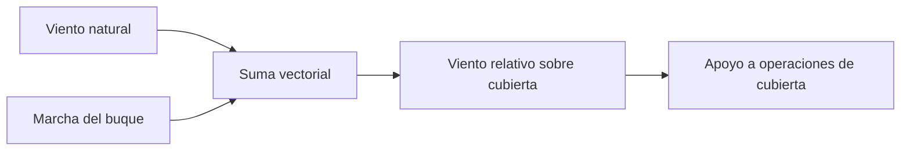

# 🧰 Recursos del portaviones

[🏠 Inicio](../../../README.md) · [🛳️ Curso: Portaviones](../README.md) · 🧰 Recursos

Glosario náutico específico, enlaces y diagramas de apoyo del curso de
portaviones. Solo material público e histórico. Amplia el
[glosario general](../../../docs/05-glosario-general.md).

---

## 📖 Glosario específico

| Término | Definición |
| --- | --- |
| Cubierta de vuelo | Superficie plana superior donde operan las aeronaves. |
| Cubierta angulada | Cubierta inclinada que separa despegue y aterrizaje. |
| Hangar | Espacio interior bajo cubierta para las aeronaves. |
| Isla | Superestructura lateral que aloja el puente. |
| Viento relativo | Viento resultante de sumar el viento natural y la marcha del buque. |
| Ascensor | Plataforma que mueve aeronaves entre hangar y cubierta. |
| Desplazamiento | Peso del agua que desplaza el buque; su peso total. |
| Nudo | Unidad de velocidad: una milla náutica por hora. |
| Babor / estribor | Costado izquierdo / derecho mirando a proa. |

---

## 🗺️ Diagrama de viento relativo

---

## 🔗 Enlaces y fuentes

- Seguridad y límites: [🦺 docs/04-seguridad-y-limites.md](../../../docs/04-seguridad-y-limites.md)
- Marco legal: [⚖️ docs/07-marco-legal-chile.md](../../../docs/07-marco-legal-chile.md)
- Registro de fuentes: [📚 manuales/fuentes.md](../../../manuales/fuentes.md)
- Buques museo y fuentes históricas públicas: ver el registro de fuentes.

Registrar cada recurso nuevo con su origen y licencia, siguiendo
[`recursos/README.md`](../../../recursos/README.md).

---

[🎓 Portada del curso](../README.md) · [⬅️ Anterior: Diseño de simulación](../simulacion/diseno-simulador-portaviones.md)
