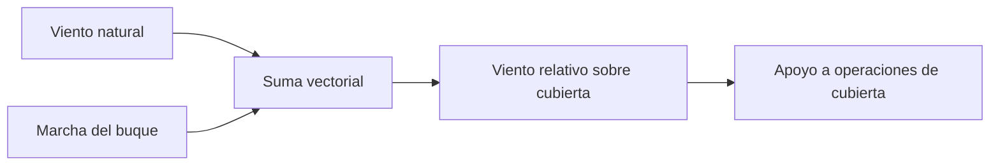

<!-- clase-meta
tipo_documento: clase
clase: 10
codigo: PORTAVIONES-10
curso: portaviones
titulo: "Recursos del portaviones"
modalidad: "taller documental"
duracion_minutos: 45
nivel: introductorio
prerrequisito: PORTAVIONES-09
competencia: "alfabetizacion_tecnica"
resultados_aprendizaje:
  - "Explicar glosario, esquemas y trazabilidad de fuentes con vocabulario propio de Portaviones."
  - "Aplicar esos conceptos a una decisión segura o a un escenario de simulación de Portaviones."
evidencia: "Glosario aplicado y ficha breve de trazabilidad."
criterio_aprobacion: "Los términos permiten interpretar el curso y las fuentes se distinguen por autoridad, alcance y vigencia."
fuentes: manuales/fuentes.md
ultima_revision: 2026-09-10
-->

# 🧰 Recursos del portaviones

[🏠 Inicio](../../../README.md) · [🛳️ Curso: Portaviones](../README.md) · 🧰 Recursos

Glosario náutico específico, enlaces y diagramas de apoyo del curso de
portaviones. Solo material público e histórico. Amplia el
[glosario general](../../../docs/05-glosario-general.md).

---

## 📖 Glosario específico

| Término | Definición |
| --- | --- |
| Cubierta de vuelo | Superficie plana superior donde operan las aeronaves. |
| Cubierta angulada | Cubierta inclinada que separa despegue y aterrizaje. |
| Hangar | Espacio interior bajo cubierta para las aeronaves. |
| Isla | Superestructura lateral que aloja el puente. |
| Viento relativo | Viento resultante de sumar el viento natural y la marcha del buque. |
| Ascensor | Plataforma que mueve aeronaves entre hangar y cubierta. |
| Desplazamiento | Peso del agua que desplaza el buque; su peso total. |
| Nudo | Unidad de velocidad: una milla náutica por hora. |
| Babor / estribor | Costado izquierdo / derecho mirando a proa. |

---

## 🗺️ Diagrama de viento relativo

```mermaid
flowchart LR
    Natural[Viento natural] --> Suma[Suma vectorial]
    Marcha[Marcha del buque] --> Suma
    Suma --> Relativo[Viento relativo sobre cubierta]
    Relativo --> Operaciones[Apoyo a operaciones de cubierta]
```

---

## 🔗 Enlaces y fuentes

- Seguridad y límites: [🦺 docs/04-seguridad-y-limites.md](../../../docs/04-seguridad-y-limites.md)
- Marco legal: [⚖️ docs/07-marco-legal-chile.md](../../../docs/07-marco-legal-chile.md)
- Registro de fuentes: [📚 manuales/fuentes.md](../../../manuales/fuentes.md)
- Buques museo y fuentes históricas públicas: ver el registro de fuentes.

Registrar cada recurso nuevo con su origen y licencia, siguiendo
[`recursos/README.md`](../../../recursos/README.md).

## 🧭 Guía de estudio aplicada

### Pregunta guía

¿Cómo ayuda **Glosario específico, Diagrama de viento relativo, Enlaces y fuentes y Guía de estudio aplicada** a **explicar con fuentes los términos planta propulsora, generación y catapulta, cubierta de vuelo y aeronave**?

### Explicación razonada

El vocabulario técnico organiza relaciones: planta propulsora, generación y catapulta, cubierta de vuelo y aeronave nombran partes distintas de una misma cadena funcional. Una fuente se usa para sostener una afirmación concreta —principio, límite, procedimiento o contexto— y debe distinguirse del manual particular de un fabricante o de una regla narrativa.

Esta clase se conecta con el resto del curso mediante **integración de viento relativo, movimiento del buque y secuencia segura de cubierta**. El hilo de
seguridad consiste en reconocer a tiempo **conflicto de trayectorias, objetos extraños o envolvente de viento inadecuada** y poder justificar la decisión
**ordenar cubierta, rumbo y velocidad antes de iniciar la recuperación**; en clases posteriores cambiará el ángulo de análisis, no esa relación causal.
La lectura funcional común sigue **planta propulsora → generación y catapulta → cubierta de vuelo → aeronave**, de modo que cada concepto pueda
ubicarse dentro del funcionamiento completo y no quede como un dato aislado.

**Apoyo documental:** [Ships](https://www.history.navy.mil/browse-by-topic/ships.html) aporta historia pública de buques militares;
[Safety of Navigation](https://www.imo.org/en/ourwork/safety/pages/navigationdefault.aspx) se usa para navegación, SOLAS, COLREG y STCW. Estas fuentes
se contrastan con el alcance de la clase y no sustituyen un manual de equipo concreto.

### Caso resuelto: de la observación a la decisión

1. **Definir en contexto:** explica **planta propulsora**, **generación y catapulta**, **cubierta de vuelo** y **aeronave** por su función y relación.
2. **Respaldar:** enlaza cada afirmación importante con una fuente identificable y declara su alcance.
3. **Contrastar:** separa principios generales, requisitos locales, manual de fabricante y —si aplica— canon ficticio.
4. **Reformular:** convierte una definición copiada en una explicación propia con un ejemplo de **Portaviones**.

### Comprueba tu comprensión

1. Explica la diferencia funcional entre **generación y catapulta** y **cubierta de vuelo** sin copiar una definición.
2. ¿Qué fuente respalda el principio «integración de viento relativo, movimiento del buque y secuencia segura de cubierta» y cuál es su alcance?
3. ¿Qué dato exigiría un manual de fabricante en vez de una fuente general?

Orientación para revisar tus respuestas

- La primera respuesta debe relacionar el eslabón elegido con un efecto posterior, no solo nombrarlo.
- La segunda debe proponer una señal medible u observable y explicar qué tendencia sería preocupante.
- La tercera debe cambiar al menos una variable de capacidad, mando, entorno o margen de seguridad.

## 🎓 Cierre de clase

- **Actividad:** Selecciona términos de glosario, esquemas y trazabilidad de fuentes, explícalos en contexto de Portaviones y verifica la procedencia de las fuentes utilizadas.
- **Evidencia:** Glosario aplicado y ficha breve de trazabilidad.
- **Criterio de aprobación:** Los términos permiten interpretar el curso y las fuentes se distinguen por autoridad, alcance y vigencia.
- **Transferencia:** explica qué cambiaría al pasar a otra variante de esta máquina.

### Fuentes de esta clase

- [US-NHHC-SHIPS](https://www.history.navy.mil/browse-by-topic/ships.html): Ships, Naval History and Heritage Command. Uso: historia pública de buques militares.
- [IMO-NAV](https://www.imo.org/en/ourwork/safety/pages/navigationdefault.aspx): Safety of Navigation, International Maritime Organization. Uso: navegación, SOLAS, COLREG y STCW.
- [US-FAA-HANDBOOKS](https://www.faa.gov/regulations_policies/handbooks_manuals): Aviation Handbooks and Manuals, FAA. Uso: aerodinámica, sistemas y operación.

> Las fuentes sostienen el marco conceptual y normativo; esta clase no reemplaza el manual
> del fabricante, la formación certificada ni la habilitación exigida para operar equipos reales.

---

[🎓 Portada del curso](../README.md) · [⬅️ Anterior: Diseño de simulación](../simulacion/diseno-simulador-portaviones.md) · [➡️ Siguiente: Ejercicios](../ejercicios/ejercicios-portaviones.md)
