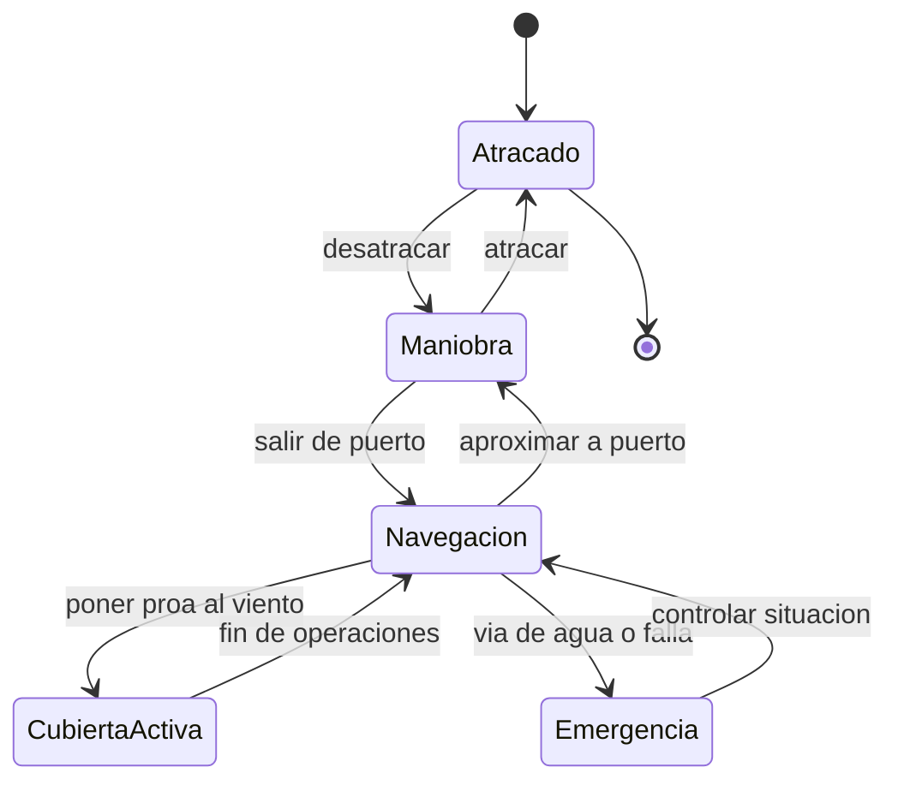

# 🎮 Diseño de simulación del portaviones

[🏠 Inicio](../../../README.md) · [🛳️ Curso: Portaviones](../README.md) · 🎮 Simulación

## Objetivo de la simulación

Que el usuario aprenda a navegar un buque muy grande respetando la inercia,
gestionar propulsión y gobierno, entender el viento relativo sobre la cubierta y
la física de flotación y estabilidad, de forma educativa. **Fuera de alcance**:
táctica, doctrina y sistemas de armas.

## Nivel de realismo

- Nivel elegido: se ofrece del 1 al 3 (ver `docs/03-niveles-de-realismo.md`).
- Justificación: el foco es histórico y físico; la escala y la cubierta agregan
  el concepto de viento relativo y retos de estabilidad.

## Variables principales

| Variable | Tipo | Rango | Afecta a | Comentarios |
| --- | --- | --- | --- | --- |
| Velocidad | numérica | 0-30 nudos | Avance y viento relativo | Suma al viento natural. |
| Rumbo | numérica | 0-359 grados | Dirección | Cambia con retardo. |
| Régimen de máquina | discreta | atrás..avante toda | Empuje | Escalonado por telégrafo. |
| Ángulo de timón | numérica | -35..35 grados | Radio de giro | Giro amplio por la masa. |
| Viento relativo | vectorial | variable | Cubierta | Rumbo y velocidad al viento. |
| Escora | numérica | grados | Estabilidad y cubierta | Vigilar en operaciones. |
| Estabilidad (GM) | numérica | positiva | Seguridad | Peso alto de la cubierta. |
| Lastre | numérica | 0-100% | Estabilidad y calado | Ajuste de peso. |

## Ciclo básico

1. Leer entrada del usuario (timón, telégrafo, rumbo al viento, lastre).
2. Actualizar estado de la máquina y la posición del timón.
3. Calcular fuerzas: empuje, resistencia, viento y corriente.
4. Calcular el viento relativo sobre la cubierta.
5. Aplicar la gran inercia al cambio de velocidad y rumbo.
6. Actualizar posición, rumbo, escora y estabilidad; refrescar instrumentos.

## Modos de juego futuros

- Tutorial guiado del puente y el telégrafo.
- Práctica libre de maniobra en puerto.
- Travesía oceánica con clima variable.
- Desafíos de rumbo al viento para cubierta, a nivel general.
- Recorridos históricos de buques museo, sin contenido sensible.

## Elementos fuera de alcance

- Táctica, doctrina o sistemas de armas de cualquier tipo.
- Detalle operativo sensible de operaciones aéreas reales.
- Datos clasificados, restringidos o no públicos.

## Pendientes

- [ ] Definir valores por defecto por clase histórica de buque.
- [ ] Prototipar el modelo de inercia y viento relativo.
- [ ] Ajustar el efecto del peso alto de la cubierta en la estabilidad.
- [ ] Agregar fuentes históricas públicas a [`manuales/fuentes.md`](../../../manuales/fuentes.md).

---

[⬅️ Anterior: Reglamentos](../reglamentos/reglamentos-portaviones.md) · [➡️ Siguiente: Recursos](../recursos/recursos-portaviones.md)
