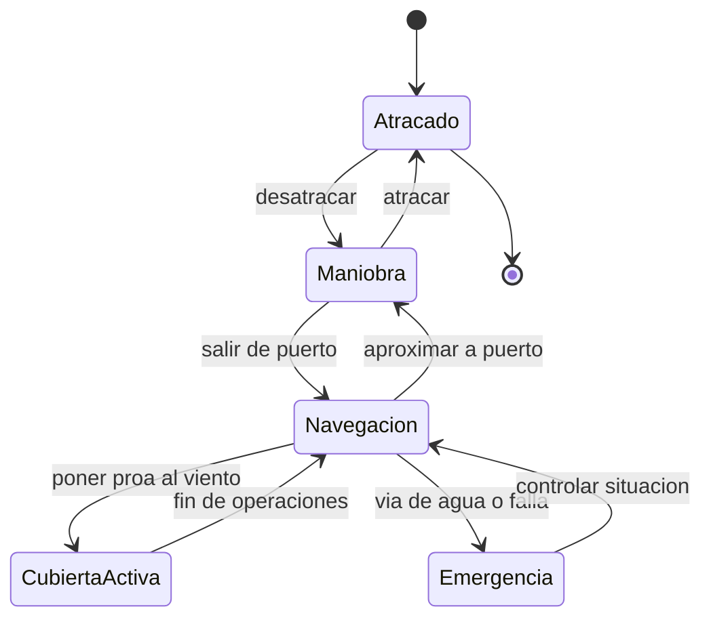

# 🎮 Diseno de simulacion del portaviones

[🏠 Inicio](../../../README.md) · [🛳️ Curso: Portaviones](../README.md) · 🎮 Simulacion

## Objetivo de la simulacion

Que el usuario aprenda a navegar un buque muy grande respetando la inercia,
gestionar propulsion y gobierno, entender el viento relativo sobre la cubierta y
la fisica de flotacion y estabilidad, de forma educativa. **Fuera de alcance**:
tactica, doctrina y sistemas de armas.

## Nivel de realismo

- Nivel elegido: se ofrece del 1 al 3 (ver `docs/03-niveles-de-realismo.md`).
- Justificacion: el foco es historico y fisico; la escala y la cubierta agregan
  el concepto de viento relativo y retos de estabilidad.

## Variables principales

| Variable | Tipo | Rango | Afecta a | Comentarios |
| --- | --- | --- | --- | --- |
| Velocidad | numerica | 0-30 nudos | Avance y viento relativo | Suma al viento natural. |
| Rumbo | numerica | 0-359 grados | Direccion | Cambia con retardo. |
| Regimen de maquina | discreta | atras..avante toda | Empuje | Escalonado por telegrafo. |
| Angulo de timon | numerica | -35..35 grados | Radio de giro | Giro amplio por la masa. |
| Viento relativo | vectorial | variable | Cubierta | Rumbo y velocidad al viento. |
| Escora | numerica | grados | Estabilidad y cubierta | Vigilar en operaciones. |
| Estabilidad (GM) | numerica | positiva | Seguridad | Peso alto de la cubierta. |
| Lastre | numerica | 0-100% | Estabilidad y calado | Ajuste de peso. |

## Ciclo basico

1. Leer entrada del usuario (timon, telegrafo, rumbo al viento, lastre).
2. Actualizar estado de la maquina y la posicion del timon.
3. Calcular fuerzas: empuje, resistencia, viento y corriente.
4. Calcular el viento relativo sobre la cubierta.
5. Aplicar la gran inercia al cambio de velocidad y rumbo.
6. Actualizar posicion, rumbo, escora y estabilidad; refrescar instrumentos.

## Modos de juego futuros

- Tutorial guiado del puente y el telegrafo.
- Practica libre de maniobra en puerto.
- Travesia oceanica con clima variable.
- Desafios de rumbo al viento para cubierta, a nivel general.
- Recorridos historicos de buques museo, sin contenido sensible.

## Elementos fuera de alcance

- Tactica, doctrina o sistemas de armas de cualquier tipo.
- Detalle operativo sensible de operaciones aereas reales.
- Datos clasificados, restringidos o no publicos.

## Pendientes

- [ ] Definir valores por defecto por clase historica de buque.
- [ ] Prototipar el modelo de inercia y viento relativo.
- [ ] Ajustar el efecto del peso alto de la cubierta en la estabilidad.
- [ ] Agregar fuentes historicas publicas a [`manuales/fuentes.md`](../../../manuales/fuentes.md).

---

[⬅️ Anterior: Reglamentos](../reglamentos/reglamentos-portaviones.md) · [➡️ Siguiente: Recursos](../recursos/recursos-portaviones.md)
