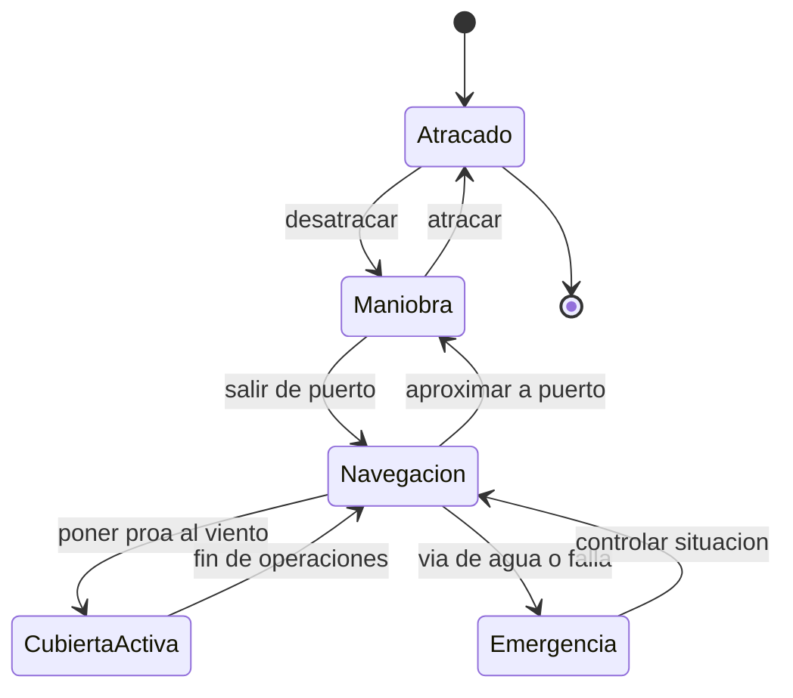
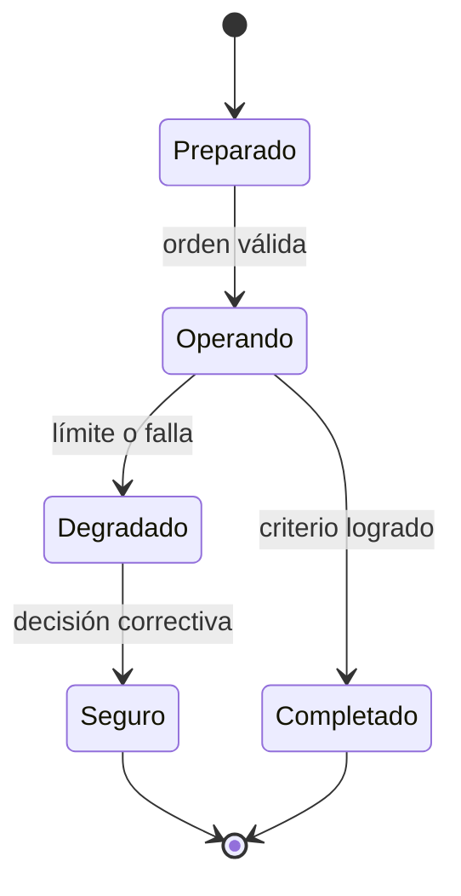

<!-- clase-meta
tipo_documento: clase
clase: 9
codigo: PORTAVIONES-09
curso: portaviones
titulo: "Diseño de simulación del portaviones"
modalidad: "laboratorio de diseño"
duracion_minutos: 90
nivel: introductorio
prerrequisito: PORTAVIONES-08
competencia: "modelado_de_simulacion"
resultados_aprendizaje:
  - "Explicar objetivo, variables, estados, ciclo y escenarios de simulación con vocabulario propio de Portaviones."
  - "Aplicar esos conceptos a una decisión segura o a un escenario de simulación de Portaviones."
evidencia: "Ficha de escenario y diagrama de estados."
criterio_aprobacion: "El modelo es específico de la máquina, medible, seguro y trazable a clases anteriores."
fuentes: manuales/fuentes.md
ultima_revision: 2026-09-10
-->

# 🎮 Diseño de simulación del portaviones

[🏠 Inicio](../../../README.md) · [🛳️ Curso: Portaviones](../README.md) · 🎮 Simulación

```mermaid
stateDiagram-v2
    [*] --> Atracado
    Atracado --> Maniobra: desatracar
    Maniobra --> Navegacion: salir de puerto
    Navegacion --> CubiertaActiva: poner proa al viento
    CubiertaActiva --> Navegacion: fin de operaciones
    Navegacion --> Maniobra: aproximar a puerto
    Maniobra --> Atracado: atracar
    Navegacion --> Emergencia: via de agua o falla
    Emergencia --> Navegacion: controlar situacion
    Atracado --> [*]
```

## Objetivo de la simulación

Que el usuario aprenda a navegar un buque muy grande respetando la inercia,
gestionar propulsión y gobierno, entender el viento relativo sobre la cubierta y
la física de flotación y estabilidad, de forma educativa. **Fuera de alcance**:
táctica, doctrina y sistemas de armas.

## Nivel de realismo

- Nivel elegido: se ofrece del 1 al 3 (ver `docs/03-niveles-de-realismo.md`).
- Justificación: el foco es histórico y físico; la escala y la cubierta agregan
  el concepto de viento relativo y retos de estabilidad.

## Variables principales

| Variable | Tipo | Rango | Afecta a | Comentarios |
| --- | --- | --- | --- | --- |
| Velocidad | numérica | 0-30 nudos | Avance y viento relativo | Suma al viento natural. |
| Rumbo | numérica | 0-359 grados | Dirección | Cambia con retardo. |
| Régimen de máquina | discreta | atrás..avante toda | Empuje | Escalonado por telégrafo. |
| Ángulo de timón | numérica | -35..35 grados | Radio de giro | Giro amplio por la masa. |
| Viento relativo | vectorial | variable | Cubierta | Rumbo y velocidad al viento. |
| Escora | numérica | grados | Estabilidad y cubierta | Vigilar en operaciones. |
| Estabilidad (GM) | numérica | positiva | Seguridad | Peso alto de la cubierta. |
| Lastre | numérica | 0-100% | Estabilidad y calado | Ajuste de peso. |

## Ciclo básico

1. Leer entrada del usuario (timón, telégrafo, rumbo al viento, lastre).
2. Actualizar estado de la máquina y la posición del timón.
3. Calcular fuerzas: empuje, resistencia, viento y corriente.
4. Calcular el viento relativo sobre la cubierta.
5. Aplicar la gran inercia al cambio de velocidad y rumbo.
6. Actualizar posición, rumbo, escora y estabilidad; refrescar instrumentos.

## Modos de juego futuros

- Tutorial guiado del puente y el telégrafo.
- Práctica libre de maniobra en puerto.
- Travesía oceánica con clima variable.
- Desafíos de rumbo al viento para cubierta, a nivel general.
- Recorridos históricos de buques museo, sin contenido sensible.

## Elementos fuera de alcance

- Táctica, doctrina o sistemas de armas de cualquier tipo.
- Detalle operativo sensible de operaciones aéreas reales.
- Datos clasificados, restringidos o no públicos.

## Pendientes

- [ ] Definir valores por defecto por clase histórica de buque.
- [ ] Prototipar el modelo de inercia y viento relativo.
- [ ] Ajustar el efecto del peso alto de la cubierta en la estabilidad.
- [ ] Agregar fuentes históricas públicas a [`manuales/fuentes.md`](../../../manuales/fuentes.md).

## 🧭 Guía de estudio aplicada

### Pregunta guía

¿Cómo ayuda **Objetivo de la simulación, Nivel de realismo, Variables principales y Ciclo básico** a **modelar recuperación simulada de aeronaves con cubierta ocupada parcialmente como estados, variables y decisiones observables**?

### Explicación razonada

Una simulación de Portaviones es educativa si representa decisiones y consecuencias. Como mínimo debe modelar el estado de planta propulsora, la respuesta de generación y catapulta, la transición en cubierta de vuelo y el resultado en aeronave. El escenario «recuperación simulada de aeronaves con cubierta ocupada parcialmente» es valioso porque obliga a observar, formular una hipótesis, actuar y comprobar.

```mermaid
stateDiagram-v2
    [*] --> Preparado
    Preparado --> Operando: orden válida
    Operando --> Degradado: límite o falla
    Degradado --> Seguro: decisión correctiva
    Operando --> Completado: criterio logrado
    Seguro --> [*]
    Completado --> [*]
```

Esta clase se conecta con el resto del curso mediante **integración de viento relativo, movimiento del buque y secuencia segura de cubierta**. El hilo de
seguridad consiste en reconocer a tiempo **conflicto de trayectorias, objetos extraños o envolvente de viento inadecuada** y poder justificar la decisión
**ordenar cubierta, rumbo y velocidad antes de iniciar la recuperación**; en clases posteriores cambiará el ángulo de análisis, no esa relación causal.
La lectura funcional común sigue **planta propulsora → generación y catapulta → cubierta de vuelo → aeronave**, de modo que cada concepto pueda
ubicarse dentro del funcionamiento completo y no quede como un dato aislado.

**Apoyo documental:** [Ships](https://www.history.navy.mil/browse-by-topic/ships.html) aporta historia pública de buques militares;
[Safety of Navigation](https://www.imo.org/en/ourwork/safety/pages/navigationdefault.aspx) se usa para navegación, SOLAS, COLREG y STCW. Estas fuentes
se contrastan con el alcance de la clase y no sustituyen un manual de equipo concreto.

### Caso resuelto: de la observación a la decisión

1. **Estado inicial:** representa recuperación simulada de aeronaves con cubierta ocupada parcialmente con valores observables para **planta propulsora**, **generación y catapulta**, **cubierta de vuelo** y **aeronave**.
2. **Decisión del estudiante:** ofrece una elección que cambie el estado, no una animación automática.
3. **Consecuencia:** modela la tendencia hacia **conflicto de trayectorias, objetos extraños o envolvente de viento inadecuada** y una señal previa que permita corregir.
4. **Cierre:** evalúa la explicación de la decisión, además de si el estudiante “ganó” el escenario.

### Comprueba tu comprensión

1. ¿Qué cuatro estados mínimos necesita el escenario «recuperación simulada de aeronaves con cubierta ocupada parcialmente»?
2. ¿Qué variable anticipa **conflicto de trayectorias, objetos extraños o envolvente de viento inadecuada** antes de llegar al estado de falla?
3. ¿Cómo evaluarías la explicación del estudiante y no solo el resultado final?

Orientación para revisar tus respuestas

- La primera respuesta debe relacionar el eslabón elegido con un efecto posterior, no solo nombrarlo.
- La segunda debe proponer una señal medible u observable y explicar qué tendencia sería preocupante.
- La tercera debe cambiar al menos una variable de capacidad, mando, entorno o margen de seguridad.

## 🎓 Cierre de clase

- **Actividad:** Diseña un escenario educativo de Portaviones basado en objetivo, variables, estados, ciclo y escenarios de simulación, con entradas, estados, variables y criterio de cierre.
- **Evidencia:** Ficha de escenario y diagrama de estados.
- **Criterio de aprobación:** El modelo es específico de la máquina, medible, seguro y trazable a clases anteriores.
- **Transferencia:** explica qué cambiaría al pasar a otra variante de esta máquina.

### Fuentes de esta clase

- [US-NHHC-SHIPS](https://www.history.navy.mil/browse-by-topic/ships.html): Ships, Naval History and Heritage Command. Uso: historia pública de buques militares.
- [IMO-NAV](https://www.imo.org/en/ourwork/safety/pages/navigationdefault.aspx): Safety of Navigation, International Maritime Organization. Uso: navegación, SOLAS, COLREG y STCW.
- [US-FAA-HANDBOOKS](https://www.faa.gov/regulations_policies/handbooks_manuals): Aviation Handbooks and Manuals, FAA. Uso: aerodinámica, sistemas y operación.

> Las fuentes sostienen el marco conceptual y normativo; esta clase no reemplaza el manual
> del fabricante, la formación certificada ni la habilitación exigida para operar equipos reales.

---

[⬅️ Anterior: Reglamentos](../reglamentos/reglamentos-portaviones.md) · [➡️ Siguiente: Recursos](../recursos/recursos-portaviones.md)
