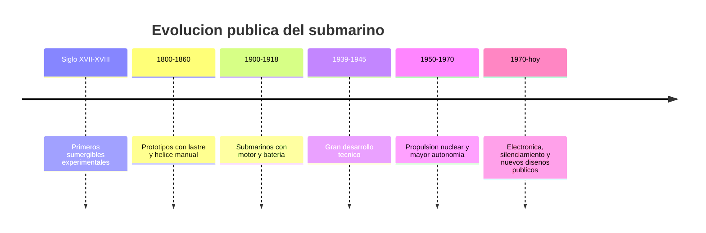

# 📜 Historia del submarino

[🏠 Inicio](../../../README.md) · [🌊 Curso: Submarinos](../README.md) · 📜 Historia

## Origen

El submarino nace del deseo de navegar bajo el agua. Los primeros sumergibles
experimentales usaban lastre y propulsión manual. Con el motor y la batería se
hizo práctico. Este módulo trata solo la evolución **histórica y pública** del
tipo de buque.

## Línea de tiempo

| Periodo | Hito | Importancia |
| --- | --- | --- |
| Siglo XVII-XVIII | Sumergibles experimentales | Prueba del concepto. |
| 1800-1860 | Lastre y hélice manual | Control básico de inmersión. |
| 1900-1918 | Motor y batería | Submarino práctico. |
| 1939-1945 | Gran desarrollo | Avances técnicos importantes. |
| 1950-1970 | Propulsión nuclear | Enorme autonomía sumergida. |
| 1970-presente | Electrónica y silenciamiento | Nuevos diseños de dominio público. |

## Evolución tecnológica

- **Casco**: del casco simple al casco resistente a la presión.
- **Flotabilidad**: perfeccionamiento de los tanques de lastre.
- **Propulsión**: de la hélice manual al motor, la batería y la energía nuclear.
- **Soporte vital**: sistemas para renovar el aire y sostener a la tripulación.
- **Navegación**: instrumentos para conocer profundidad, rumbo y presión.
- **Autonomía**: de horas sumergido a semanas o meses.

## Tipos representativos

| Tipo | Rasgo | Característica destacada |
| --- | --- | --- |
| Sumergible experimental | Histórico | Lastre y propulsión manual. |
| Submarino diesel-electrico | Clásico | Motor en superficie, batería sumergido. |
| Submarino de propulsión nuclear | Moderno | Gran autonomía sumergida. |
| Sumergible de investigación | Civil | Exploración científica del océano. |

## Impacto histórico y científico

El submarino impulso avances en ingeniería de presión, soporte vital y
propulsión. Los sumergibles civiles de investigación permiten explorar las
profundidades oceánicas, con gran valor científico y educativo.

## Fuentes

- Registrar aquí las fuentes públicas consultadas.
- Enlazar cada fuente también en [`manuales/fuentes.md`](../../../manuales/fuentes.md).

---

[🎓 Portada del curso](../README.md) · [➡️ Siguiente: Características](../operacion/caracteristicas-submarino.md)
