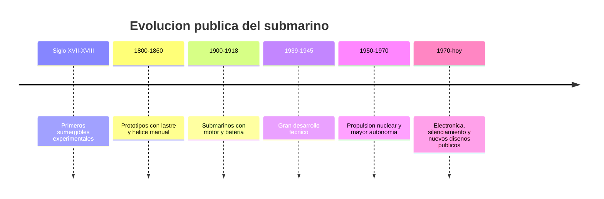

# 📜 Historia del submarino

[🏠 Inicio](../../../README.md) · [🌊 Curso: Submarinos](../README.md) · 📜 Historia

## Origen

El submarino nace del deseo de navegar bajo el agua. Los primeros sumergibles
experimentales usaban lastre y propulsion manual. Con el motor y la bateria se
hizo practico. Este modulo trata solo la evolucion **historica y publica** del
tipo de buque.

## Linea de tiempo

| Periodo | Hito | Importancia |
| --- | --- | --- |
| Siglo XVII-XVIII | Sumergibles experimentales | Prueba del concepto. |
| 1800-1860 | Lastre y helice manual | Control basico de inmersion. |
| 1900-1918 | Motor y bateria | Submarino practico. |
| 1939-1945 | Gran desarrollo | Avances tecnicos importantes. |
| 1950-1970 | Propulsion nuclear | Enorme autonomia sumergida. |
| 1970-presente | Electronica y silenciamiento | Nuevos disenos de dominio publico. |

## Evolucion tecnologica

- **Casco**: del casco simple al casco resistente a la presion.
- **Flotabilidad**: perfeccionamiento de los tanques de lastre.
- **Propulsion**: de la helice manual al motor, la bateria y la energia nuclear.
- **Soporte vital**: sistemas para renovar el aire y sostener a la tripulacion.
- **Navegacion**: instrumentos para conocer profundidad, rumbo y presion.
- **Autonomia**: de horas sumergido a semanas o meses.

## Tipos representativos

| Tipo | Rasgo | Caracteristica destacada |
| --- | --- | --- |
| Sumergible experimental | Historico | Lastre y propulsion manual. |
| Submarino diesel-electrico | Clasico | Motor en superficie, bateria sumergido. |
| Submarino de propulsion nuclear | Moderno | Gran autonomia sumergida. |
| Sumergible de investigacion | Civil | Exploracion cientifica del oceano. |

## Impacto historico y cientifico

El submarino impulso avances en ingenieria de presion, soporte vital y
propulsion. Los sumergibles civiles de investigacion permiten explorar las
profundidades oceanicas, con gran valor cientifico y educativo.

## Fuentes

- Registrar aqui las fuentes publicas consultadas.
- Enlazar cada fuente tambien en [`manuales/fuentes.md`](../../../manuales/fuentes.md).

---

[🎓 Portada del curso](../README.md) · [➡️ Siguiente: Caracteristicas](../operacion/caracteristicas-submarino.md)
