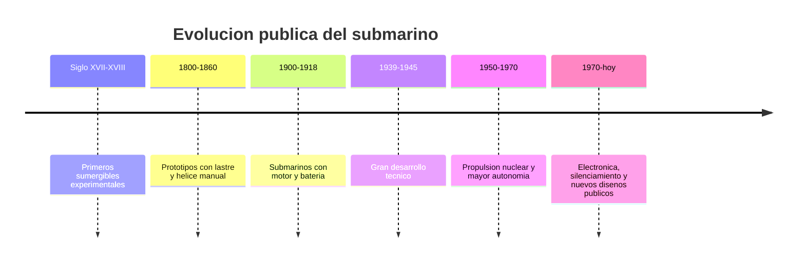

<!-- clase-meta
tipo_documento: clase
clase: 1
codigo: SUBMARINOS-01
curso: submarinos
titulo: "Historia del submarino"
modalidad: "teórica dialogada"
duracion_minutos: 45
nivel: introductorio
prerrequisito: ninguno
competencia: "contexto_historico"
resultados_aprendizaje:
  - "Explicar origen, evolución tecnológica, variantes representativas e impacto con vocabulario propio de Submarinos."
  - "Aplicar esos conceptos a una decisión segura o a un escenario de simulación de Submarinos."
evidencia: "Línea de tiempo comentada con cuatro hitos o más."
criterio_aprobacion: "Los hitos están ordenados, son pertinentes y dos relaciones de causa y efecto quedan justificadas."
fuentes: manuales/fuentes.md
ultima_revision: 2026-09-10
-->

# 📜 Historia del submarino

[🏠 Inicio](../../../README.md) · [🌊 Curso: Submarinos](../README.md) · 📜 Historia

```mermaid
timeline
    title Evolucion publica del submarino
    Siglo XVII-XVIII : Primeros sumergibles experimentales
    1800-1860 : Prototipos con lastre y helice manual
    1900-1918 : Submarinos con motor y bateria
    1939-1945 : Gran desarrollo tecnico
    1950-1970 : Propulsion nuclear y mayor autonomia
    1970-hoy : Electronica, silenciamiento y nuevos disenos publicos
```

## Origen

El submarino nace del deseo de navegar bajo el agua. Los primeros sumergibles
experimentales usaban lastre y propulsión manual. Con el motor y la batería se
hizo práctico. Esta clase trata solo la evolución **histórica y pública** del
tipo de buque.

## Línea de tiempo

| Periodo | Hito | Importancia |
| --- | --- | --- |
| Siglo XVII-XVIII | Sumergibles experimentales | Prueba del concepto. |
| 1800-1860 | Lastre y hélice manual | Control básico de inmersión. |
| 1900-1918 | Motor y batería | Submarino práctico. |
| 1939-1945 | Gran desarrollo | Avances técnicos importantes. |
| 1950-1970 | Propulsión nuclear | Enorme autonomía sumergida. |
| 1970-presente | Electrónica y silenciamiento | Nuevos diseños de dominio público. |

## Evolución tecnológica

- **Casco**: del casco simple al casco resistente a la presión.
- **Flotabilidad**: perfeccionamiento de los tanques de lastre.
- **Propulsión**: de la hélice manual al motor, la batería y la energía nuclear.
- **Soporte vital**: sistemas para renovar el aire y sostener a la tripulación.
- **Navegación**: instrumentos para conocer profundidad, rumbo y presión.
- **Autonomía**: de horas sumergido a semanas o meses.

## Tipos representativos

| Tipo | Rasgo | Característica destacada |
| --- | --- | --- |
| Sumergible experimental | Histórico | Lastre y propulsión manual. |
| Submarino diesel-eléctrico | Clásico | Motor en superficie, batería sumergido. |
| Submarino de propulsión nuclear | Moderno | Gran autonomía sumergida. |
| Sumergible de investigación | Civil | Exploración científica del océano. |

## Impacto histórico y científico

El submarino impulso avances en ingeniería de presión, soporte vital y
propulsión. Los sumergibles civiles de investigación permiten explorar las
profundidades oceánicas, con gran valor científico y educativo.

## 🧭 Guía de estudio aplicada

### Pregunta guía

¿Cómo ayuda **Origen, Línea de tiempo, Evolución tecnológica y Tipos representativos** a **explicar cómo la evolución hizo posibles alternativas como submarino diésel-eléctrico frente a nuclear**?

### Explicación razonada

La evolución de Submarinos se comprende mejor como una sucesión de respuestas a problemas, no como una lista de fechas. Los cambios en fuente de energía, motor, hélice o propulsor y planos y tanques de lastre alteraron qué podía hacer la máquina, quién podía usarla y qué riesgos debían controlarse. El contraste «submarino diésel-eléctrico frente a nuclear» permite observar qué decisiones de diseño permanecieron y cuáles cambiaron con la tecnología y el propósito.

Esta clase se conecta con el resto del curso mediante **equilibrio entre flotabilidad, peso, profundidad, trimado y control hidrodinámico**. El hilo de
seguridad consiste en reconocer a tiempo **exceso de profundidad, pérdida de control o colisión por conciencia situacional limitada** y poder justificar la decisión
**coordinar velocidad, planos y lastre observando tendencia, no solo profundidad instantánea**; en clases posteriores cambiará el ángulo de análisis, no esa relación causal.
La lectura funcional común sigue **fuente de energía → motor → hélice o propulsor → planos y tanques de lastre**, de modo que cada concepto pueda
ubicarse dentro del funcionamiento completo y no quede como un dato aislado.

**Apoyo documental:** [Ships](https://www.history.navy.mil/browse-by-topic/ships.html) aporta historia pública de buques militares;
[Safety of Navigation](https://www.imo.org/en/ourwork/safety/pages/navigationdefault.aspx) se usa para navegación, SOLAS, COLREG y STCW. Estas fuentes
se contrastan con el alcance de la clase y no sustituyen un manual de equipo concreto.

### Caso resuelto: de la observación a la decisión

1. **Situar:** ordena los hitos que explican cómo se llegó a **submarino diésel-eléctrico frente a nuclear** y describe la necesidad que impulsó cada cambio.
2. **Relacionar:** explica qué se modificó en **fuente de energía**, **motor**, **hélice o propulsor** o **planos y tanques de lastre**; una fecha sin mecanismo no basta.
3. **Interpretar:** vincula el cambio con una capacidad nueva y también con el riesgo **exceso de profundidad, pérdida de control o colisión por conciencia situacional limitada**.
4. **Transferir:** usa la evolución para justificar por qué hoy conviene **coordinar velocidad, planos y lastre observando tendencia, no solo profundidad instantánea**.

### Comprueba tu comprensión

1. ¿Qué necesidad histórica impulsó un cambio en **fuente de energía** o **motor**?
2. ¿Qué hito modificó la relación entre capacidad y **exceso de profundidad, pérdida de control o colisión por conciencia situacional limitada**?
3. ¿Por qué **submarino diésel-eléctrico frente a nuclear** no puede explicarse como una simple diferencia estética?

Orientación para revisar tus respuestas

- La primera respuesta debe relacionar el eslabón elegido con un efecto posterior, no solo nombrarlo.
- La segunda debe proponer una señal medible u observable y explicar qué tendencia sería preocupante.
- La tercera debe cambiar al menos una variable de capacidad, mando, entorno o margen de seguridad.

## 🎓 Cierre de clase

- **Actividad:** Construye una línea de tiempo de Submarinos y explica cómo dos cambios históricos transformaron su función o su puesto de mando.
- **Evidencia:** Línea de tiempo comentada con cuatro hitos o más.
- **Criterio de aprobación:** Los hitos están ordenados, son pertinentes y dos relaciones de causa y efecto quedan justificadas.
- **Transferencia:** explica qué cambiaría al pasar a otra variante de esta máquina.

### Fuentes de esta clase

- [US-NHHC-SHIPS](https://www.history.navy.mil/browse-by-topic/ships.html): Ships, Naval History and Heritage Command. Uso: historia pública de buques militares.
- [IMO-NAV](https://www.imo.org/en/ourwork/safety/pages/navigationdefault.aspx): Safety of Navigation, International Maritime Organization. Uso: navegación, SOLAS, COLREG y STCW.
- [NASA-FLIGHT](https://www1.grc.nasa.gov/beginners-guide-to-aeronautics/): Beginner's Guide to Aeronautics, NASA. Uso: contraste con física y vuelo reales.

> Las fuentes sostienen el marco conceptual y normativo; esta clase no reemplaza el manual
> del fabricante, la formación certificada ni la habilitación exigida para operar equipos reales.

---

[🎓 Portada del curso](../README.md) · [➡️ Siguiente: Características](../operacion/caracteristicas-submarino.md)
