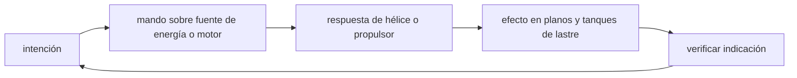

<!-- clase-meta
tipo_documento: clase
clase: 5
codigo: SUBMARINOS-05
curso: submarinos
titulo: "Mandos e instrumentos del submarino"
modalidad: "taller de simulación"
duracion_minutos: 60
nivel: introductorio
prerrequisito: SUBMARINOS-04
competencia: "lectura_y_mando"
resultados_aprendizaje:
  - "Explicar controles, instrumentos, entradas y estados del sistema con vocabulario propio de Submarinos."
  - "Aplicar esos conceptos a una decisión segura o a un escenario de simulación de Submarinos."
evidencia: "Mapa de mandos y resolución de dos estados del tablero."
criterio_aprobacion: "Reconoce los controles críticos y responde a los estados sin introducir acciones inseguras."
fuentes: manuales/fuentes.md
ultima_revision: 2026-09-10
-->

# 🎛️ Mandos e instrumentos del submarino

[🏠 Inicio](../../../README.md) · [🌊 Curso: Submarinos](../README.md) · 🎛️ Mandos

## Vista general

Esta clase describe, **a nivel educativo y solo para simulación**, el puesto de
control de un submarino. No representa operación militar real ni sistemas de
armas: se limita a la flotabilidad, el gobierno en profundidad, la propulsión y
los instrumentos básicos. El control se concentra en un puesto central donde la
tripulación coordina rumbo, profundidad y lastre.

## Mapa de controles

| Zona | Control | Tipo | Función | Prioridad | Comentarios |
| --- | --- | --- | --- | --- | --- |
| Puesto central | Timón vertical | Rueda o palanca | Cambiar el rumbo | Alta | Gobierno horizontal. |
| Puesto central | Planos de inmersión | Palancas | Ajustar ángulo y profundidad | Alta | Control fino en movimiento. |
| Puesto central | Control de lastre | Panel | Inundar o purgar tanques | Alta | Flotabilidad general. |
| Puesto central | Telégrafo / control de máquina | Palanca | Ordenar potencia | Alta | Avante, atrás, parado. |
| Puesto central | Aire comprimido | Válvulas | Emerger de emergencia | Alta | Concepto de seguridad. |
| Puesto central | Comunicaciones internas | Panel | Coordinar la tripulación | Media | Ordenes de maniobra. |
| Puesto central | Alarmas | Panel | Avisar fallas | Alta | Presión, energía, aire. |

## Instrumentos principales

| Instrumento | Mide o muestra | Unidad | Importancia | Notas |
| --- | --- | --- | --- | --- |
| Profundímetro | Profundidad | metros | Alta | Central en inmersión. |
| Manómetro | Presión externa | atmósferas | Alta | Crece con la profundidad. |
| Compás / giroscópica | Rumbo | grados | Alta | Referencia de dirección. |
| Indicador de lastre | Estado de tanques | fracción | Alta | Agua o aire en tanques. |
| Inclinómetro | Ángulo de cabeceo | grados | Alta | Control de la inmersión. |
| Nivel de oxígeno | Aire respirable | porcentaje | Alta | Soporte vital. |
| Carga de batería | Energía disponible | porcentaje | Alta | Autonomía sumergido. |

## Entradas de simulación

| Acción | Teclado | Controlador | Pantalla táctil | Comentarios |
| --- | --- | --- | --- | --- |
| Cambiar rumbo | Flechas izq/der | Stick izquierdo | Rueda táctil | Timón vertical. |
| Sumergir | Tecla S | Gatillo izquierdo | Botón descenso | Inunda lastre / planos abajo. |
| Emerger | Tecla W | Gatillo derecho | Botón ascenso | Purga lastre / planos arriba. |
| Ajustar profundidad | Flechas arriba/abajo | Stick derecho | Deslizador | Planos de inmersión. |
| Ordenar avante | Tecla E | Cruceta arriba | Palanca telégrafo | Escalonado por regímenes. |
| Parar máquina | Tecla P | Botón central | Botón parado | Régimen cero. |
| Emersión de emergencia | Barra espaciadora | Botón R1 | Botón emergencia | Aire comprimido a tanques. |

## Estados del sistema

| Estado | Descripción | Indicadores | Acciones disponibles |
| --- | --- | --- | --- |
| Superficie | Flotando, escotillas usables | Profundidad cero | Cargar batería, ventilar. |
| Inmersión | Sumergiendo | Lastre inundandose | Ajustar planos y cota. |
| En cota | Navegando sumergido | Profundidad estable | Rumbo, velocidad, vigilancia. |
| Emersión | Subiendo a superficie | Lastre purgandose | Controlar ascenso. |
| Emergencia | Falla o riesgo | Alarmas activas | Emersión de emergencia, achique. |

## Observaciones ergonomicas

- La profundidad, la presión y el rumbo deben verse en todo momento.
- El control de lastre y los planos deben distinguirse con claridad.
- El nivel de oxígeno y la carga de batería deben estar siempre visibles.
- La emersión de emergencia debe ser un control accesible y reconocible.
- Toda la interfaz debe dejar claro que es una **simulación educativa**, no
  operación real ni entrenamiento militar.

## 🧭 Guía de estudio aplicada

### Pregunta guía

¿Cómo ayuda **Vista general, Mapa de controles, Instrumentos principales y Entradas de simulación** a **interpretar mandos e indicaciones durante cambio de profundidad manteniendo rumbo y discreción**?

### Explicación razonada

Un mando no se aprende memorizando su nombre, sino recorriendo el ciclo intención → acción → indicación → verificación. En Submarinos, el operador actúa sobre fuente de energía o motor, observa la respuesta en hélice o propulsor y confirma el efecto en planos y tanques de lastre. Una indicación inesperada exige detener la secuencia mental, identificar el modo activo y evitar una segunda orden que agrave el estado.

Esta clase se conecta con el resto del curso mediante **equilibrio entre flotabilidad, peso, profundidad, trimado y control hidrodinámico**. El hilo de
seguridad consiste en reconocer a tiempo **exceso de profundidad, pérdida de control o colisión por conciencia situacional limitada** y poder justificar la decisión
**coordinar velocidad, planos y lastre observando tendencia, no solo profundidad instantánea**; en clases posteriores cambiará el ángulo de análisis, no esa relación causal.
La lectura funcional común sigue **fuente de energía → motor → hélice o propulsor → planos y tanques de lastre**, de modo que cada concepto pueda
ubicarse dentro del funcionamiento completo y no quede como un dato aislado.

**Apoyo documental:** [Ships](https://www.history.navy.mil/browse-by-topic/ships.html) aporta historia pública de buques militares;
[Safety of Navigation](https://www.imo.org/en/ourwork/safety/pages/navigationdefault.aspx) se usa para navegación, SOLAS, COLREG y STCW. Estas fuentes
se contrastan con el alcance de la clase y no sustituyen un manual de equipo concreto.

### Caso resuelto: de la observación a la decisión

1. **Intención:** formula qué cambio se necesita durante **cambio de profundidad manteniendo rumbo y discreción**.
2. **Mando:** identifica el control que actúa sobre **fuente de energía** o **motor** y el modo que debe estar activo.
3. **Lectura:** localiza la indicación que confirma la respuesta de **hélice o propulsor** y el efecto en **planos y tanques de lastre**.
4. **Verificación:** si la lectura no coincide, no acumules órdenes; estabiliza e investiga el estado.

### Comprueba tu comprensión

1. ¿Qué mando inicia la respuesta y qué instrumento confirma que el modo correcto está activo?
2. ¿Qué indicación temprana advertiría **exceso de profundidad, pérdida de control o colisión por conciencia situacional limitada**?
3. ¿Qué secuencia usarías si la respuesta de **planos y tanques de lastre** no coincide con la orden?

Orientación para revisar tus respuestas

- La primera respuesta debe relacionar el eslabón elegido con un efecto posterior, no solo nombrarlo.
- La segunda debe proponer una señal medible u observable y explicar qué tendencia sería preocupante.
- La tercera debe cambiar al menos una variable de capacidad, mando, entorno o margen de seguridad.

## 🎓 Cierre de clase

- **Actividad:** Recorre el puesto de mando simulado de Submarinos: localiza los controles de controles, instrumentos, entradas y estados del sistema y asocia cada indicación con una decisión.
- **Evidencia:** Mapa de mandos y resolución de dos estados del tablero.
- **Criterio de aprobación:** Reconoce los controles críticos y responde a los estados sin introducir acciones inseguras.
- **Transferencia:** explica qué cambiaría al pasar a otra variante de esta máquina.

### Fuentes de esta clase

- [US-NHHC-SHIPS](https://www.history.navy.mil/browse-by-topic/ships.html): Ships, Naval History and Heritage Command. Uso: historia pública de buques militares.
- [IMO-NAV](https://www.imo.org/en/ourwork/safety/pages/navigationdefault.aspx): Safety of Navigation, International Maritime Organization. Uso: navegación, SOLAS, COLREG y STCW.
- [NASA-FLIGHT](https://www1.grc.nasa.gov/beginners-guide-to-aeronautics/): Beginner's Guide to Aeronautics, NASA. Uso: contraste con física y vuelo reales.

> Las fuentes sostienen el marco conceptual y normativo; esta clase no reemplaza el manual
> del fabricante, la formación certificada ni la habilitación exigida para operar equipos reales.

---

[⬅️ Anterior: Sistemas mecánicos](../operacion/sistemas-mecanicos-submarino.md) · [➡️ Siguiente: Principios y operación](../operacion/principios-submarino.md)
