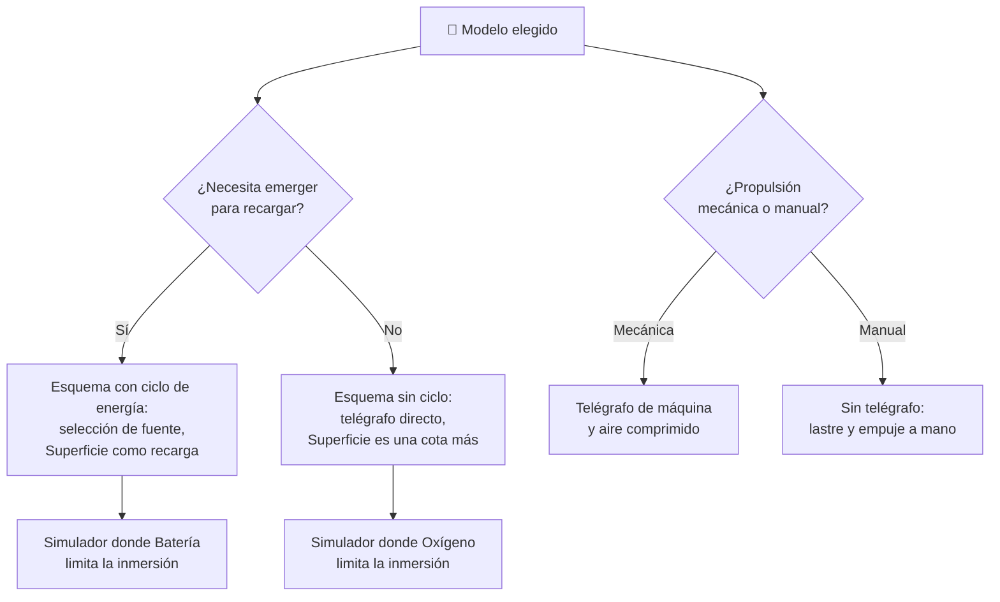

# 🧩 Modelos y variantes del submarino

[🏠 Inicio](../../../README.md) · [🌊 Curso: Submarinos](../README.md) · 🧩 Modelos

El [Módulo 2](../operacion/caracteristicas-submarino.md) ya dijo qué tipos de
submarino existieron y cuál fue el papel general de cada uno. Este módulo
responde a lo siguiente: **no todos se gobiernan igual**, y esa diferencia no es
de matiz. Cambia qué mandos tiene la máquina y, por tanto, qué debe modelar el
simulador.

> 🎯 **La idea que sostiene el módulo.** "Un submarino" no es una sola máquina
> desde el punto de vista del mando. Un diesel-eléctrico depende de emerger o
> usar el snórkel para recargar su batería; un nuclear no. No es que lo tenga
> más fácil: es que **esa restricción no existe** en él. Todo lo que sigue se
> distingue por propulsión, autonomía y flotabilidad, con marco público y
> educativo: no hay táctica, doctrina ni sistemas de armas en ningún punto.

---

## 🧭 Por qué el modelo decide el simulador

El [Módulo 5](../mandos/manual-mandos-submarino.md) describe un puesto de
control con un telégrafo de máquina y una carga de batería que debe estar
siempre visible. El [Módulo 9](../simulacion/diseno-simulador-submarino.md)
expone una variable `Batería` con rango `0-100%` que rige la **autonomía
sumergido**, y un estado `Superficie` cuya acción propia es *cargar batería*.
Ambos describen un submarino **convencional diesel-eléctrico**.

En un nuclear ese vínculo se rompe. La `Batería` deja de ser el reloj que marca
cuánto puede durar la inmersión, y el estado `Superficie` pierde su razón de
ser: ya no es el sitio al que hay que volver, es una posición más. Lo que limita
la inmersión pasa a ser el `Oxígeno` y el soporte vital, no la energía. Si el
simulador se construye sobre el ciclo "sumergirse, gastar batería, emerger a
recargar" y luego se le "añade" un nuclear, el resultado es un nuclear que tiene
que subir a repostar, que no existe.

---

## 🗂️ Qué cambia en el manejo

| Modelo | Qué cambia al gobernarlo |
| --- | --- |
| Diesel-eléctrico | La referencia del curso: motor en superficie, batería sumergido. La inmersión es un préstamo de energía que se paga emergiendo o con snórkel. |
| Propulsión nuclear | La energía deja de ser un recurso que se administra. La inmersión se gobierna sola contra el soporte vital y la cota, no contra la carga. |
| Experimental | Lastre y propulsión manual: la velocidad depende del esfuerzo de la tripulación, no de una orden de potencia. Todo el gobierno es directo y lento. |
| Investigación civil | La inmersión es una salida acotada, no una campaña: se desciende a una cota de trabajo, se opera y se sube. La profundidad es el objetivo, no un medio. |

---

## 🎛️ Qué cambia en el mando

| Modelo | Qué mando aparece o desaparece | Consecuencia |
| --- | --- | --- |
| Diesel-eléctrico | Ninguno: el mapa de controles del Módulo 5 aplica tal cual. **Aparece** la selección de fuente de propulsión (diesel en superficie / batería sumergido). | El telégrafo no manda solo potencia: manda potencia *de una fuente concreta*, y esa fuente depende de la profundidad. |
| Propulsión nuclear | **Desaparece** la selección de fuente. El telégrafo pide potencia sin más. | La carga de batería deja de ser un instrumento de decisión; el nivel de oxígeno queda como único reloj de la inmersión. |
| Experimental | **Desaparecen** el telégrafo, el aire comprimido y el panel de lastre. La propulsión y el lastre **se mudan** a accionamiento manual. | No hay emersión de emergencia como control: la reserva de aire comprimido del Módulo 5 no está ahí para pulsarla. |
| Investigación civil | **Desaparece** el telégrafo escalonado en regímenes; el empuje se ordena de forma continua y fina. | El gobierno se parece más a posicionarse que a navegar: se maniobra para quedarse quieto, no para avanzar. |

---

## 🎮 Qué cambia en el simulador

Contrastado con las variables del
[Módulo 9](../simulacion/diseno-simulador-submarino.md):

| Modelo | Variables que cambian | Esquema de control |
| --- | --- | --- |
| Diesel-eléctrico | Ninguna: es el caso base. `Batería` se descarga sumergido y solo se repone en `Superficie`. | El del Módulo 5. |
| Propulsión nuclear | `Batería` **deja de limitar la autonomía** o desaparece como recurso administrable. `Oxígeno` pasa a ser la única variable que cierra la inmersión. | El mismo, sin selección de fuente y sin el bucle de recarga. |
| Experimental | `Velocidad` **reduce** mucho su rango útil y deja de depender del telégrafo. `Lastre` se mueve en pasos gruesos y lentos. `Presión externa` acota una `Profundidad` mucho menor. | Sin telégrafo ni aire comprimido; lastre y empuje manuales. |
| Investigación civil | `Profundidad` y `Presión externa` **amplían** su rango: la cota es el terreno de juego, no el borde. `Velocidad` se estrecha; `Rumbo` pierde peso frente a `Flotabilidad`. | El mismo, con empuje continuo en lugar de regímenes. |

---

## 🗺️ Del modelo al esquema de control

---

## ⚠️ Qué modelos no comparten simulador

Dos familias no se resuelven con un ajuste de parámetros, porque su esquema de
control es otro:

- **El nuclear** frente al convencional: no le sobra batería, es que la variable
  deja de gobernar la partida. Desaparecen la selección de fuente y el bucle
  `Superficie → cargar batería`. Es un modo de control distinto, no una
  dificultad distinta.
- **El experimental** frente a los demás: faltan el telégrafo y el aire
  comprimido, y dos mandos se accionan a mano. Un simulador que le ofrezca
  emersión de emergencia le está prestando un sistema que no tiene.

El diesel-eléctrico y el sumergible civil sí caben en un mismo simulador
ajustando rangos, tal como plantean los
[niveles de realismo](../../../docs/03-niveles-de-realismo.md): en el nivel 1
sumergir, emerger y mantener cota se parecen bastante en ambos, y las
diferencias emergen a medida que el nivel sube y entran la gestión de aire, la
batería y la cota máxima.

> ⚖️ **El principio detrás de todo esto.** Cuánto pesa la carga y dónde va no cambia
> solo los números: cambia qué puede hacer el operador. La física común a todas las
> máquinas del catálogo —sostener, girar, equilibrar y la masa que cambia en
> marcha— está en [⚖️ carga y manejo](../../../docs/09-carga-y-manejo.md).

---

[⬅️ Anterior: Características](../operacion/caracteristicas-submarino.md) · [➡️ Siguiente: Sistemas mecánicos](../operacion/sistemas-mecanicos-submarino.md)
