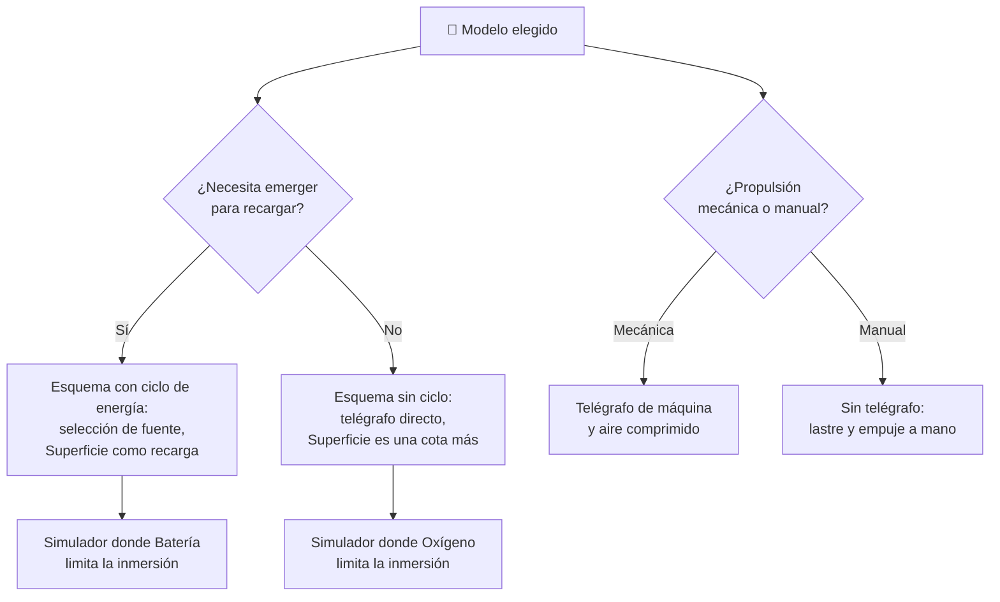

<!-- clase-meta
tipo_documento: clase
clase: 3
codigo: SUBMARINOS-03
curso: submarinos
titulo: "Modelos y variantes del submarino"
modalidad: "comparativa guiada"
duracion_minutos: 60
nivel: introductorio
prerrequisito: SUBMARINOS-02
competencia: "seleccion_de_configuracion"
resultados_aprendizaje:
  - "Explicar manejo, arquitectura de mandos y variables de simulación con vocabulario propio de Submarinos."
  - "Aplicar esos conceptos a una decisión segura o a un escenario de simulación de Submarinos."
evidencia: "Matriz comparativa y decisión justificada."
criterio_aprobacion: "La elección considera función, límites, mando y efecto en la simulación; no se apoya solo en preferencias."
fuentes: manuales/fuentes.md
ultima_revision: 2026-09-10
-->

# 🧩 Modelos y variantes del submarino

[🏠 Inicio](../../../README.md) · [🌊 Curso: Submarinos](../README.md) · 🧩 Modelos

El [Clase 2](../operacion/caracteristicas-submarino.md) ya dijo qué tipos de
submarino existieron y cuál fue el papel general de cada uno. Esta clase
responde a lo siguiente: **no todos se gobiernan igual**, y esa diferencia no es
de matiz. Cambia qué mandos tiene la máquina y, por tanto, qué debe modelar el
simulador.

> 🎯 **La idea que sostiene el módulo.** "Un submarino" no es una sola máquina
> desde el punto de vista del mando. Un diesel-eléctrico depende de emerger o
> usar el snórkel para recargar su batería; un nuclear no. No es que lo tenga
> más fácil: es que **esa restricción no existe** en él. Todo lo que sigue se
> distingue por propulsión, autonomía y flotabilidad, con marco público y
> educativo: no hay táctica, doctrina ni sistemas de armas en ningún punto.

---

## 🧭 Por qué el modelo decide el simulador

El [Clase 5](../mandos/manual-mandos-submarino.md) describe un puesto de
control con un telégrafo de máquina y una carga de batería que debe estar
siempre visible. El [Clase 9](../simulacion/diseno-simulador-submarino.md)
expone una variable `Batería` con rango `0-100%` que rige la **autonomía
sumergido**, y un estado `Superficie` cuya acción propia es *cargar batería*.
Ambos describen un submarino **convencional diesel-eléctrico**.

En un nuclear ese vínculo se rompe. La `Batería` deja de ser el reloj que marca
cuánto puede durar la inmersión, y el estado `Superficie` pierde su razón de
ser: ya no es el sitio al que hay que volver, es una posición más. Lo que limita
la inmersión pasa a ser el `Oxígeno` y el soporte vital, no la energía. Si el
simulador se construye sobre el ciclo "sumergirse, gastar batería, emerger a
recargar" y luego se le "añade" un nuclear, el resultado es un nuclear que tiene
que subir a repostar, que no existe.

---

## 🗂️ Qué cambia en el manejo

| Modelo | Qué cambia al gobernarlo |
| --- | --- |
| Diesel-eléctrico | La referencia del curso: motor en superficie, batería sumergido. La inmersión es un préstamo de energía que se paga emergiendo o con snórkel. |
| Propulsión nuclear | La energía deja de ser un recurso que se administra. La inmersión se gobierna sola contra el soporte vital y la cota, no contra la carga. |
| Experimental | Lastre y propulsión manual: la velocidad depende del esfuerzo de la tripulación, no de una orden de potencia. Todo el gobierno es directo y lento. |
| Investigación civil | La inmersión es una salida acotada, no una campaña: se desciende a una cota de trabajo, se opera y se sube. La profundidad es el objetivo, no un medio. |

---

## 🎛️ Qué cambia en el mando

| Modelo | Qué mando aparece o desaparece | Consecuencia |
| --- | --- | --- |
| Diesel-eléctrico | Ninguno: el mapa de controles del Clase 5 aplica tal cual. **Aparece** la selección de fuente de propulsión (diesel en superficie / batería sumergido). | El telégrafo no manda solo potencia: manda potencia *de una fuente concreta*, y esa fuente depende de la profundidad. |
| Propulsión nuclear | **Desaparece** la selección de fuente. El telégrafo pide potencia sin más. | La carga de batería deja de ser un instrumento de decisión; el nivel de oxígeno queda como único reloj de la inmersión. |
| Experimental | **Desaparecen** el telégrafo, el aire comprimido y el panel de lastre. La propulsión y el lastre **se mudan** a accionamiento manual. | No hay emersión de emergencia como control: la reserva de aire comprimido del Clase 5 no está ahí para pulsarla. |
| Investigación civil | **Desaparece** el telégrafo escalonado en regímenes; el empuje se ordena de forma continua y fina. | El gobierno se parece más a posicionarse que a navegar: se maniobra para quedarse quieto, no para avanzar. |

---

## 🎮 Qué cambia en el simulador

Contrastado con las variables del
[Clase 9](../simulacion/diseno-simulador-submarino.md):

| Modelo | Variables que cambian | Esquema de control |
| --- | --- | --- |
| Diesel-eléctrico | Ninguna: es el caso base. `Batería` se descarga sumergido y solo se repone en `Superficie`. | El del Clase 5. |
| Propulsión nuclear | `Batería` **deja de limitar la autonomía** o desaparece como recurso administrable. `Oxígeno` pasa a ser la única variable que cierra la inmersión. | El mismo, sin selección de fuente y sin el bucle de recarga. |
| Experimental | `Velocidad` **reduce** mucho su rango útil y deja de depender del telégrafo. `Lastre` se mueve en pasos gruesos y lentos. `Presión externa` acota una `Profundidad` mucho menor. | Sin telégrafo ni aire comprimido; lastre y empuje manuales. |
| Investigación civil | `Profundidad` y `Presión externa` **amplían** su rango: la cota es el terreno de juego, no el borde. `Velocidad` se estrecha; `Rumbo` pierde peso frente a `Flotabilidad`. | El mismo, con empuje continuo en lugar de regímenes. |

---

## 🗺️ Del modelo al esquema de control

```mermaid
flowchart TD
    Modelo[🧩 Modelo elegido] --> Energia{¿Necesita emerger<br/>para recargar?}
    Energia -- Sí --> Ciclo[Esquema con ciclo de energía:<br/>selección de fuente,<br/>Superficie como recarga]
    Energia -- No --> Continuo[Esquema sin ciclo:<br/>telégrafo directo,<br/>Superficie es una cota más]
    Ciclo --> Var1[Simulador donde Batería<br/>limita la inmersión]
    Continuo --> Var2[Simulador donde Oxígeno<br/>limita la inmersión]
    Modelo --> Prop{¿Propulsión<br/>mecánica o manual?}
    Prop -- Mecánica --> Tel[Telégrafo de máquina<br/>y aire comprimido]
    Prop -- Manual --> Man[Sin telégrafo:<br/>lastre y empuje a mano]
```

---

## ⚠️ Qué modelos no comparten simulador

Dos familias no se resuelven con un ajuste de parámetros, porque su esquema de
control es otro:

- **El nuclear** frente al convencional: no le sobra batería, es que la variable
  deja de gobernar la partida. Desaparecen la selección de fuente y el bucle
  `Superficie → cargar batería`. Es un modo de control distinto, no una
  dificultad distinta.
- **El experimental** frente a los demás: faltan el telégrafo y el aire
  comprimido, y dos mandos se accionan a mano. Un simulador que le ofrezca
  emersión de emergencia le está prestando un sistema que no tiene.

El diesel-eléctrico y el sumergible civil sí caben en un mismo simulador
ajustando rangos, tal como plantean los
[niveles de realismo](../../../docs/03-niveles-de-realismo.md): en el nivel 1
sumergir, emerger y mantener cota se parecen bastante en ambos, y las
diferencias emergen a medida que el nivel sube y entran la gestión de aire, la
batería y la cota máxima.

> ⚖️ **El principio detrás de todo esto.** Cuánto pesa la carga y dónde va no cambia
> solo los números: cambia qué puede hacer el operador. La física común a todas las
> máquinas del catálogo —sostener, girar, equilibrar y la masa que cambia en
> marcha— está en [⚖️ carga y manejo](../../../docs/09-carga-y-manejo.md).

## 🧭 Guía de estudio aplicada

### Pregunta guía

¿Cómo ayuda **Por qué el modelo decide el simulador, Qué cambia en el manejo, Qué cambia en el mando y Qué cambia en el simulador** a **comparar submarino diésel-eléctrico frente a nuclear frente al mismo encargo**?

### Explicación razonada

Las variantes «submarino diésel-eléctrico frente a nuclear» resuelven prioridades distintas. Una comparación profesional sigue la cadena fuente de energía → motor → hélice o propulsor → planos y tanques de lastre: cada cambio de arquitectura modifica mandos, respuesta, mantenimiento y variables que una simulación debe representar. Elegir un modelo significa justificar qué compromiso sirve mejor al caso, no declarar un favorito.

Esta clase se conecta con el resto del curso mediante **equilibrio entre flotabilidad, peso, profundidad, trimado y control hidrodinámico**. El hilo de
seguridad consiste en reconocer a tiempo **exceso de profundidad, pérdida de control o colisión por conciencia situacional limitada** y poder justificar la decisión
**coordinar velocidad, planos y lastre observando tendencia, no solo profundidad instantánea**; en clases posteriores cambiará el ángulo de análisis, no esa relación causal.
La lectura funcional común sigue **fuente de energía → motor → hélice o propulsor → planos y tanques de lastre**, de modo que cada concepto pueda
ubicarse dentro del funcionamiento completo y no quede como un dato aislado.

**Apoyo documental:** [Ships](https://www.history.navy.mil/browse-by-topic/ships.html) aporta historia pública de buques militares;
[Safety of Navigation](https://www.imo.org/en/ourwork/safety/pages/navigationdefault.aspx) se usa para navegación, SOLAS, COLREG y STCW. Estas fuentes
se contrastan con el alcance de la clase y no sustituyen un manual de equipo concreto.

### Caso resuelto: de la observación a la decisión

1. **Mantener el encargo constante:** ambas variantes deben evaluarse ante **cambio de profundidad manteniendo rumbo y discreción**.
2. **Trazar consecuencias:** para cada variante sigue el efecto desde **fuente de energía** hasta **planos y tanques de lastre**.
3. **Comparar el puesto de mando:** determina qué debe percibir y controlar el operador en cada arquitectura.
4. **Justificar:** elige una variante y explica qué sacrifica; toda selección técnica contiene un compromiso.

### Comprueba tu comprensión

1. ¿Qué cambia en la cadena **fuente de energía → motor → hélice o propulsor → planos y tanques de lastre** entre las dos variantes?
2. ¿Qué indicación o mando adicional necesitaría una de ellas?
3. ¿Cuál elegirías para «cambio de profundidad manteniendo rumbo y discreción» y qué desventaja aceptarías?

Orientación para revisar tus respuestas

- La primera respuesta debe relacionar el eslabón elegido con un efecto posterior, no solo nombrarlo.
- La segunda debe proponer una señal medible u observable y explicar qué tendencia sería preocupante.
- La tercera debe cambiar al menos una variable de capacidad, mando, entorno o margen de seguridad.

## 🎓 Cierre de clase

- **Actividad:** Compara variantes de Submarinos mediante los ejes «manejo, arquitectura de mandos y variables de simulación» y elige una para un caso de uso razonado.
- **Evidencia:** Matriz comparativa y decisión justificada.
- **Criterio de aprobación:** La elección considera función, límites, mando y efecto en la simulación; no se apoya solo en preferencias.
- **Transferencia:** explica qué cambiaría al pasar a otra variante de esta máquina.

### Fuentes de esta clase

- [US-NHHC-SHIPS](https://www.history.navy.mil/browse-by-topic/ships.html): Ships, Naval History and Heritage Command. Uso: historia pública de buques militares.
- [IMO-NAV](https://www.imo.org/en/ourwork/safety/pages/navigationdefault.aspx): Safety of Navigation, International Maritime Organization. Uso: navegación, SOLAS, COLREG y STCW.
- [NASA-FLIGHT](https://www1.grc.nasa.gov/beginners-guide-to-aeronautics/): Beginner's Guide to Aeronautics, NASA. Uso: contraste con física y vuelo reales.

> Las fuentes sostienen el marco conceptual y normativo; esta clase no reemplaza el manual
> del fabricante, la formación certificada ni la habilitación exigida para operar equipos reales.

---

[⬅️ Anterior: Características](../operacion/caracteristicas-submarino.md) · [➡️ Siguiente: Sistemas mecánicos](../operacion/sistemas-mecanicos-submarino.md)
