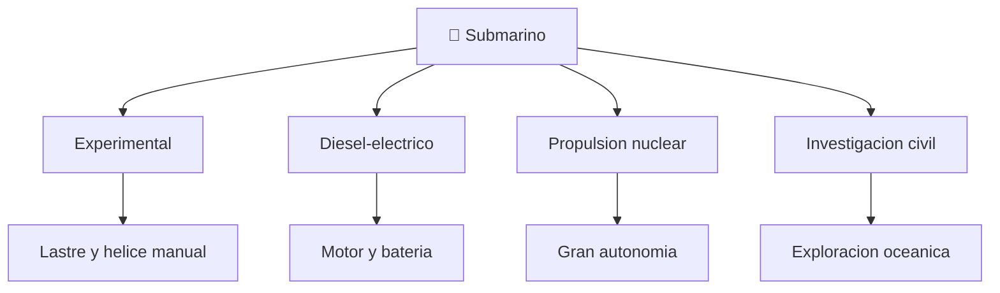

# 📋 Caracteristicas funcionales del submarino

[🏠 Inicio](../../../README.md) · [🌊 Curso: Submarinos](../README.md) · 📋 Caracteristicas

Que es un submarino, que tipos historicos existieron y cual fue su papel general.
Contexto publico antes de abrir la fisica de inmersion (Modulo 3). No se
documentan tactica ni sistemas de armas.

---

## 🧭 Definicion

Un submarino es un buque capaz de navegar en superficie y bajo el agua
controlando su flotabilidad. En superficie flota como cualquier buque; para
sumergirse inunda tanques de lastre y aumenta su peso hasta igualar el empuje.
Su rasgo distintivo es la **flotabilidad variable** y el casco resistente a la
presion.

---

## 🧬 Caracteristicas clave

| Caracteristica | Descripcion |
| --- | --- |
| Flotabilidad variable | Se sumerge o emerge ajustando el lastre. |
| Casco resistente | Soporta la presion del agua a profundidad. |
| Control de profundidad | Usa lastre y planos de inmersion. |
| Soporte vital | Renueva el aire y sostiene a la tripulacion. |
| Autonomia | Puede permanecer sumergido largos periodos. |
| Sigilo | Disenado para navegar de forma discreta. |

---

## 🗂️ Tipos historicos

| Tipo | Epoca | Rasgo destacado |
| --- | --- | --- |
| Experimental | Historico | Lastre y propulsion manual. |
| Diesel-electrico | Clasico | Motor en superficie, bateria sumergido. |
| Propulsion nuclear | Moderno | Gran autonomia sumergida. |
| Investigacion civil | Actual | Exploracion cientifica de profundidades. |

---

## 🎯 Para que se uso

- Navegacion sumergida (contexto historico general).
- Investigacion cientifica de las profundidades (sumergibles civiles).
- Avances en ingenieria de presion y soporte vital.
- En este repositorio: base para simulacion educativa de flotabilidad e inmersion.

---

[⬅️ Anterior: Historia](../historia/historia-submarino.md) · [➡️ Siguiente: Sistemas mecanicos](sistemas-mecanicos-submarino.md)
