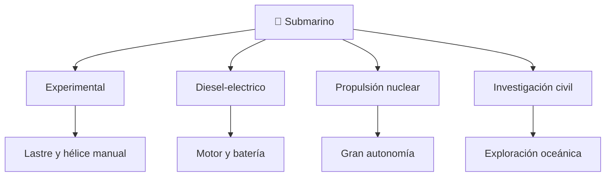

# 📋 Características funcionales del submarino

[🏠 Inicio](../../../README.md) · [🌊 Curso: Submarinos](../README.md) · 📋 Características

Que es un submarino, que tipos históricos existieron y cual fue su papel general.
Contexto público antes de abrir la física de inmersión (Módulo 3). No se
documentan táctica ni sistemas de armas.

---

## 🧭 Definición

Un submarino es un buque capaz de navegar en superficie y bajo el agua
controlando su flotabilidad. En superficie flota como cualquier buque; para
sumergirse inunda tanques de lastre y aumenta su peso hasta igualar el empuje.
Su rasgo distintivo es la **flotabilidad variable** y el casco resistente a la
presión.

---

## 🧬 Características clave

| Característica | Descripción |
| --- | --- |
| Flotabilidad variable | Se sumerge o emerge ajustando el lastre. |
| Casco resistente | Soporta la presión del agua a profundidad. |
| Control de profundidad | Usa lastre y planos de inmersión. |
| Soporte vital | Renueva el aire y sostiene a la tripulación. |
| Autonomía | Puede permanecer sumergido largos periodos. |
| Sigilo | Disenado para navegar de forma discreta. |

---

## 🗂️ Tipos históricos

| Tipo | Época | Rasgo destacado |
| --- | --- | --- |
| Experimental | Histórico | Lastre y propulsión manual. |
| Diesel-electrico | Clásico | Motor en superficie, batería sumergido. |
| Propulsión nuclear | Moderno | Gran autonomía sumergida. |
| Investigación civil | Actual | Exploración científica de profundidades. |

---

## 🎯 Para qué se usó

- Navegación sumergida (contexto histórico general).
- Investigación científica de las profundidades (sumergibles civiles).
- Avances en ingeniería de presión y soporte vital.
- En este repositorio: base para simulación educativa de flotabilidad e inmersión.

---

[⬅️ Anterior: Historia](../historia/historia-submarino.md) · [➡️ Siguiente: Sistemas mecánicos](sistemas-mecanicos-submarino.md)
