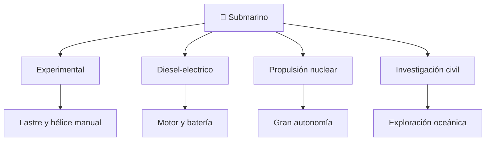

# 📋 Características funcionales del submarino

[🏠 Inicio](../../../README.md) · [🌊 Curso: Submarinos](../README.md) · 📋 Características

Que es un submarino, que tipos históricos existieron y cual fue su papel general.
Contexto público antes de abrir la física de inmersión (Módulo 4). No se
documentan táctica ni sistemas de armas.

---

## 🧭 Definición

Un submarino es un buque capaz de navegar en superficie y bajo el agua
controlando su flotabilidad. En superficie flota como cualquier buque; para
sumergirse inunda tanques de lastre y aumenta su peso hasta igualar el empuje.
Su rasgo distintivo es la **flotabilidad variable** y el casco resistente a la
presión.

---

## 🧬 Características clave

| Característica | Descripción |
| --- | --- |
| Flotabilidad variable | Se sumerge o emerge ajustando el lastre. |
| Casco resistente | Soporta la presión del agua a profundidad. |
| Control de profundidad | Usa lastre y planos de inmersión. |
| Soporte vital | Renueva el aire y sostiene a la tripulación. |
| Autonomía | Puede permanecer sumergido largos periodos. |
| Sigilo | Disenado para navegar de forma discreta. |

---

## 🗂️ Tipos históricos

```mermaid
flowchart TD
    Sub[🌊 Submarino] --> Experimental[Experimental]
    Sub --> Convencional[Diesel-electrico]
    Sub --> Nuclear[Propulsión nuclear]
    Sub --> Civil[Investigación civil]
    Experimental --> Manual[Lastre y hélice manual]
    Convencional --> Bateria[Motor y batería]
    Nuclear --> Autonomia[Gran autonomía]
    Civil --> Exploracion[Exploración oceánica]
```

| Tipo | Época | Rasgo destacado |
| --- | --- | --- |
| Experimental | Histórico | Lastre y propulsión manual. |
| Diesel-eléctrico | Clásico | Motor en superficie, batería sumergido. |
| Propulsión nuclear | Moderno | Gran autonomía sumergida. |
| Investigación civil | Actual | Exploración científica de profundidades. |

---

## 🎯 Para qué se usó

- Navegación sumergida (contexto histórico general).
- Investigación científica de las profundidades (sumergibles civiles).
- Avances en ingeniería de presión y soporte vital.
- En este repositorio: base para simulación educativa de flotabilidad e inmersión.

## 🎓 Cierre de clase

- **Actividad:** Compara variantes de Submarinos mediante los ejes «definición, rasgos funcionales, tipos y usos» y elige una para un caso de uso razonado.
- **Evidencia:** Matriz comparativa y decisión justificada.
- **Criterio de aprobación:** La elección considera función, límites, mando y efecto en la simulación; no se apoya solo en preferencias.
- **Transferencia:** explica qué cambiaría al pasar a otra variante de esta máquina.

### Fuentes de esta clase

- [US-NHHC-SHIPS](https://www.history.navy.mil/browse-by-topic/ships.html): Ships, Naval History and Heritage Command. Uso: historia pública de buques militares.
- [IMO-NAV](https://www.imo.org/en/ourwork/safety/pages/navigationdefault.aspx): Safety of Navigation, International Maritime Organization. Uso: navegación, SOLAS, COLREG y STCW.
- [NASA-FLIGHT](https://www1.grc.nasa.gov/beginners-guide-to-aeronautics/): Beginner's Guide to Aeronautics, NASA. Uso: contraste con física y vuelo reales.

> Las fuentes sostienen el marco conceptual y normativo; esta clase no reemplaza el manual
> del fabricante, la formación certificada ni la habilitación exigida para operar equipos reales.

---

[⬅️ Anterior: Historia](../historia/historia-submarino.md) · [➡️ Siguiente: Modelos y variantes](../modelos/modelos-submarino.md)
