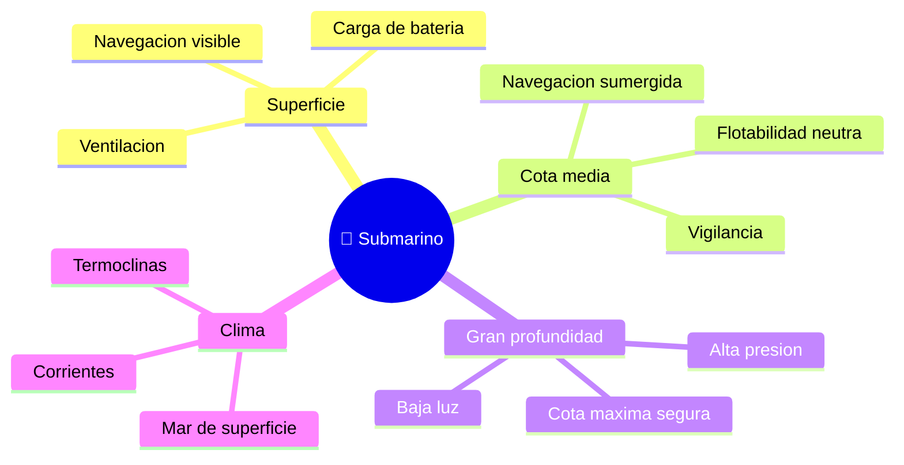

# 🌍 Entornos de trabajo del submarino

[🏠 Inicio](../../../README.md) · [🌊 Curso: Submarinos](../README.md) · 🌍 Entornos

Dónde opera un submarino y cómo cambia la navegación según la profundidad y el
entorno. Enfoque general y educativo; cada entorno se traduce en un escenario de
simulación distinto.

---

## 🗺️ Entornos principales

| Entorno | Características | Riesgos típicos | Ajuste de navegación |
| --- | --- | --- | --- |
| Superficie | Flotando, visible. | Abordaje, mar gruesa. | Vigilancia, luces, COLREG. |
| Cota media | Sumergido, presión moderada. | Perder cota, choque con fondo. | Flotabilidad neutra, planos. |
| Gran profundidad | Presión alta. | Superar cota segura. | Respetar límite de diseño. |
| Aguas costeras | Poca profundidad. | Tocar fondo, obstáculos. | Sonda, margen de seguridad. |
| Termoclinas / corrientes | Cambios de densidad. | Derivas de cota. | Ajuste de lastre y planos. |

---

## 🌦️ Factores del entorno

- **Profundidad**: define la presión y la cota máxima segura.
- **Densidad del agua**: cambia con temperatura y salinidad; afecta la
  flotabilidad (termoclinas).
- **Corrientes**: modifican la trayectoria real.
- **Fondo marino**: limita la cota en aguas someras.
- **Superficie**: en emersión, el mar y el tráfico exigen vigilancia y COLREG.

---

## 🎮 Traducción a simulación

Cada entorno es un escenario con su profundidad, densidad, corriente y estado de
superficie. Ver cómo se modela en el
[Módulo 8: Diseño de simulación](../simulacion/diseno-simulador-submarino.md).

---

[⬅️ Anterior: Principios y operación](principios-submarino.md) · [➡️ Siguiente: Reglamentos](../reglamentos/reglamentos-submarino.md)
