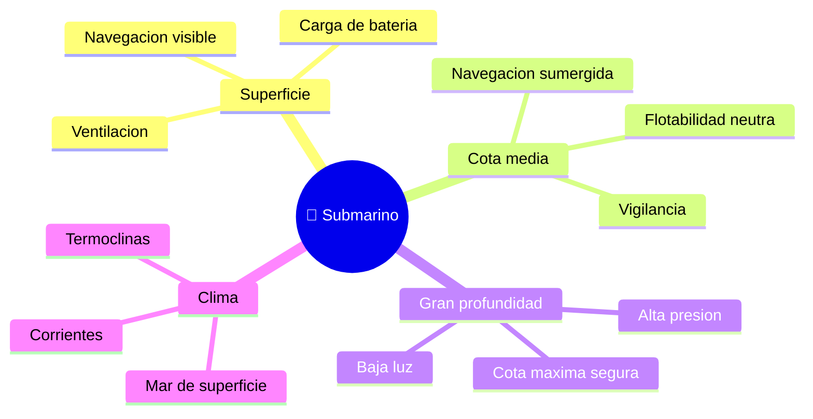

# 🌍 Entornos de trabajo del submarino

[🏠 Inicio](../../../README.md) · [🌊 Curso: Submarinos](../README.md) · 🌍 Entornos

Donde opera un submarino y como cambia la navegacion segun la profundidad y el
entorno. Enfoque general y educativo; cada entorno se traduce en un escenario de
simulacion distinto.

---

## 🗺️ Entornos principales

| Entorno | Caracteristicas | Riesgos tipicos | Ajuste de navegacion |
| --- | --- | --- | --- |
| Superficie | Flotando, visible. | Abordaje, mar gruesa. | Vigilancia, luces, COLREG. |
| Cota media | Sumergido, presion moderada. | Perder cota, choque con fondo. | Flotabilidad neutra, planos. |
| Gran profundidad | Presion alta. | Superar cota segura. | Respetar limite de diseno. |
| Aguas costeras | Poca profundidad. | Tocar fondo, obstaculos. | Sonda, margen de seguridad. |
| Termoclinas / corrientes | Cambios de densidad. | Derivas de cota. | Ajuste de lastre y planos. |

---

## 🌦️ Factores del entorno

- **Profundidad**: define la presion y la cota maxima segura.
- **Densidad del agua**: cambia con temperatura y salinidad; afecta la
  flotabilidad (termoclinas).
- **Corrientes**: modifican la trayectoria real.
- **Fondo marino**: limita la cota en aguas someras.
- **Superficie**: en emersion, el mar y el trafico exigen vigilancia y COLREG.

---

## 🎮 Traduccion a simulacion

Cada entorno es un escenario con su profundidad, densidad, corriente y estado de
superficie. Ver como se modela en el
[Modulo 8: Diseno de simulacion](../simulacion/diseno-simulador-submarino.md).

---

[⬅️ Anterior: Principios y operacion](principios-submarino.md) · [➡️ Siguiente: Reglamentos](../reglamentos/reglamentos-submarino.md)
