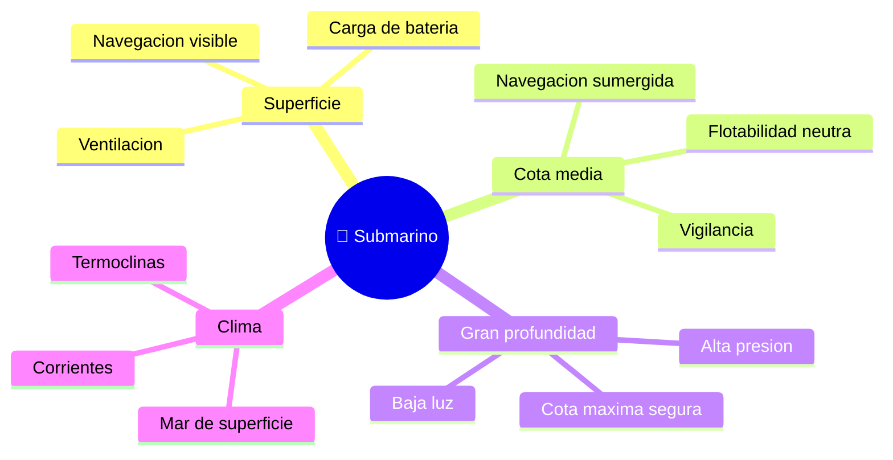

<!-- clase-meta
tipo_documento: clase
clase: 7
codigo: SUBMARINOS-07
curso: submarinos
titulo: "Entornos de trabajo del submarino"
modalidad: "análisis de escenarios"
duracion_minutos: 60
nivel: introductorio
prerrequisito: SUBMARINOS-06
competencia: "adaptacion_al_entorno"
resultados_aprendizaje:
  - "Explicar entornos, factores ambientales, riesgos y respuesta de simulación con vocabulario propio de Submarinos."
  - "Aplicar esos conceptos a una decisión segura o a un escenario de simulación de Submarinos."
evidencia: "Matriz entorno–cambio–riesgo–respuesta."
criterio_aprobacion: "Cada respuesta se adapta al entorno y distingue riesgos que no son intercambiables entre escenarios."
fuentes: manuales/fuentes.md
ultima_revision: 2026-09-10
-->

# 🌍 Entornos de trabajo del submarino

[🏠 Inicio](../../../README.md) · [🌊 Curso: Submarinos](../README.md) · 🌍 Entornos

Dónde opera un submarino y cómo cambia la navegación según la profundidad y el
entorno. Enfoque general y educativo; cada entorno se traduce en un escenario de
simulación distinto.

---

## 🗺️ Entornos principales

```mermaid
mindmap
  root((🌊 Submarino))
    Superficie
      Navegacion visible
      Carga de bateria
      Ventilacion
    Cota media
      Navegacion sumergida
      Flotabilidad neutra
      Vigilancia
    Gran profundidad
      Alta presion
      Cota maxima segura
      Baja luz
    Clima
      Mar de superficie
      Corrientes
      Termoclinas
```

| Entorno | Características | Riesgos típicos | Ajuste de navegación |
| --- | --- | --- | --- |
| Superficie | Flotando, visible. | Abordaje, mar gruesa. | Vigilancia, luces, COLREG. |
| Cota media | Sumergido, presión moderada. | Perder cota, choque con fondo. | Flotabilidad neutra, planos. |
| Gran profundidad | Presión alta. | Superar cota segura. | Respetar límite de diseño. |
| Aguas costeras | Poca profundidad. | Tocar fondo, obstáculos. | Sonda, margen de seguridad. |
| Termoclinas / corrientes | Cambios de densidad. | Derivas de cota. | Ajuste de lastre y planos. |

---

## 🌦️ Factores del entorno

- **Profundidad**: define la presión y la cota máxima segura.
- **Densidad del agua**: cambia con temperatura y salinidad; afecta la
  flotabilidad (termoclinas).
- **Corrientes**: modifican la trayectoria real.
- **Fondo marino**: limita la cota en aguas someras.
- **Superficie**: en emersión, el mar y el tráfico exigen vigilancia y COLREG.

---

## 🎮 Traducción a simulación

Cada entorno es un escenario con su profundidad, densidad, corriente y estado de
superficie. Ver cómo se modela en el
[Clase 9: Diseño de simulación](../simulacion/diseno-simulador-submarino.md).

## 🧭 Guía de estudio aplicada

### Pregunta guía

¿Cómo ayuda **Entornos principales, Factores del entorno, Traducción a simulación y Guía de estudio aplicada** a **adaptar cambio de profundidad manteniendo rumbo y discreción a tres condiciones ambientales distintas**?

### Explicación razonada

El entorno no es decoración: modifica las fuerzas, la percepción y el tiempo disponible. En el caso «cambio de profundidad manteniendo rumbo y discreción», cambia el comportamiento de planos y tanques de lastre y aumenta la probabilidad de exceso de profundidad, pérdida de control o colisión por conciencia situacional limitada. La respuesta correcta empieza por reconocer qué variable cambió y después adaptar límites, ruta o misión.

Esta clase se conecta con el resto del curso mediante **equilibrio entre flotabilidad, peso, profundidad, trimado y control hidrodinámico**. El hilo de
seguridad consiste en reconocer a tiempo **exceso de profundidad, pérdida de control o colisión por conciencia situacional limitada** y poder justificar la decisión
**coordinar velocidad, planos y lastre observando tendencia, no solo profundidad instantánea**; en clases posteriores cambiará el ángulo de análisis, no esa relación causal.
La lectura funcional común sigue **fuente de energía → motor → hélice o propulsor → planos y tanques de lastre**, de modo que cada concepto pueda
ubicarse dentro del funcionamiento completo y no quede como un dato aislado.

**Apoyo documental:** [Ships](https://www.history.navy.mil/browse-by-topic/ships.html) aporta historia pública de buques militares;
[Safety of Navigation](https://www.imo.org/en/ourwork/safety/pages/navigationdefault.aspx) se usa para navegación, SOLAS, COLREG y STCW. Estas fuentes
se contrastan con el alcance de la clase y no sustituyen un manual de equipo concreto.

### Caso resuelto: de la observación a la decisión

1. **Escenario base:** conserva la misión «cambio de profundidad manteniendo rumbo y discreción» para poder comparar.
2. **Cambiar una condición:** modifica sucesivamente superficie o medio, visibilidad y perturbación externa.
3. **Recalcular margen:** explica cómo cada cambio afecta **planos y tanques de lastre** y acerca o aleja **exceso de profundidad, pérdida de control o colisión por conciencia situacional limitada**.
4. **Adaptar:** cambia límite, ruta, configuración o incluso cancela; no mantengas la misma respuesta por hábito.

### Comprueba tu comprensión

1. ¿Cómo cambiaría **planos y tanques de lastre** si empeora la perturbación externa?
2. ¿Qué condición ambiental acerca más el escenario a **exceso de profundidad, pérdida de control o colisión por conciencia situacional limitada**?
3. ¿Cuándo adaptarías la maniobra y cuándo la cancelarías?

Orientación para revisar tus respuestas

- La primera respuesta debe relacionar el eslabón elegido con un efecto posterior, no solo nombrarlo.
- La segunda debe proponer una señal medible u observable y explicar qué tendencia sería preocupante.
- La tercera debe cambiar al menos una variable de capacidad, mando, entorno o margen de seguridad.

## 🎓 Cierre de clase

- **Actividad:** Contrasta tres entornos de Submarinos a partir de entornos, factores ambientales, riesgos y respuesta de simulación y determina cómo cambian variables, percepción, riesgos y respuesta.
- **Evidencia:** Matriz entorno–cambio–riesgo–respuesta.
- **Criterio de aprobación:** Cada respuesta se adapta al entorno y distingue riesgos que no son intercambiables entre escenarios.
- **Transferencia:** explica qué cambiaría al pasar a otra variante de esta máquina.

### Fuentes de esta clase

- [US-NHHC-SHIPS](https://www.history.navy.mil/browse-by-topic/ships.html): Ships, Naval History and Heritage Command. Uso: historia pública de buques militares.
- [IMO-NAV](https://www.imo.org/en/ourwork/safety/pages/navigationdefault.aspx): Safety of Navigation, International Maritime Organization. Uso: navegación, SOLAS, COLREG y STCW.
- [NASA-FLIGHT](https://www1.grc.nasa.gov/beginners-guide-to-aeronautics/): Beginner's Guide to Aeronautics, NASA. Uso: contraste con física y vuelo reales.

> Las fuentes sostienen el marco conceptual y normativo; esta clase no reemplaza el manual
> del fabricante, la formación certificada ni la habilitación exigida para operar equipos reales.

---

[⬅️ Anterior: Principios y operación](principios-submarino.md) · [➡️ Siguiente: Reglamentos](../reglamentos/reglamentos-submarino.md)
