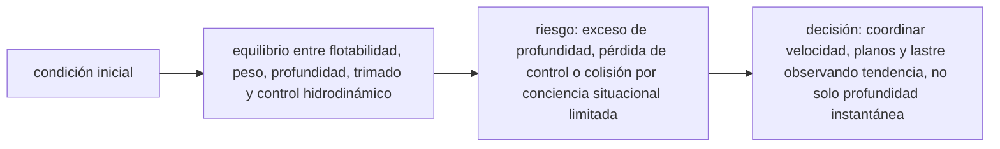

<!-- clase-meta
tipo_documento: clase
clase: 6
codigo: SUBMARINOS-06
curso: submarinos
titulo: "Principios y operación del submarino"
modalidad: "resolución de problemas"
duracion_minutos: 90
nivel: introductorio
prerrequisito: SUBMARINOS-05
competencia: "razonamiento_operacional"
resultados_aprendizaje:
  - "Explicar principios físicos, fases de operación, decisiones y errores frecuentes con vocabulario propio de Submarinos."
  - "Aplicar esos conceptos a una decisión segura o a un escenario de simulación de Submarinos."
evidencia: "Resolución argumentada de un escenario operacional."
criterio_aprobacion: "Aplica los principios correctos, anticipa consecuencias y respeta los límites del curso."
fuentes: manuales/fuentes.md
ultima_revision: 2026-09-10
-->

# 🧪 Principios y operación del submarino

[🏠 Inicio](../../../README.md) · [🌊 Curso: Submarinos](../README.md) · 🧪 Principios

Documento general, educativo e histórico. Trata solo principios físicos públicos
de flotabilidad, lastre, presión e inmersión. No sustituye formación náutica ni
describe operación militar real, táctica o sistemas de armas.

## Principios de funcionamiento

- **Flotación (Arquímedes)**: el empuje del agua iguala al peso; si el peso sube
  por encima del empuje, el submarino baja.
- **Flotabilidad variable**: inundar los tanques de lastre aumenta el peso
  (sumergirse); vaciarlos con aire lo reduce (emerger).
- **Presión con la profundidad**: la presión crece aproximadamente una atmósfera
  cada 10 metros; por eso existe una cota máxima segura.
- **Gobierno en 3D**: el timón cambia el rumbo y los planos de inmersión ajustan
  la profundidad al avanzar.
- **Propulsión**: la hélice empuja agua hacia atrás y, por reacción, el submarino
  avanza (tercera ley de Newton).

## Fases de operación

| Fase | Que ocurre | Puntos clave |
| --- | --- | --- |
| Superficie | Navegar flotando | Ventilar, cargar batería, vigilar. |
| Preparación de inmersión | Alistar el buque | Cerrar escotillas, chequear sistemas. |
| Inmersión | Sumergirse | Inundar lastre, planos abajo, control de cota. |
| Navegación en cota | Navegar sumergido | Flotabilidad neutra, rumbo y velocidad. |
| Emersión | Volver a superficie | Purgar lastre con aire, controlar ascenso. |
| Emergencia | Falla o riesgo | Emersión de emergencia, achique, soporte vital. |

## Control de profundidad: idea general

1. Para **sumergirse**, se inundan los tanques de lastre (peso mayor que empuje).
2. Los **planos de inmersión** ajustan el ángulo y afinan la profundidad al
   avanzar.
3. Para **mantener cota**, se busca la **flotabilidad neutra**.
4. Para **emerger**, se **purgan** los tanques con aire comprimido.
5. Nunca superar la **cota máxima segura** por la presión.

## Errores comunes que la simulación puede enseñar a evitar

- Descender más allá de la cota segura ignorando la presión.
- Confundir el control de lastre con el de los planos de inmersión.
- Olvidar el nivel de oxígeno y la carga de batería.
- Emerger de forma brusca perdiendo el control del ascenso.
- No cerrar y verificar sistemas antes de la inmersión.

## Relación con los niveles de realismo

- **Nivel 1 (educativo)**: sumergir, emerger y mantener una cota simple.
- **Nivel 2 (simplificado)**: agregar flotabilidad neutra, inercia y presión.
- **Nivel 3 (técnico)**: sumar planos de inmersión, gestión de aire, batería y
  cota máxima.

Ver [`docs/03-niveles-de-realismo.md`](../../../docs/03-niveles-de-realismo.md) para el detalle de cada nivel.

## 🧭 Guía de estudio aplicada

### Pregunta guía

¿Cómo ayuda **Principios de funcionamiento, Fases de operación, Control de profundidad: idea general y Errores comunes que la simulación puede enseñar a evitar** a **resolver cambio de profundidad manteniendo rumbo y discreción sin agotar el margen operacional**?

### Explicación razonada

El principio rector puede resumirse así: equilibrio entre flotabilidad, peso, profundidad, trimado y control hidrodinámico. Esto explica por qué una misma orden produce resultados distintos cuando cambian velocidad, carga, configuración o entorno. Operar bien consiste en leer la tendencia antes de agotar el margen y tomar esta decisión: coordinar velocidad, planos y lastre observando tendencia, no solo profundidad instantánea.

Esta clase se conecta con el resto del curso mediante **equilibrio entre flotabilidad, peso, profundidad, trimado y control hidrodinámico**. El hilo de
seguridad consiste en reconocer a tiempo **exceso de profundidad, pérdida de control o colisión por conciencia situacional limitada** y poder justificar la decisión
**coordinar velocidad, planos y lastre observando tendencia, no solo profundidad instantánea**; en clases posteriores cambiará el ángulo de análisis, no esa relación causal.
La lectura funcional común sigue **fuente de energía → motor → hélice o propulsor → planos y tanques de lastre**, de modo que cada concepto pueda
ubicarse dentro del funcionamiento completo y no quede como un dato aislado.

**Apoyo documental:** [Ships](https://www.history.navy.mil/browse-by-topic/ships.html) aporta historia pública de buques militares;
[Safety of Navigation](https://www.imo.org/en/ourwork/safety/pages/navigationdefault.aspx) se usa para navegación, SOLAS, COLREG y STCW. Estas fuentes
se contrastan con el alcance de la clase y no sustituyen un manual de equipo concreto.

### Caso resuelto: de la observación a la decisión

1. **Datos:** reconoce condiciones, configuración y margen disponibles en **cambio de profundidad manteniendo rumbo y discreción**.
2. **Modelo:** aplica **equilibrio entre flotabilidad, peso, profundidad, trimado y control hidrodinámico** para predecir una tendencia antes de actuar.
3. **Riesgo:** explica mediante qué cadena de causas podría ocurrir **exceso de profundidad, pérdida de control o colisión por conciencia situacional limitada**.
4. **Decisión:** ejecuta mentalmente **coordinar velocidad, planos y lastre observando tendencia, no solo profundidad instantánea** y define qué observación confirmaría que funcionó.

### Comprueba tu comprensión

1. ¿Qué variable del principio «equilibrio entre flotabilidad, peso, profundidad, trimado y control hidrodinámico» cambia primero en el caso?
2. ¿Cómo se propaga ese cambio hasta **planos y tanques de lastre**?
3. ¿Qué evidencia confirmaría que **coordinar velocidad, planos y lastre observando tendencia, no solo profundidad instantánea** conservó margen operacional?

Orientación para revisar tus respuestas

- La primera respuesta debe relacionar el eslabón elegido con un efecto posterior, no solo nombrarlo.
- La segunda debe proponer una señal medible u observable y explicar qué tendencia sería preocupante.
- La tercera debe cambiar al menos una variable de capacidad, mando, entorno o margen de seguridad.

## 🎓 Cierre de clase

- **Actividad:** Resuelve un escenario de Submarinos explicando, paso a paso, cómo intervienen principios físicos, fases de operación, decisiones y errores frecuentes.
- **Evidencia:** Resolución argumentada de un escenario operacional.
- **Criterio de aprobación:** Aplica los principios correctos, anticipa consecuencias y respeta los límites del curso.
- **Transferencia:** explica qué cambiaría al pasar a otra variante de esta máquina.

### Fuentes de esta clase

- [US-NHHC-SHIPS](https://www.history.navy.mil/browse-by-topic/ships.html): Ships, Naval History and Heritage Command. Uso: historia pública de buques militares.
- [IMO-NAV](https://www.imo.org/en/ourwork/safety/pages/navigationdefault.aspx): Safety of Navigation, International Maritime Organization. Uso: navegación, SOLAS, COLREG y STCW.
- [NASA-FLIGHT](https://www1.grc.nasa.gov/beginners-guide-to-aeronautics/): Beginner's Guide to Aeronautics, NASA. Uso: contraste con física y vuelo reales.

> Las fuentes sostienen el marco conceptual y normativo; esta clase no reemplaza el manual
> del fabricante, la formación certificada ni la habilitación exigida para operar equipos reales.

---

[⬅️ Anterior: Mandos](../mandos/manual-mandos-submarino.md) · [➡️ Siguiente: Entornos de trabajo](entornos-submarino.md)
