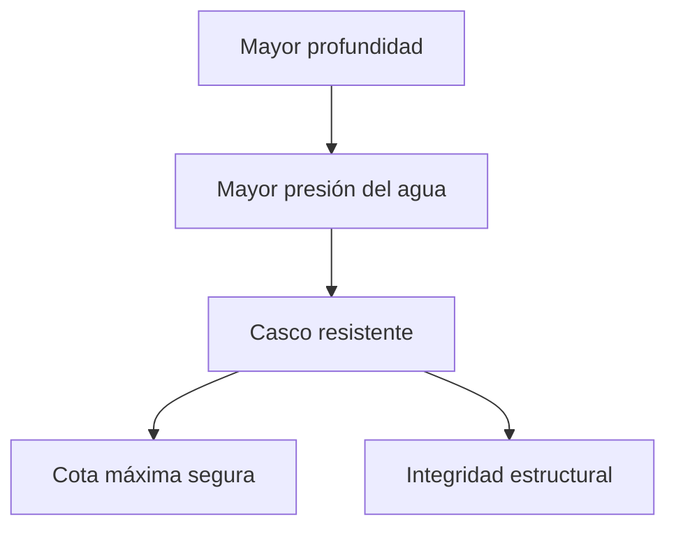

# 🔧 Sistemas mecánicos del submarino

[🏠 Inicio](../../../README.md) · [🌊 Curso: Submarinos](../README.md) · 🔧 Sistemas mecánicos

Este módulo describe, **solo con física pública**, como flota, se sumerge, avanza
y gobierna un submarino. No incluye sistemas de armas, táctica ni datos
sensibles. Es la base para entender los mandos (Módulo 5) y la física de la
inmersión (Módulo 6).

---

## 1. 🌊 Flotabilidad y tanques de lastre

El submarino controla su profundidad ajustando su peso frente al empuje del agua.

- **Flotabilidad positiva**: pesa menos que el agua que desplaza; flota.
- **Flotabilidad negativa**: pesa más; se hunde.
- **Flotabilidad neutra**: peso igual al empuje; se mantiene a una cota.
- **Tanques de lastre**: se inundan con agua para sumergirse y se vacian con
  aire comprimido para emerger.

| Estado | Como se logra | Efecto |
| --- | --- | --- |
| Positiva | Tanques con aire | El submarino sube o flota. |
| Negativa | Tanques con agua | El submarino baja. |
| Neutra | Equilibrio agua/aire | Se mantiene a profundidad. |

---

## 2. 🧱 Casco resistente y presión

El casco debe soportar la presión del agua, que aumenta con la profundidad.

- **Casco resistente**: estructura interior que aguanta la presión.
- **Casco exterior**: da forma hidrodinámica y aloja tanques de lastre.
- **Presión con la profundidad**: cada 10 metros añade aproximadamente una
  atmósfera; por eso existe una cota máxima segura de diseño.

---

## 3. 🔧 Propulsión

Convierte energía en empuje para avanzar sumergido o en superficie.

- **Planta propulsora**: diesel-eléctrica (motor y baterías) o nuclear según el
  tipo.
- **Baterías**: permiten avanzar sumergido de forma silenciosa (en los
  convencionales).
- **Línea de ejes y hélice**: transmiten el giro y generan empuje.

---

## 4. ⚙️ Gobierno: timón y planos de inmersión

El submarino gobierna en tres dimensiones.

- **Timón vertical**: cambia el rumbo (izquierda/derecha).
- **Planos de inmersión (horizontales)**: controlan el ángulo y la profundidad
  al avanzar, complementando el lastre.
- **Combinación**: lastre para flotabilidad general, planos para ajuste fino en
  movimiento.

| Mando | Eje | Función |
| --- | --- | --- |
| Timón vertical | Horizontal | Cambiar rumbo. |
| Planos de proa | Vertical | Ajuste fino de profundidad. |
| Planos de popa | Vertical | Ángulo de inmersión. |
| Lastre | Vertical | Flotabilidad general. |

---

## 5. 🫁 Soporte vital y energía

- **Soporte vital**: renueva el oxígeno y retira el dioxido de carbono para
  sostener a la tripulación.
- **Energía**: baterías y planta propulsora alimentan todos los sistemas.
- **Aire comprimido**: reserva para vaciar tanques y emerger.

---

## 🔁 Cómo se conecta todo

1. Los **tanques de lastre** fijan la flotabilidad (subir, bajar, mantener).
2. El **casco resistente** soporta la presión a profundidad.
3. La **planta propulsora** mueve la **hélice** para avanzar.
4. El **timón** y los **planos** controlan rumbo y profundidad.
5. El **soporte vital** mantiene el aire respirable.

Con esto entendido, el
[Módulo 5: Mandos](../mandos/manual-mandos-submarino.md) describe, a nivel
educativo, como se opera el puesto de control.

---

[⬅️ Anterior: Modelos y variantes](../modelos/modelos-submarino.md) · [➡️ Siguiente: Mandos e instrumentos](../mandos/manual-mandos-submarino.md)
