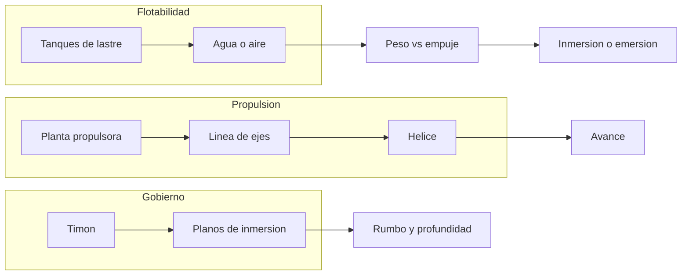

# 🔧 Sistemas mecanicos del submarino

[🏠 Inicio](../../../README.md) · [🌊 Curso: Submarinos](../README.md) · 🔧 Sistemas mecanicos

Este modulo describe, **solo con fisica publica**, como flota, se sumerge, avanza
y gobierna un submarino. No incluye sistemas de armas, tactica ni datos
sensibles. Es la base para entender los mandos (Modulo 4) y la fisica de la
inmersion (Modulo 5).

---

## 1. 🌊 Flotabilidad y tanques de lastre

El submarino controla su profundidad ajustando su peso frente al empuje del agua.

- **Flotabilidad positiva**: pesa menos que el agua que desplaza; flota.
- **Flotabilidad negativa**: pesa mas; se hunde.
- **Flotabilidad neutra**: peso igual al empuje; se mantiene a una cota.
- **Tanques de lastre**: se inundan con agua para sumergirse y se vacian con
  aire comprimido para emerger.

| Estado | Como se logra | Efecto |
| --- | --- | --- |
| Positiva | Tanques con aire | El submarino sube o flota. |
| Negativa | Tanques con agua | El submarino baja. |
| Neutra | Equilibrio agua/aire | Se mantiene a profundidad. |

---

## 2. 🧱 Casco resistente y presion

El casco debe soportar la presion del agua, que aumenta con la profundidad.

- **Casco resistente**: estructura interior que aguanta la presion.
- **Casco exterior**: da forma hidrodinamica y aloja tanques de lastre.
- **Presion con la profundidad**: cada 10 metros anade aproximadamente una
  atmosfera; por eso existe una cota maxima segura de diseno.

---

## 3. 🔧 Propulsion

Convierte energia en empuje para avanzar sumergido o en superficie.

- **Planta propulsora**: diesel-electrica (motor y baterias) o nuclear segun el
  tipo.
- **Baterias**: permiten avanzar sumergido de forma silenciosa (en los
  convencionales).
- **Linea de ejes y helice**: transmiten el giro y generan empuje.

---

## 4. ⚙️ Gobierno: timon y planos de inmersion

El submarino gobierna en tres dimensiones.

- **Timon vertical**: cambia el rumbo (izquierda/derecha).
- **Planos de inmersion (horizontales)**: controlan el angulo y la profundidad
  al avanzar, complementando el lastre.
- **Combinacion**: lastre para flotabilidad general, planos para ajuste fino en
  movimiento.

| Mando | Eje | Funcion |
| --- | --- | --- |
| Timon vertical | Horizontal | Cambiar rumbo. |
| Planos de proa | Vertical | Ajuste fino de profundidad. |
| Planos de popa | Vertical | Angulo de inmersion. |
| Lastre | Vertical | Flotabilidad general. |

---

## 5. 🫁 Soporte vital y energia

- **Soporte vital**: renueva el oxigeno y retira el dioxido de carbono para
  sostener a la tripulacion.
- **Energia**: baterias y planta propulsora alimentan todos los sistemas.
- **Aire comprimido**: reserva para vaciar tanques y emerger.

---

## 🔁 Como se conecta todo

1. Los **tanques de lastre** fijan la flotabilidad (subir, bajar, mantener).
2. El **casco resistente** soporta la presion a profundidad.
3. La **planta propulsora** mueve la **helice** para avanzar.
4. El **timon** y los **planos** controlan rumbo y profundidad.
5. El **soporte vital** mantiene el aire respirable.

Con esto entendido, el
[Modulo 4: Mandos](../mandos/manual-mandos-submarino.md) describe, a nivel
educativo, como se opera el puesto de control.

---

[⬅️ Anterior: Caracteristicas](caracteristicas-submarino.md) · [➡️ Siguiente: Mandos e instrumentos](../mandos/manual-mandos-submarino.md)
