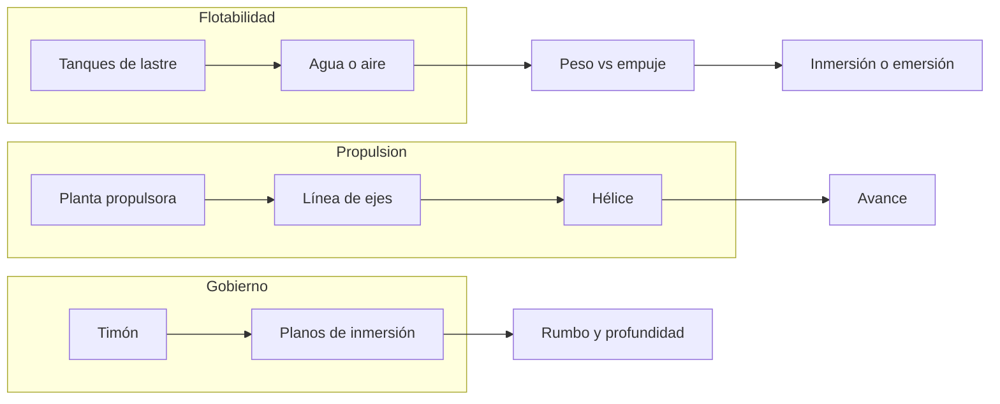
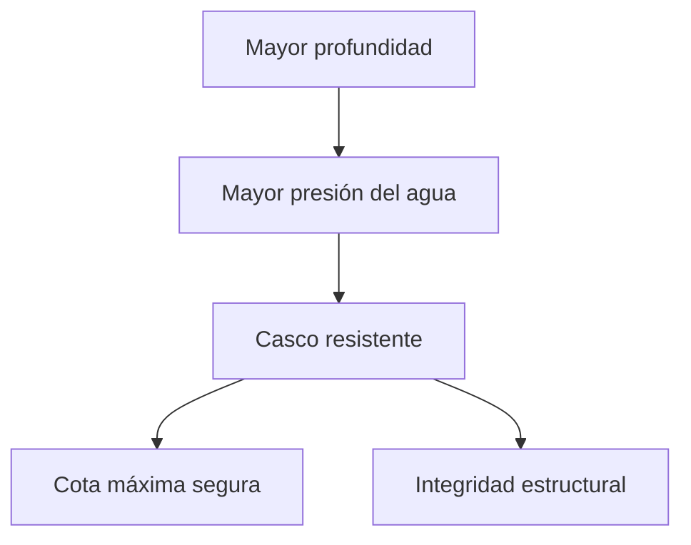
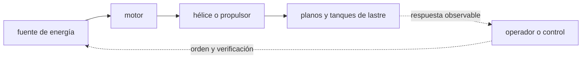

<!-- clase-meta
tipo_documento: clase
clase: 4
codigo: SUBMARINOS-04
curso: submarinos
titulo: "Sistemas mecánicos del submarino"
modalidad: "teórica aplicada"
duracion_minutos: 90
nivel: introductorio
prerrequisito: SUBMARINOS-03
competencia: "comprension_de_sistemas"
resultados_aprendizaje:
  - "Explicar Flotabilidad y tanques de lastre, Casco resistente y presión, Propulsión y Gobierno: timón y planos de inmersión con vocabulario propio de Submarinos."
  - "Aplicar esos conceptos a una decisión segura o a un escenario de simulación de Submarinos."
evidencia: "Esquema con flujos de energía, materia o información anotados."
criterio_aprobacion: "Las conexiones esenciales son correctas y la consecuencia de la falla se propaga de manera coherente."
fuentes: manuales/fuentes.md
ultima_revision: 2026-09-10
-->

# 🔧 Sistemas mecánicos del submarino

[🏠 Inicio](../../../README.md) · [🌊 Curso: Submarinos](../README.md) · 🔧 Sistemas mecánicos

Esta clase describe, **solo con física pública**, como flota, se sumerge, avanza
y gobierna un submarino. No incluye sistemas de armas, táctica ni datos
sensibles. Es la base para entender los mandos (Clase 5) y la física de la
inmersión (Clase 6).

```mermaid
flowchart LR
    subgraph Flotabilidad
        Ta[Tanques de lastre] --> Ag[Agua o aire]
    end
    subgraph Propulsion
        M[Planta propulsora] --> Ej[Línea de ejes] --> H[Hélice]
    end
    subgraph Gobierno
        Ti[Timón] --> Pl[Planos de inmersión]
    end
    Ag --> Peso[Peso vs empuje]
    Peso --> Inmersion[Inmersión o emersión]
    H --> Empuje[Avance]
    Pl --> Profundidad[Rumbo y profundidad]
```

---

## 1. 🌊 Flotabilidad y tanques de lastre

El submarino controla su profundidad ajustando su peso frente al empuje del agua.

- **Flotabilidad positiva**: pesa menos que el agua que desplaza; flota.
- **Flotabilidad negativa**: pesa más; se hunde.
- **Flotabilidad neutra**: peso igual al empuje; se mantiene a una cota.
- **Tanques de lastre**: se inundan con agua para sumergirse y se vacian con
  aire comprimido para emerger.

| Estado | Como se logra | Efecto |
| --- | --- | --- |
| Positiva | Tanques con aire | El submarino sube o flota. |
| Negativa | Tanques con agua | El submarino baja. |
| Neutra | Equilibrio agua/aire | Se mantiene a profundidad. |

---

## 2. 🧱 Casco resistente y presión

El casco debe soportar la presión del agua, que aumenta con la profundidad.

```mermaid
flowchart TD
    Profundidad[Mayor profundidad] --> Presion[Mayor presión del agua]
    Presion --> Casco[Casco resistente]
    Casco --> Limite[Cota máxima segura]
    Casco --> Seguridad[Integridad estructural]
```

- **Casco resistente**: estructura interior que aguanta la presión.
- **Casco exterior**: da forma hidrodinámica y aloja tanques de lastre.
- **Presión con la profundidad**: cada 10 metros añade aproximadamente una
  atmósfera; por eso existe una cota máxima segura de diseño.

---

## 3. 🔧 Propulsión

Convierte energía en empuje para avanzar sumergido o en superficie.

- **Planta propulsora**: diesel-eléctrica (motor y baterías) o nuclear según el
  tipo.
- **Baterías**: permiten avanzar sumergido de forma silenciosa (en los
  convencionales).
- **Línea de ejes y hélice**: transmiten el giro y generan empuje.

---

## 4. ⚙️ Gobierno: timón y planos de inmersión

El submarino gobierna en tres dimensiones.

- **Timón vertical**: cambia el rumbo (izquierda/derecha).
- **Planos de inmersión (horizontales)**: controlan el ángulo y la profundidad
  al avanzar, complementando el lastre.
- **Combinación**: lastre para flotabilidad general, planos para ajuste fino en
  movimiento.

| Mando | Eje | Función |
| --- | --- | --- |
| Timón vertical | Horizontal | Cambiar rumbo. |
| Planos de proa | Vertical | Ajuste fino de profundidad. |
| Planos de popa | Vertical | Ángulo de inmersión. |
| Lastre | Vertical | Flotabilidad general. |

---

## 5. 🫁 Soporte vital y energía

- **Soporte vital**: renueva el oxígeno y retira el dioxido de carbono para
  sostener a la tripulación.
- **Energía**: baterías y planta propulsora alimentan todos los sistemas.
- **Aire comprimido**: reserva para vaciar tanques y emerger.

---

## 🔁 Cómo se conecta todo

1. Los **tanques de lastre** fijan la flotabilidad (subir, bajar, mantener).
2. El **casco resistente** soporta la presión a profundidad.
3. La **planta propulsora** mueve la **hélice** para avanzar.
4. El **timón** y los **planos** controlan rumbo y profundidad.
5. El **soporte vital** mantiene el aire respirable.

Con esto entendido, el
[Clase 5: Mandos](../mandos/manual-mandos-submarino.md) describe, a nivel
educativo, como se opera el puesto de control.

## 🧭 Guía de estudio aplicada

### Pregunta guía

¿Cómo ayuda **Flotabilidad y tanques de lastre, Casco resistente y presión, Propulsión y Gobierno: timón y planos de inmersión** a **seguir una alteración desde fuente de energía hasta planos y tanques de lastre durante cambio de profundidad manteniendo rumbo y discreción**?

### Explicación razonada

El funcionamiento puede leerse como una cadena causal: fuente de energía entrega o transforma energía; motor la adapta; hélice o propulsor la transmite o gobierna; y planos y tanques de lastre produce el efecto observable. La cadena no es lineal en sentido estricto: sensores, estructura y operador cierran el lazo. Si un eslabón se degrada, la señal importante es cómo cambia el estado de planos y tanques de lastre y qué margen queda.

```mermaid
flowchart LR
    A["fuente de energía"] --> B["motor"] --> C["hélice o propulsor"] --> D["planos y tanques de lastre"]
    D -. respuesta observable .-> O["operador o control"]
    O -. orden y verificación .-> A
```

Esta clase se conecta con el resto del curso mediante **equilibrio entre flotabilidad, peso, profundidad, trimado y control hidrodinámico**. El hilo de
seguridad consiste en reconocer a tiempo **exceso de profundidad, pérdida de control o colisión por conciencia situacional limitada** y poder justificar la decisión
**coordinar velocidad, planos y lastre observando tendencia, no solo profundidad instantánea**; en clases posteriores cambiará el ángulo de análisis, no esa relación causal.
La lectura funcional común sigue **fuente de energía → motor → hélice o propulsor → planos y tanques de lastre**, de modo que cada concepto pueda
ubicarse dentro del funcionamiento completo y no quede como un dato aislado.

**Apoyo documental:** [Ships](https://www.history.navy.mil/browse-by-topic/ships.html) aporta historia pública de buques militares;
[Safety of Navigation](https://www.imo.org/en/ourwork/safety/pages/navigationdefault.aspx) se usa para navegación, SOLAS, COLREG y STCW. Estas fuentes
se contrastan con el alcance de la clase y no sustituyen un manual de equipo concreto.

### Caso resuelto: de la observación a la decisión

1. **Entrada:** identifica el estado inicial de **fuente de energía** durante **cambio de profundidad manteniendo rumbo y discreción**.
2. **Transformación:** explica qué hacen **motor** y **hélice o propulsor**, y qué magnitud cambia en cada paso.
3. **Salida:** comprueba el efecto esperado en **planos y tanques de lastre** y busca una desviación temprana.
4. **Falla razonada:** si aparece **exceso de profundidad, pérdida de control o colisión por conciencia situacional limitada**, retrocede por la cadena antes de ordenar otra acción.

### Comprueba tu comprensión

1. Si se degrada **motor**, ¿qué efecto esperarías primero en **hélice o propulsor** y después en **planos y tanques de lastre**?
2. ¿Qué observación ayudaría a diferenciar una falla de **fuente de energía** de una falla de **hélice o propulsor**?
3. ¿Por qué una segunda orden podría agravar **exceso de profundidad, pérdida de control o colisión por conciencia situacional limitada**?

Orientación para revisar tus respuestas

- La primera respuesta debe relacionar el eslabón elegido con un efecto posterior, no solo nombrarlo.
- La segunda debe proponer una señal medible u observable y explicar qué tendencia sería preocupante.
- La tercera debe cambiar al menos una variable de capacidad, mando, entorno o margen de seguridad.

## 🎓 Cierre de clase

- **Actividad:** Dibuja un esquema funcional de Submarinos que conecte Flotabilidad y tanques de lastre, Casco resistente y presión, Propulsión y Gobierno: timón y planos de inmersión; después predice el efecto de una falla simulada.
- **Evidencia:** Esquema con flujos de energía, materia o información anotados.
- **Criterio de aprobación:** Las conexiones esenciales son correctas y la consecuencia de la falla se propaga de manera coherente.
- **Transferencia:** explica qué cambiaría al pasar a otra variante de esta máquina.

### Fuentes de esta clase

- [US-NHHC-SHIPS](https://www.history.navy.mil/browse-by-topic/ships.html): Ships, Naval History and Heritage Command. Uso: historia pública de buques militares.
- [IMO-NAV](https://www.imo.org/en/ourwork/safety/pages/navigationdefault.aspx): Safety of Navigation, International Maritime Organization. Uso: navegación, SOLAS, COLREG y STCW.
- [NASA-FLIGHT](https://www1.grc.nasa.gov/beginners-guide-to-aeronautics/): Beginner's Guide to Aeronautics, NASA. Uso: contraste con física y vuelo reales.

> Las fuentes sostienen el marco conceptual y normativo; esta clase no reemplaza el manual
> del fabricante, la formación certificada ni la habilitación exigida para operar equipos reales.

---

[⬅️ Anterior: Modelos y variantes](../modelos/modelos-submarino.md) · [➡️ Siguiente: Mandos e instrumentos](../mandos/manual-mandos-submarino.md)
