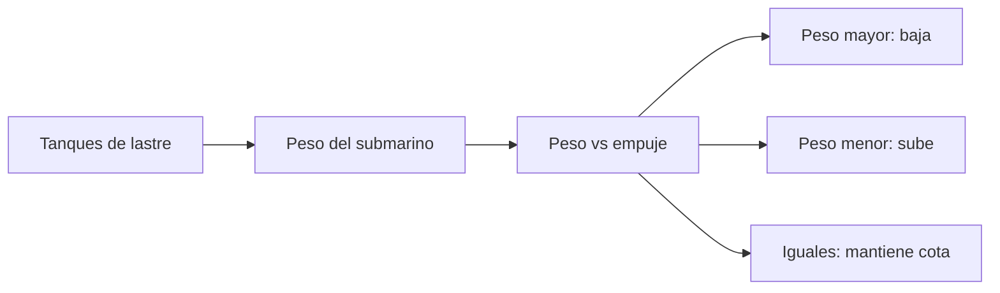

# 🧰 Recursos del submarino

[🏠 Inicio](../../../README.md) · [🌊 Curso: Submarinos](../README.md) · 🧰 Recursos

Glosario nautico especifico, enlaces y diagramas de apoyo del curso de
submarinos. Solo material publico e historico. Amplia el
[glosario general](../../../docs/05-glosario-general.md).

---

## 📖 Glosario especifico

| Termino | Definicion |
| --- | --- |
| Flotabilidad | Relacion entre el peso y el empuje del agua desplazada. |
| Flotabilidad neutra | Peso igual al empuje; el submarino se mantiene a una cota. |
| Lastre | Agua que se admite o purga para variar el peso. |
| Cota | Profundidad a la que navega el submarino. |
| Casco resistente | Estructura interior que soporta la presion. |
| Planos de inmersion | Superficies horizontales que ajustan la profundidad. |
| Cota maxima segura | Profundidad limite por resistencia a la presion. |
| Termoclina | Cambio de temperatura y densidad del agua con la profundidad. |
| Soporte vital | Sistemas que mantienen el aire respirable a bordo. |

---

## 🗺️ Diagrama de flotabilidad

---

## 🔗 Enlaces y fuentes

- Seguridad y limites: [🦺 docs/04-seguridad-y-limites.md](../../../docs/04-seguridad-y-limites.md)
- Marco legal: [⚖️ docs/07-marco-legal-chile.md](../../../docs/07-marco-legal-chile.md)
- Registro de fuentes: [📚 manuales/fuentes.md](../../../manuales/fuentes.md)
- Sumergibles de investigacion y fuentes publicas: ver el registro de fuentes.

Registrar cada recurso nuevo con su origen y licencia, siguiendo
[`recursos/README.md`](../../../recursos/README.md).

---

[🎓 Portada del curso](../README.md) · [⬅️ Anterior: Diseno de simulacion](../simulacion/diseno-simulador-submarino.md)
