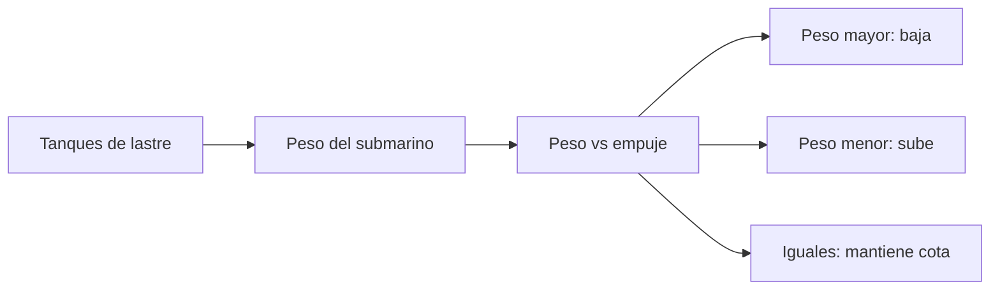

# 🧰 Recursos del submarino

[🏠 Inicio](../../../README.md) · [🌊 Curso: Submarinos](../README.md) · 🧰 Recursos

Glosario náutico específico, enlaces y diagramas de apoyo del curso de
submarinos. Solo material público e histórico. Amplia el
[glosario general](../../../docs/05-glosario-general.md).

---

## 📖 Glosario específico

| Término | Definición |
| --- | --- |
| Flotabilidad | Relación entre el peso y el empuje del agua desplazada. |
| Flotabilidad neutra | Peso igual al empuje; el submarino se mantiene a una cota. |
| Lastre | Agua que se admite o purga para variar el peso. |
| Cota | Profundidad a la que navega el submarino. |
| Casco resistente | Estructura interior que soporta la presión. |
| Planos de inmersión | Superficies horizontales que ajustan la profundidad. |
| Cota máxima segura | Profundidad límite por resistencia a la presión. |
| Termoclina | Cambio de temperatura y densidad del agua con la profundidad. |
| Soporte vital | Sistemas que mantienen el aire respirable a bordo. |

---

## 🗺️ Diagrama de flotabilidad

```mermaid
flowchart LR
    Lastre[Tanques de lastre] --> Peso[Peso del submarino]
    Peso --> Comparacion[Peso vs empuje]
    Comparacion --> Baja[Peso mayor: baja]
    Comparacion --> Sube[Peso menor: sube]
    Comparacion --> Neutra[Iguales: mantiene cota]
```

---

## 🔗 Enlaces y fuentes

- Seguridad y límites: [🦺 docs/04-seguridad-y-limites.md](../../../docs/04-seguridad-y-limites.md)
- Marco legal: [⚖️ docs/07-marco-legal-chile.md](../../../docs/07-marco-legal-chile.md)
- Registro de fuentes: [📚 manuales/fuentes.md](../../../manuales/fuentes.md)
- Sumergibles de investigación y fuentes públicas: ver el registro de fuentes.

Registrar cada recurso nuevo con su origen y licencia, siguiendo
[`recursos/README.md`](../../../recursos/README.md).

## 🎓 Cierre de clase

- **Actividad:** Selecciona términos de glosario, esquemas y trazabilidad de fuentes, explícalos en contexto de Submarinos y verifica la procedencia de las fuentes utilizadas.
- **Evidencia:** Glosario aplicado y ficha breve de trazabilidad.
- **Criterio de aprobación:** Los términos permiten interpretar el curso y las fuentes se distinguen por autoridad, alcance y vigencia.
- **Transferencia:** explica qué cambiaría al pasar a otra variante de esta máquina.

### Fuentes de esta clase

- [US-NHHC-SHIPS](https://www.history.navy.mil/browse-by-topic/ships.html): Ships, Naval History and Heritage Command. Uso: historia pública de buques militares.
- [IMO-NAV](https://www.imo.org/en/ourwork/safety/pages/navigationdefault.aspx): Safety of Navigation, International Maritime Organization. Uso: navegación, SOLAS, COLREG y STCW.
- [NASA-FLIGHT](https://www1.grc.nasa.gov/beginners-guide-to-aeronautics/): Beginner's Guide to Aeronautics, NASA. Uso: contraste con física y vuelo reales.

> Las fuentes sostienen el marco conceptual y normativo; esta clase no reemplaza el manual
> del fabricante, la formación certificada ni la habilitación exigida para operar equipos reales.

---

[🎓 Portada del curso](../README.md) · [⬅️ Anterior: Diseño de simulación](../simulacion/diseno-simulador-submarino.md) · [➡️ Siguiente: Ejercicios](../ejercicios/ejercicios-submarino.md)
