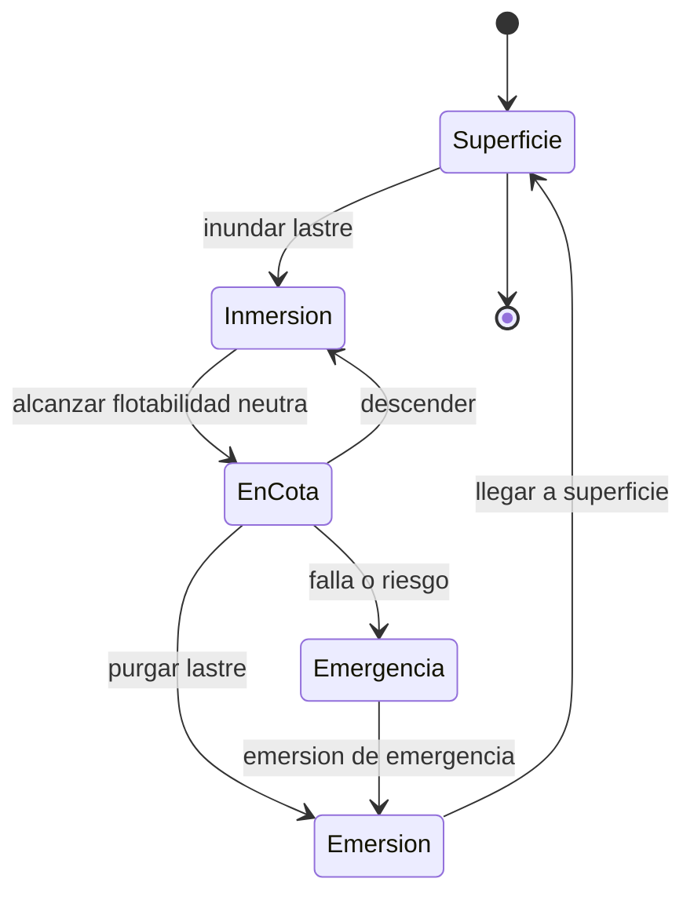

# 🎮 Diseño de simulación del submarino

[🏠 Inicio](../../../README.md) · [🌊 Curso: Submarinos](../README.md) · 🎮 Simulación

## Objetivo de la simulación

Que el usuario aprenda a controlar la flotabilidad, sumergir y emerger de forma
segura, mantener una cota, gobernar en profundidad y respetar la cota máxima por
la presión, de forma educativa. **Fuera de alcance**: táctica, doctrina y
sistemas de armas.

## Nivel de realismo

- Nivel elegido: se ofrece del 1 al 3 (ver `docs/03-niveles-de-realismo.md`).
- Justificación: el submarino agrega la flotabilidad variable, el lastre y la
  presión, que no aparecen en un buque de superficie.

## Variables principales

| Variable | Tipo | Rango | Afecta a | Comentarios |
| --- | --- | --- | --- | --- |
| Profundidad | numérica | 0-cota máxima | Presión y seguridad | Central en inmersión. |
| Flotabilidad | numérica | negativa..positiva | Subir o bajar | Depende del lastre. |
| Lastre | numérica | 0-100% agua | Flotabilidad | Agua o aire en tanques. |
| Velocidad | numérica | 0-25 nudos | Avance y planos | Los planos necesitan flujo. |
| Rumbo | numérica | 0-359 grados | Dirección | Timón vertical. |
| Presión externa | numérica | según profundidad | Integridad | ~1 atm cada 10 m. |
| Oxígeno | numérica | 0-100% | Soporte vital | Limita el tiempo sumergido. |
| Batería | numérica | 0-100% | Autonomía | Energía sumergido. |

## Ciclo básico

1. Leer entrada del usuario (timón, planos, lastre, telégrafo).
2. Actualizar el estado de tanques de lastre y flotabilidad.
3. Calcular fuerzas: empuje, peso, propulsión y presión.
4. Actualizar profundidad, rumbo, ángulo y velocidad.
5. Verificar la cota máxima segura y el soporte vital.
6. Refrescar instrumentos (profundímetro, manómetro, oxígeno) y alarmas.

## Modos de juego futuros

- Tutorial guiado de flotabilidad y lastre.
- Práctica libre de inmersión y emersión.
- Mantener una cota con flotabilidad neutra.
- Desafíos de gestión de aire y batería.
- Exploración educativa del fondo marino, sin contenido sensible.

## Elementos fuera de alcance

- Táctica, doctrina o sistemas de armas de cualquier tipo.
- Detalle operativo sensible de submarinos militares modernos.
- Datos clasificados, restringidos o no públicos.

## Pendientes

- [ ] Definir valores por defecto por tipo de submarino.
- [ ] Prototipar el modelo de flotabilidad y lastre.
- [ ] Ajustar la relación presión-profundidad y la cota máxima.
- [ ] Agregar fuentes públicas a [`manuales/fuentes.md`](../../../manuales/fuentes.md).

---

[⬅️ Anterior: Reglamentos](../reglamentos/reglamentos-submarino.md) · [➡️ Siguiente: Recursos](../recursos/recursos-submarino.md)
