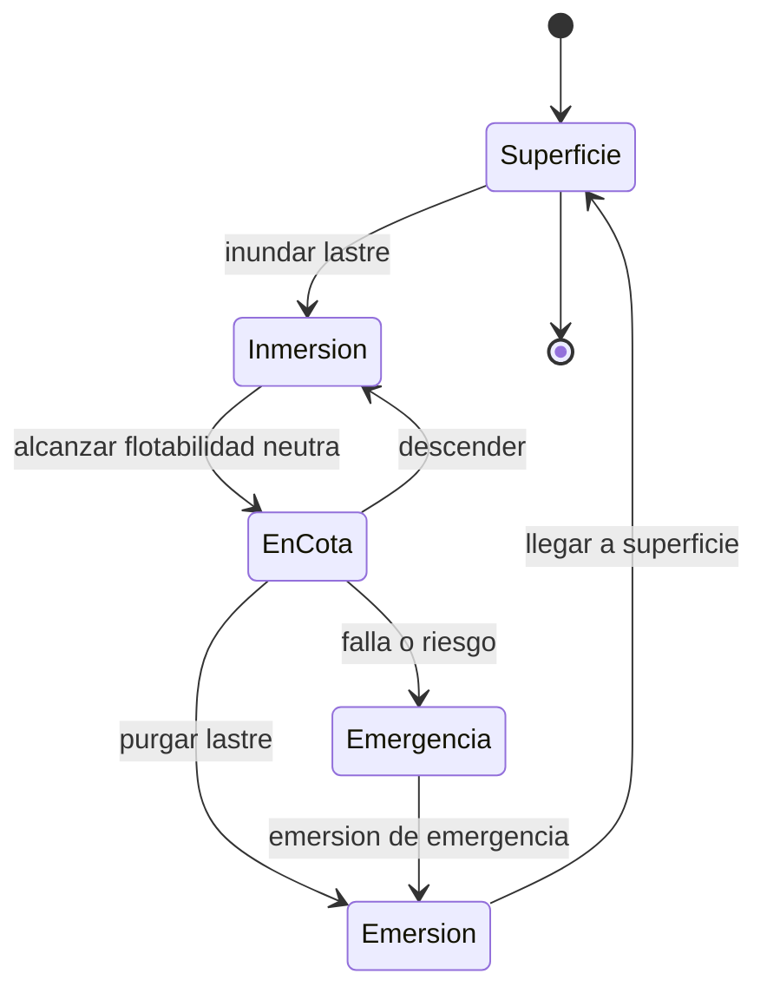

# 🎮 Diseno de simulacion del submarino

[🏠 Inicio](../../../README.md) · [🌊 Curso: Submarinos](../README.md) · 🎮 Simulacion

## Objetivo de la simulacion

Que el usuario aprenda a controlar la flotabilidad, sumergir y emerger de forma
segura, mantener una cota, gobernar en profundidad y respetar la cota maxima por
la presion, de forma educativa. **Fuera de alcance**: tactica, doctrina y
sistemas de armas.

## Nivel de realismo

- Nivel elegido: se ofrece del 1 al 3 (ver `docs/03-niveles-de-realismo.md`).
- Justificacion: el submarino agrega la flotabilidad variable, el lastre y la
  presion, que no aparecen en un buque de superficie.

## Variables principales

| Variable | Tipo | Rango | Afecta a | Comentarios |
| --- | --- | --- | --- | --- |
| Profundidad | numerica | 0-cota maxima | Presion y seguridad | Central en inmersion. |
| Flotabilidad | numerica | negativa..positiva | Subir o bajar | Depende del lastre. |
| Lastre | numerica | 0-100% agua | Flotabilidad | Agua o aire en tanques. |
| Velocidad | numerica | 0-25 nudos | Avance y planos | Los planos necesitan flujo. |
| Rumbo | numerica | 0-359 grados | Direccion | Timon vertical. |
| Presion externa | numerica | segun profundidad | Integridad | ~1 atm cada 10 m. |
| Oxigeno | numerica | 0-100% | Soporte vital | Limita el tiempo sumergido. |
| Bateria | numerica | 0-100% | Autonomia | Energia sumergido. |

## Ciclo basico

1. Leer entrada del usuario (timon, planos, lastre, telegrafo).
2. Actualizar el estado de tanques de lastre y flotabilidad.
3. Calcular fuerzas: empuje, peso, propulsion y presion.
4. Actualizar profundidad, rumbo, angulo y velocidad.
5. Verificar la cota maxima segura y el soporte vital.
6. Refrescar instrumentos (profundimetro, manometro, oxigeno) y alarmas.

## Modos de juego futuros

- Tutorial guiado de flotabilidad y lastre.
- Practica libre de inmersion y emersion.
- Mantener una cota con flotabilidad neutra.
- Desafios de gestion de aire y bateria.
- Exploracion educativa del fondo marino, sin contenido sensible.

## Elementos fuera de alcance

- Tactica, doctrina o sistemas de armas de cualquier tipo.
- Detalle operativo sensible de submarinos militares modernos.
- Datos clasificados, restringidos o no publicos.

## Pendientes

- [ ] Definir valores por defecto por tipo de submarino.
- [ ] Prototipar el modelo de flotabilidad y lastre.
- [ ] Ajustar la relacion presion-profundidad y la cota maxima.
- [ ] Agregar fuentes publicas a [`manuales/fuentes.md`](../../../manuales/fuentes.md).

---

[⬅️ Anterior: Reglamentos](../reglamentos/reglamentos-submarino.md) · [➡️ Siguiente: Recursos](../recursos/recursos-submarino.md)
