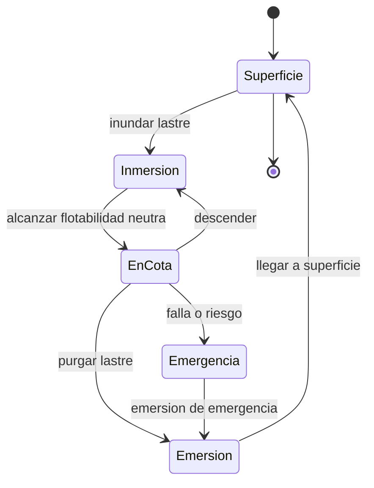
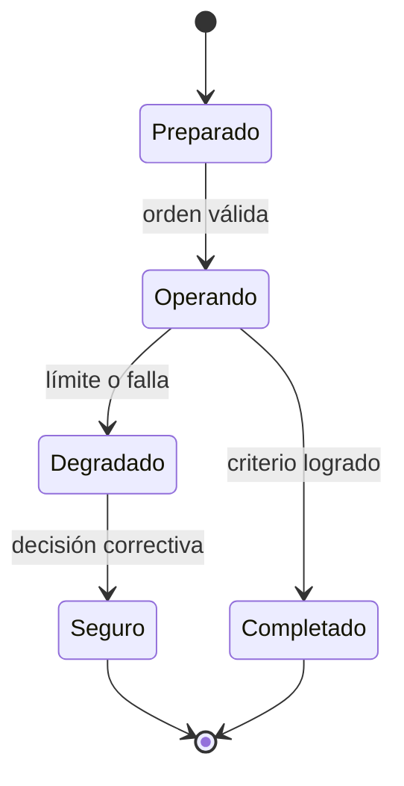

<!-- clase-meta
tipo_documento: clase
clase: 9
codigo: SUBMARINOS-09
curso: submarinos
titulo: "Diseño de simulación del submarino"
modalidad: "laboratorio de diseño"
duracion_minutos: 90
nivel: introductorio
prerrequisito: SUBMARINOS-08
competencia: "modelado_de_simulacion"
resultados_aprendizaje:
  - "Explicar objetivo, variables, estados, ciclo y escenarios de simulación con vocabulario propio de Submarinos."
  - "Aplicar esos conceptos a una decisión segura o a un escenario de simulación de Submarinos."
evidencia: "Ficha de escenario y diagrama de estados."
criterio_aprobacion: "El modelo es específico de la máquina, medible, seguro y trazable a clases anteriores."
fuentes: manuales/fuentes.md
ultima_revision: 2026-09-10
-->

# 🎮 Diseño de simulación del submarino

[🏠 Inicio](../../../README.md) · [🌊 Curso: Submarinos](../README.md) · 🎮 Simulación

```mermaid
stateDiagram-v2
    [*] --> Superficie
    Superficie --> Inmersion: inundar lastre
    Inmersion --> EnCota: alcanzar flotabilidad neutra
    EnCota --> Inmersion: descender
    EnCota --> Emersion: purgar lastre
    Emersion --> Superficie: llegar a superficie
    EnCota --> Emergencia: falla o riesgo
    Emergencia --> Emersion: emersion de emergencia
    Superficie --> [*]
```

## Objetivo de la simulación

Que el usuario aprenda a controlar la flotabilidad, sumergir y emerger de forma
segura, mantener una cota, gobernar en profundidad y respetar la cota máxima por
la presión, de forma educativa. **Fuera de alcance**: táctica, doctrina y
sistemas de armas.

## Nivel de realismo

- Nivel elegido: se ofrece del 1 al 3 (ver `docs/03-niveles-de-realismo.md`).
- Justificación: el submarino agrega la flotabilidad variable, el lastre y la
  presión, que no aparecen en un buque de superficie.

## Variables principales

| Variable | Tipo | Rango | Afecta a | Comentarios |
| --- | --- | --- | --- | --- |
| Profundidad | numérica | 0-cota máxima | Presión y seguridad | Central en inmersión. |
| Flotabilidad | numérica | negativa..positiva | Subir o bajar | Depende del lastre. |
| Lastre | numérica | 0-100% agua | Flotabilidad | Agua o aire en tanques. |
| Velocidad | numérica | 0-25 nudos | Avance y planos | Los planos necesitan flujo. |
| Rumbo | numérica | 0-359 grados | Dirección | Timón vertical. |
| Presión externa | numérica | según profundidad | Integridad | ~1 atm cada 10 m. |
| Oxígeno | numérica | 0-100% | Soporte vital | Limita el tiempo sumergido. |
| Batería | numérica | 0-100% | Autonomía | Energía sumergido. |

## Ciclo básico

1. Leer entrada del usuario (timón, planos, lastre, telégrafo).
2. Actualizar el estado de tanques de lastre y flotabilidad.
3. Calcular fuerzas: empuje, peso, propulsión y presión.
4. Actualizar profundidad, rumbo, ángulo y velocidad.
5. Verificar la cota máxima segura y el soporte vital.
6. Refrescar instrumentos (profundímetro, manómetro, oxígeno) y alarmas.

## Modos de juego futuros

- Tutorial guiado de flotabilidad y lastre.
- Práctica libre de inmersión y emersión.
- Mantener una cota con flotabilidad neutra.
- Desafíos de gestión de aire y batería.
- Exploración educativa del fondo marino, sin contenido sensible.

## Elementos fuera de alcance

- Táctica, doctrina o sistemas de armas de cualquier tipo.
- Detalle operativo sensible de submarinos militares modernos.
- Datos clasificados, restringidos o no públicos.

## Pendientes

- [ ] Definir valores por defecto por tipo de submarino.
- [ ] Prototipar el modelo de flotabilidad y lastre.
- [ ] Ajustar la relación presión-profundidad y la cota máxima.
- [ ] Agregar fuentes públicas a [`manuales/fuentes.md`](../../../manuales/fuentes.md).

## 🧭 Guía de estudio aplicada

### Pregunta guía

¿Cómo ayuda **Objetivo de la simulación, Nivel de realismo, Variables principales y Ciclo básico** a **modelar cambio de profundidad manteniendo rumbo y discreción como estados, variables y decisiones observables**?

### Explicación razonada

Una simulación de Submarinos es educativa si representa decisiones y consecuencias. Como mínimo debe modelar el estado de fuente de energía, la respuesta de motor, la transición en hélice o propulsor y el resultado en planos y tanques de lastre. El escenario «cambio de profundidad manteniendo rumbo y discreción» es valioso porque obliga a observar, formular una hipótesis, actuar y comprobar.

```mermaid
stateDiagram-v2
    [*] --> Preparado
    Preparado --> Operando: orden válida
    Operando --> Degradado: límite o falla
    Degradado --> Seguro: decisión correctiva
    Operando --> Completado: criterio logrado
    Seguro --> [*]
    Completado --> [*]
```

Esta clase se conecta con el resto del curso mediante **equilibrio entre flotabilidad, peso, profundidad, trimado y control hidrodinámico**. El hilo de
seguridad consiste en reconocer a tiempo **exceso de profundidad, pérdida de control o colisión por conciencia situacional limitada** y poder justificar la decisión
**coordinar velocidad, planos y lastre observando tendencia, no solo profundidad instantánea**; en clases posteriores cambiará el ángulo de análisis, no esa relación causal.
La lectura funcional común sigue **fuente de energía → motor → hélice o propulsor → planos y tanques de lastre**, de modo que cada concepto pueda
ubicarse dentro del funcionamiento completo y no quede como un dato aislado.

**Apoyo documental:** [Ships](https://www.history.navy.mil/browse-by-topic/ships.html) aporta historia pública de buques militares;
[Safety of Navigation](https://www.imo.org/en/ourwork/safety/pages/navigationdefault.aspx) se usa para navegación, SOLAS, COLREG y STCW. Estas fuentes
se contrastan con el alcance de la clase y no sustituyen un manual de equipo concreto.

### Caso resuelto: de la observación a la decisión

1. **Estado inicial:** representa cambio de profundidad manteniendo rumbo y discreción con valores observables para **fuente de energía**, **motor**, **hélice o propulsor** y **planos y tanques de lastre**.
2. **Decisión del estudiante:** ofrece una elección que cambie el estado, no una animación automática.
3. **Consecuencia:** modela la tendencia hacia **exceso de profundidad, pérdida de control o colisión por conciencia situacional limitada** y una señal previa que permita corregir.
4. **Cierre:** evalúa la explicación de la decisión, además de si el estudiante “ganó” el escenario.

### Comprueba tu comprensión

1. ¿Qué cuatro estados mínimos necesita el escenario «cambio de profundidad manteniendo rumbo y discreción»?
2. ¿Qué variable anticipa **exceso de profundidad, pérdida de control o colisión por conciencia situacional limitada** antes de llegar al estado de falla?
3. ¿Cómo evaluarías la explicación del estudiante y no solo el resultado final?

Orientación para revisar tus respuestas

- La primera respuesta debe relacionar el eslabón elegido con un efecto posterior, no solo nombrarlo.
- La segunda debe proponer una señal medible u observable y explicar qué tendencia sería preocupante.
- La tercera debe cambiar al menos una variable de capacidad, mando, entorno o margen de seguridad.

## 🎓 Cierre de clase

- **Actividad:** Diseña un escenario educativo de Submarinos basado en objetivo, variables, estados, ciclo y escenarios de simulación, con entradas, estados, variables y criterio de cierre.
- **Evidencia:** Ficha de escenario y diagrama de estados.
- **Criterio de aprobación:** El modelo es específico de la máquina, medible, seguro y trazable a clases anteriores.
- **Transferencia:** explica qué cambiaría al pasar a otra variante de esta máquina.

### Fuentes de esta clase

- [US-NHHC-SHIPS](https://www.history.navy.mil/browse-by-topic/ships.html): Ships, Naval History and Heritage Command. Uso: historia pública de buques militares.
- [IMO-NAV](https://www.imo.org/en/ourwork/safety/pages/navigationdefault.aspx): Safety of Navigation, International Maritime Organization. Uso: navegación, SOLAS, COLREG y STCW.
- [NASA-FLIGHT](https://www1.grc.nasa.gov/beginners-guide-to-aeronautics/): Beginner's Guide to Aeronautics, NASA. Uso: contraste con física y vuelo reales.

> Las fuentes sostienen el marco conceptual y normativo; esta clase no reemplaza el manual
> del fabricante, la formación certificada ni la habilitación exigida para operar equipos reales.

---

[⬅️ Anterior: Reglamentos](../reglamentos/reglamentos-submarino.md) · [➡️ Siguiente: Recursos](../recursos/recursos-submarino.md)
